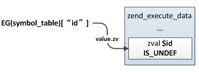
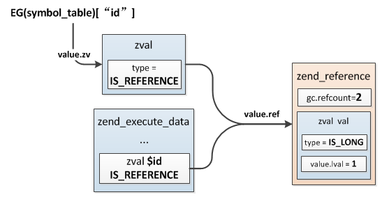

## 2.4 全局变量
PHP中把定义在函数、类之外的变量称之为全局变量，也就是定义在主脚本中的变量，这些变量可以在函数、成员方法中通过global关键字引入使用。

```php
function test() {
    global $id;
    $id++;
}

$id = 1;
test();
echo $id;
```
### 2.4.1 全局变量初始化
全局变量在整个请求执行期间始终存在，它们保存在`EG(symbol_table)`中，也就是全局变量符号表，与静态变量的存储一样，这也是一个哈希表，主脚本(或include、require)在`zend_execute_ex`执行开始之前会把当前作用域下的所有局部变量添加到`EG(symbol_table)`中，这一步操作后面介绍zend执行过程时还会讲到，这里先简单提下：
```c
ZEND_API void zend_execute(zend_op_array *op_array, zval *return_value)
{
    ...
    i_init_execute_data(execute_data, op_array, return_value);
    zend_execute_ex(execute_data);
    ...
}
```
`i_init_execute_data()`这个函数中会把局部变量插入到EG(symbol_table)：
```c
ZEND_API void zend_attach_symbol_table(zend_execute_data *execute_data)
{
    zend_op_array *op_array = &execute_data->func->op_array;
    HashTable *ht = execute_data->symbol_table;

    if (!EXPECTED(op_array->last_var)) { 
        return;
    }

    zend_string **str = op_array->vars;
    zend_string **end = str + op_array->last_var;
    //局部变量数组起始位置
    zval *var = EX_VAR_NUM(0);

    do{
        zval *zv = zend_hash_find(ht, *str);
        //插入全局变量符号表
        zv = zend_hash_add_new(ht, *str, var);
        //哈希表中value指向局部变量的zval
        ZVAL_INDIRECT(zv, var);
        ...
    }while(str != end);
}
```
从上面的过程可以很直观的看到，在执行前遍历局部变量，然后插入EG(symbol_table)，EG(symbol_table)中的value直接指向局部变量的zval，示例经过这一步的处理之后(此时局部变量只是分配了zval，但还未初始化，所以是IS_UNDEF)：



### 2.4.2 全局变量的访问
与静态变量的访问一样，全局变量也是将原来的值转换为引用，然后在global导入的作用域内创建一个局部变量指向该引用：
```php
global $id; // 相当于：$id = & EG(symbol_table)["id"];
```
具体的操作过程不再细讲，与静态变量的处理过程一致，这时示例中局部变量与全局变量的引用情况如下图。



### 2.4.3 超全局变量
全局变量除了通过global引入外还有一类特殊的类型，它们不需要使用global引入而可以直接使用，这些全局变量称为：超全局变量。

超全局变量实际是PHP内核定义的一些全局变量：$GLOBALS、$_SERVER、$_REQUEST、$_POST、$_GET、$_FILES、$_ENV、$_COOKIE、$_SESSION、argv、argc。

### 2.4.4 销毁
局部变量如果没有手动销毁，那么在函数执行结束时会将它们销毁，而全局变量则是在整个请求结束时才会销毁，即使是我们直接在PHP脚本中定义在函数外的那些变量。
```c
void shutdown_destructors(void)
{
    if (CG(unclean_shutdown)) {
        EG(symbol_table).pDestructor = zend_unclean_zval_ptr_dtor;
    }
    zend_try {
        uint32_t symbols;
        do {
            symbols = zend_hash_num_elements(&EG(symbol_table));
            //销毁
            zend_hash_reverse_apply(&EG(symbol_table), (apply_func_t) zval_call_destructor);
        } while (symbols != zend_hash_num_elements(&EG(symbol_table)));
    }
    ...
}
```
