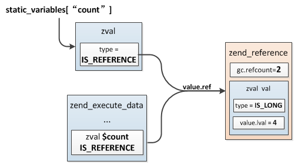

## 2.3 静态变量
PHP中局部变量分配在zend_execute_data结构上，每次执行zend_op_array都会生成一个新的zend_execute_data，局部变量在执行之初分配，然后在执行结束时释放，这是局部变量的生命周期，而局部变量中有一种特殊的类型：静态变量，它们不会在函数执行完后释放，当程序执行离开函数域时静态变量的值被保留下来，下次执行时仍然可以使用之前的值。

PHP中的静态变量通过`static`关键词创建：
```php
function my_func(){
    static $count = 4;
    $count++;
    echo $count,"\n";
}
my_func();
my_func();
===========================
5
6
```
### 2.3.1 静态变量的存储
静态变量既然不会随执行的结束而释放，那么很容易想到它的保存位置：`zend_op_array->static_variables`，这是一个哈希表，所以PHP中的静态变量与普通局部变量不同，它们没有分配在执行空间zend_execute_data上，而是以哈希表的形式保存在zend_op_array中。

> 静态变量只会初始化一次，注意：它的初始化发生在编译阶段而不是执行阶段，上面这个例子中：`static $count = 4;`是在编译阶段发现定义了一个静态变量，然后插进了zend_op_array->static_variables中，并不是执行的时候把static_variables中的值修改为4，所以上面执行的时候会输出5、6，再次执行并没有重置静态变量的值。
>
> 这个特性也意味着静态变量初始的值不能是变量，比如：`static $count = $xxx;`这样定义将会报错。

### 2.3.2 静态变量的访问
局部变量通过编译时确定的编号进行读写操作，而静态变量通过哈希表保存，这就使得其不能像普通变量那样有一个固定的编号，有一种可能是通过变量名索引的，那么究竟是否如此呢？我们分析下其编译过程。

静态变量编译的语法规则：
```c
statement:
    ...
    |   T_STATIC static_var_list ';'    { $$ = $2; }
    ...
;

static_var_list:
        static_var_list ',' static_var { $$ = zend_ast_list_add($1, $3); }
    |   static_var { $$ = zend_ast_create_list(1, ZEND_AST_STMT_LIST, $1); }
;

static_var:
        T_VARIABLE          { $$ = zend_ast_create(ZEND_AST_STATIC, $1, NULL); }
    |   T_VARIABLE '=' expr { $$ = zend_ast_create(ZEND_AST_STATIC, $1, $3); }
;
```
语法解析后生成了一个`ZEND_AST_STATIC`语法树节点，接着再看下这个节点编译为opcode的过程：zend_compile_static_var。
```c
void zend_compile_static_var(zend_ast *ast)
{
    zend_ast *var_ast = ast->child[0];
    zend_ast *value_ast = ast->child[1];
    zval value_zv;

    if (value_ast) {
        //定义了初始值
        zend_const_expr_to_zval(&value_zv, value_ast);
    } else {
        //无初始值
        ZVAL_NULL(&value_zv);
    }

    zend_compile_static_var_common(var_ast, &value_zv, 1);
}
```
这里首先对初始化值进行编译，最终得到一个固定值，然后调用：`zend_compile_static_var_common()`处理，首先判断当前编译的`zend_op_array->static_variables`是否已创建，未创建则分配一个HashTable，接着将定义的静态变量插入：
```c
//zend_compile_static_var_common():
if (!CG(active_op_array)->static_variables) {
    ALLOC_HASHTABLE(CG(active_op_array)->static_variables);
    zend_hash_init(CG(active_op_array)->static_variables, 8, NULL, ZVAL_PTR_DTOR, 0);
}
//插入静态变量
zend_hash_update(CG(active_op_array)->static_variables, Z_STR(var_node.u.constant), value);
```
插入静态变量哈希表后并没有完成，接下来还有一个重要操作：
```c
//生成一条ZEND_FETCH_W的opcode
opline = zend_emit_op(&result, by_ref ? ZEND_FETCH_W : ZEND_FETCH_R, &var_node, NULL);
opline->extended_value = ZEND_FETCH_STATIC;

if (by_ref) {
    zend_ast *fetch_ast = zend_ast_create(ZEND_AST_VAR, var_ast);
    //生成一条ZEND_ASSIGN_REF的opcode
    zend_emit_assign_ref_znode(fetch_ast, &result);
}
```
后面生成了两条opcode：
* __ZEND_FETCH_W:__ 这条opcode对应的操作是创建一个IS_INDIRECT类型的zval，指向static_variables中对应静态变量的zval
* __ZEND_ASSIGN_REF:__ 它的操作是引用赋值，即将一个引用赋值给CV变量

通过上面两条opcode可以确定静态变量的读写过程：首先根据变量名在static_variables中取出对应的zval，然后将它修改为引用类型并赋值给局部变量，也就是说`static $count = 4;`包含了两个操作，严格的说`$count`并不是真正的静态变量，它只是一个指向静态变量的局部变量，执行时实际操作是：`$count = & static_variables["count"];`。上面例子$count与static_variables["count"]间的关系如图所示。



