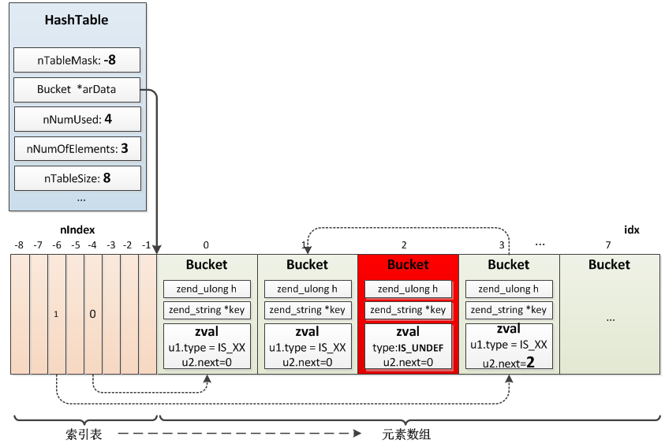

## 2.2 数组
数组是PHP中非常强大、灵活的一种数据类型，它的底层实现为散列表(HashTable，也称作：哈希表)，除了我们熟悉的PHP用户空间的Array类型之外，内核中也随处用到散列表，比如函数、类、常量、已include文件的索引表、全局符号表等都用的HashTable存储。

散列表是根据关键码值(Key value)而直接进行访问的数据结构，它的key - value之间存在一个映射函数，可以根据key通过映射函数直接索引到对应的value值，它不以关键字的比较为基本操作，采用直接寻址技术（就是说，它是直接通过key映射到内存地址上去的），从而加快查找速度，在理想情况下，无须任何比较就可以找到待查关键字，查找的期望时间为O(1)。

### 2.2.1 数组结构
存放记录的数组称做散列表，这个数组用来存储value，而value具体在数组中的存储位置由映射函数根据key计算确定，映射函数可以采用取模的方式，key可以通过一些譬如“times 33”的算法得到一个整形值，然后与数组总大小取模得到在散列表中的存储位置。这是一个普通散列表的实现，PHP散列表的实现整体也是这个思路，只是有几个特殊的地方，下面就是PHP中HashTable的数据结构：

```c
//Bucket：散列表中存储的元素
typedef struct _Bucket {
    zval              val; //存储的具体value，这里嵌入了一个zval，而不是一个指针
    zend_ulong        h;   //key根据times 33计算得到的哈希值，或者是数值索引编号
    zend_string      *key; //存储元素的key
} Bucket;

//HashTable结构
typedef struct _zend_array HashTable;
struct _zend_array {
    zend_refcounted_h gc;
    union {
        struct {
            ZEND_ENDIAN_LOHI_4(
                    zend_uchar    flags,
                    zend_uchar    nApplyCount,
                    zend_uchar    nIteratorsCount,
                    zend_uchar    reserve)
        } v;
        uint32_t flags;
    } u;
    uint32_t          nTableMask; //哈希值计算掩码，等于nTableSize的负值(nTableMask = -nTableSize)
    Bucket           *arData;     //存储元素数组，指向第一个Bucket
    uint32_t          nNumUsed;   //已用Bucket数
    uint32_t          nNumOfElements; //哈希表有效元素数
    uint32_t          nTableSize;     //哈希表总大小，为2的n次方
    uint32_t          nInternalPointer;
    zend_long         nNextFreeElement; //下一个可用的数值索引,如:arr[] = 1;arr["a"] = 2;arr[] = 3;  则nNextFreeElement = 2;
    dtor_func_t       pDestructor;
};
```
HashTable中有两个非常相近的值:`nNumUsed`、`nNumOfElements`，`nNumOfElements`表示哈希表已有元素数，那这个值不跟`nNumUsed`一样吗？为什么要定义两个呢？实际上它们有不同的含义，当将一个元素从哈希表删除时并不会将对应的Bucket移除，而是将Bucket存储的zval标示为`IS_UNDEF`，只有扩容时发现nNumOfElements与nNumUsed相差达到一定数量(这个数量是:`ht->nNumUsed - ht->nNumOfElements > (ht->nNumOfElements >> 5)`)时才会将已删除的元素全部移除，重新构建哈希表。所以`nNumUsed`>=`nNumOfElements`。

HashTable中另外一个非常重要的值`arData`，这个值指向存储元素数组的第一个Bucket，插入元素时按顺序 __依次插入__ 数组，比如第一个元素在arData[0]、第二个在arData[1]...arData[nNumUsed]。PHP数组的有序性正是通过`arData`保证的，这是第一个与普通散列表实现不同的地方。

既然arData并不是按key映射的散列表，那么映射函数是如何将key与arData中的value建立映射关系的呢？

实际上这个散列表也在`arData`中，比较特别的是散列表在ht->arData内存之前，分配内存时这个散列表与Bucket数组一起分配，arData向后移动到了Bucket数组的起始位置，并不是申请内存的起始位置，这样散列表可以由arData指针向前移动访问到，即arData[-1]、arData[-2]、arData[-3]......散列表的结构是`uint32_t`，它保存的是value在Bucket数组中的位置。

所以，整体来看HashTable主要依赖arData实现元素的存储、索引。插入一个元素时先将元素按先后顺序插入Bucket数组，位置是idx，再根据key的哈希值映射到散列表中的某个位置nIndex，将idx存入这个位置；查找时先在散列表中映射到nIndex，得到value在Bucket数组的位置idx，再从Bucket数组中取出元素。

比如：
```php
$arr["a"] = 1;
$arr["b"] = 2;
$arr["c"] = 3;
$arr["d"] = 4;

unset($arr["c"]);
```
对应的HashTable如下图所示。



### 2.2.2 映射函数
映射函数(即：散列函数)是散列表的关键部分，它将key与value建立映射关系，一般映射函数可以根据key的哈希值与Bucket数组大小取模得到，即`key->h % ht->nTableSize`，但是PHP却不是这么做的：
```c
nIndex = key->h | ht->nTableMask;
```
显然位运算要比取模更快。

`nTableMask`为`nTableSize`的负数，即:`nTableMask = -nTableSize`，因为`nTableSize`等于2^n，所以`nTableMask`二进制位右侧全部为0，也就保证了nIndex落在数组索引的范围之内(`|nIndex| <= nTableSize`)：
```c
11111111 11111111 11111111 11111000   -8
11111111 11111111 11111111 11110000   -16
11111111 11111111 11111111 11100000   -32
11111111 11111111 11111111 11000000   -64
11111111 11111111 11111111 10000000   -128
```
### 2.2.3 哈希碰撞
哈希碰撞是指不同的key可能计算得到相同的哈希值(数值索引的哈希值直接就是数值本身)，但是这些值又需要插入同一个散列表。一般解决方法是将Bucket串成链表，查找时遍历链表比较key。

PHP的实现也是如此，只是将链表的指针指向转化为了数值指向，即：指向冲突元素的指针并没有直接存在Bucket中，而是保存到了value的`zval`中：
```c
struct _zval_struct {
    zend_value        value;            /* value */
    ...
    union {
        uint32_t     var_flags;
        uint32_t     next;                 /* hash collision chain */
        uint32_t     cache_slot;           /* literal cache slot */
        uint32_t     lineno;               /* line number (for ast nodes) */
        uint32_t     num_args;             /* arguments number for EX(This) */
        uint32_t     fe_pos;               /* foreach position */
        uint32_t     fe_iter_idx;          /* foreach iterator index */
    } u2;
};
```
当出现冲突时将原value的位置保存到新value的`zval.u2.next`中，然后将新插入的value的位置更新到散列表，也就是后面冲突的value始终插入header。所以查找过程类似：
```c
zend_ulong h = zend_string_hash_val(key);
uint32_t idx = ht->arHash[h & ht->nTableMask];
while (idx != INVALID_IDX) {
    Bucket *b = &ht->arData[idx];
    if (b->h == h && zend_string_equals(b->key, key)) {
        return b;
    }
    idx = Z_NEXT(b->val); //移到下一个冲突的value
}
return NULL;
```
### 2.2.4 插入、查找、删除
这几个基本操作比较简单，不再赘述，定位到元素所在Bucket位置后的操作类似单链表的插入、删除、查找。

### 2.2.5 扩容
散列表可存储的value数是固定的，当空间不够用时就要进行扩容了。

PHP散列表的大小为2^n，插入时如果容量不够则首先检查已删除元素所占比例，如果达到阈值(ht->nNumUsed - ht->nNumOfElements > (ht->nNumOfElements >> 5)，则将已删除元素移除，重建索引，如果未到阈值则进行扩容操作，扩大为当前大小的2倍，将当前Bucket数组复制到新的空间，然后重建索引。

```c
//zend_hash.c
static void ZEND_FASTCALL zend_hash_do_resize(HashTable *ht)
{

    if (ht->nNumUsed > ht->nNumOfElements + (ht->nNumOfElements >> 5)) {
        //只有到一定阈值才进行rehash操作
        zend_hash_rehash(ht); //重建索引数组
    } else if (ht->nTableSize < HT_MAX_SIZE) {
        //扩容
        void *new_data, *old_data = HT_GET_DATA_ADDR(ht);
        //扩大为2倍，加法要比乘法快，小的优化点无处不在...
        uint32_t nSize = ht->nTableSize + ht->nTableSize;
        Bucket *old_buckets = ht->arData;

        //新分配arData空间，大小为:(sizeof(Bucket) + sizeof(uint32_t)) * nSize
        new_data = pemalloc(HT_SIZE_EX(nSize, -nSize), ...);
        ht->nTableSize = nSize;
        ht->nTableMask = -ht->nTableSize;
        //将arData指针偏移到Bucket数组起始位置
        HT_SET_DATA_ADDR(ht, new_data);
        //将旧的Bucket数组拷到新空间
        memcpy(ht->arData, old_buckets, sizeof(Bucket) * ht->nNumUsed);
        //释放旧空间
        pefree(old_data, ht->u.flags & HASH_FLAG_PERSISTENT);
        
        //重建索引数组：散列表
        zend_hash_rehash(ht);
        ...
    }
    ...
}

#define HT_SET_DATA_ADDR(ht, ptr) do { \
        (ht)->arData = (Bucket*)(((char*)(ptr)) + HT_HASH_SIZE((ht)->nTableMask)); \
    } while (0)
```

### 2.2.6 重建散列表
当删除元素达到一定数量或扩容后都需要重建散列表，因为value在Bucket位置移动了或哈希数组nTableSize变化了导致key与value的映射关系改变，重建过程实际就是遍历Bucket数组中的value，然后重新计算映射值更新到散列表，除了更新散列表之外，这里还有一个重要的处理：移除已删除的value，开始的时候我们说过，删除value时只是将value的type表为了IS_UNDEF，并没有实际从Bucket数组中删除，如果这些value一直存在那么将浪费很多空间，所以这里会把它们移除，操作的方式也比较简单：将后面未删除的value依次前移，具体过程如下：
```c
//zend_hash.c
ZEND_API int ZEND_FASTCALL zend_hash_rehash(HashTable *ht)
{
    Bucket *p;
    uint32_t nIndex, i;
    ...
    i = 0;
    p = ht->arData;
    if (ht->nNumUsed == ht->nNumOfElements) { //没有已删除的直接遍历Bucket数组重新插入索引数组即可
        do {
            nIndex = p->h | ht->nTableMask;
            Z_NEXT(p->val) = HT_HASH(ht, nIndex);
            HT_HASH(ht, nIndex) = HT_IDX_TO_HASH(i);
            p++;
        } while (++i < ht->nNumUsed);
    } else {
        do {
            if (UNEXPECTED(Z_TYPE(p->val) == IS_UNDEF)) {
                //有已删除元素则将后面的value依次前移，压实Bucket数组
                ......
                while (++i < ht->nNumUsed) {
                    p++;
                    if (EXPECTED(Z_TYPE_INFO(p->val) != IS_UNDEF)) {
                        ZVAL_COPY_VALUE(&q->val, &p->val);
                        q->h = p->h;
                        nIndex = q->h | ht->nTableMask;
                        q->key = p->key;
                        Z_NEXT(q->val) = HT_HASH(ht, nIndex);
                        HT_HASH(ht, nIndex) = HT_IDX_TO_HASH(j);
                        if (UNEXPECTED(ht->nInternalPointer == i)) {
                            ht->nInternalPointer = j;
                        }
                        q++;
                        j++;
                    }
                }
                ......
                ht->nNumUsed = j;
                break;
            }
            
            nIndex = p->h | ht->nTableMask;
            Z_NEXT(p->val) = HT_HASH(ht, nIndex);
            HT_HASH(ht, nIndex) = HT_IDX_TO_HASH(i);
            p++;
        }while(++i < ht->nNumUsed);
    }
}
```
除了上面这些操作，PHP中关于HashTable的还有很多，这里不再介绍。
