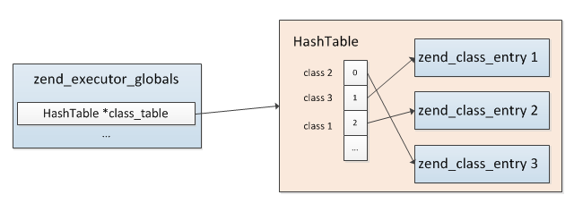
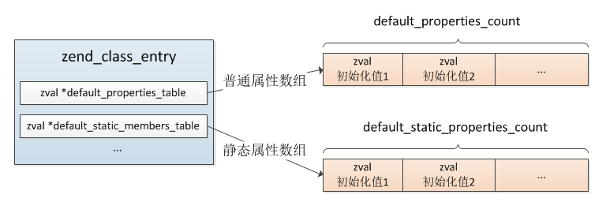
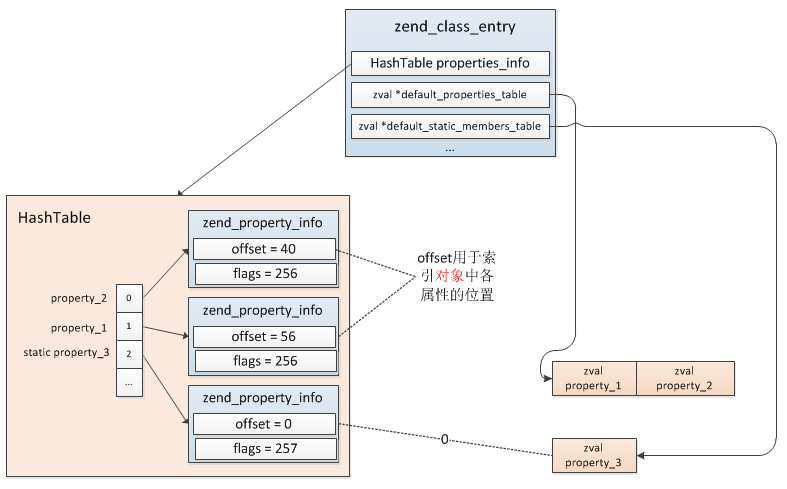
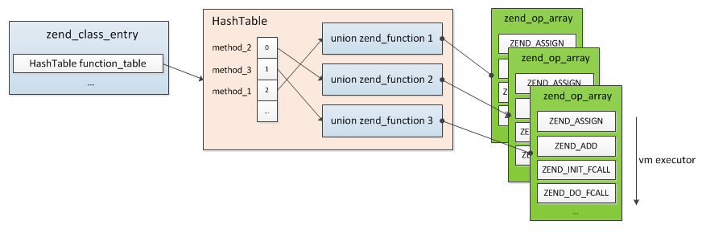
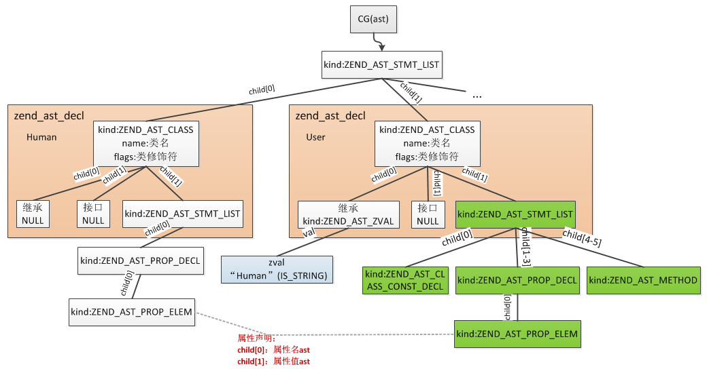
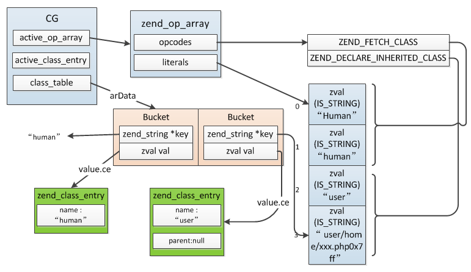
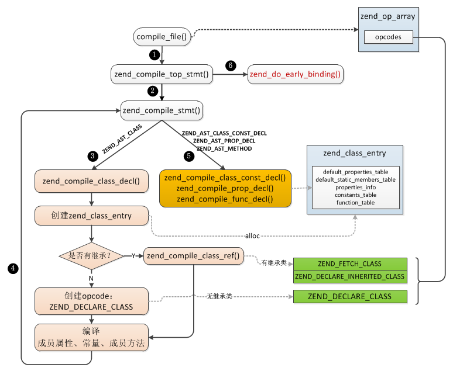
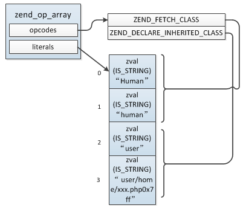

### 3.4.1 类
类是现实世界或思维世界中的实体在计算机中的反映，它将某些具有关联关系的数据以及这些数据上的操作封装在一起。在面向对象中类是对象的抽象，对象是类的具体实例。

在PHP中类是编译阶段的产物，而对象是运行时产生的，它们归属于不同阶段。

PHP中我们这样定义一个类：
```php
class 类名 {
    常量;
    成员属性;
    成员方法;
}
```

一个类可以包含有属于自己的常量、变量（称为“属性”）以及函数（称为“方法”），本节将围绕这三部分具体弄清楚以下几个问题：

* a.类的存储及索引
* b.成员属性的存储结构
* c.成员方法的存储结构
* d.成员方法的调用过程及与普通function调用的差别

#### 3.4.1.1 类的结构及存储
首先我们看下类的数据结构：
```c
struct _zend_class_entry {
    char type;          //类的类型：内部类ZEND_INTERNAL_CLASS(1)、用户自定义类ZEND_USER_CLASS(2)
    zend_string *name;  //类名，PHP类不区分大小写，统一为小写
    struct _zend_class_entry *parent; //父类
    int refcount;
    uint32_t ce_flags;  //类掩码，如普通类、抽象类、接口，除了这还有别的含义，暂未弄清

    int default_properties_count;        //普通属性数，包括public、private
    int default_static_members_count;    //静态属性数，static
    zval *default_properties_table;      //普通属性值数组
    zval *default_static_members_table;  //静态属性值数组
    zval *static_members_table;
    HashTable function_table;  //成员方法哈希表
    HashTable properties_info; //成员属性基本信息哈希表，key为成员名，value为zend_property_info
    HashTable constants_table; //常量哈希表，通过constant定义的

    //以下是构造函授、析构函数、魔术方法的指针
    union _zend_function *constructor;
    union _zend_function *destructor;
    union _zend_function *clone;
    union _zend_function *__get;
    union _zend_function *__set;
    union _zend_function *__unset;
    union _zend_function *__isset;
    union _zend_function *__call;
    union _zend_function *__callstatic;
    union _zend_function *__tostring;
    union _zend_function *__debugInfo;
    union _zend_function *serialize_func;
    union _zend_function *unserialize_func;

    zend_class_iterator_funcs iterator_funcs;

    //自定义的钩子函数，通常是定义内部类时使用，可以灵活的进行一些个性化的操作
    //用户自定义类不会用到，暂时忽略即可
    zend_object* (*create_object)(zend_class_entry *class_type);
    zend_object_iterator *(*get_iterator)(zend_class_entry *ce, zval *object, int by_ref);
    int (*interface_gets_implemented)(zend_class_entry *iface, zend_class_entry *class_type); /* a class implements this interface */
    union _zend_function *(*get_static_method)(zend_class_entry *ce, zend_string* method);

    /* serializer callbacks */
    int (*serialize)(zval *object, unsigned char **buffer, size_t *buf_len, zend_serialize_data *data);
    int (*unserialize)(zval *object, zend_class_entry *ce, const unsigned char *buf, size_t buf_len, zend_unserialize_data *data);

    uint32_t num_interfaces; //实现的接口数
    uint32_t num_traits;
    zend_class_entry **interfaces; //实现的接口

    zend_class_entry **traits;
    zend_trait_alias **trait_aliases;
    zend_trait_precedence **trait_precedences;

    union {
        struct {
            zend_string *filename;
            uint32_t line_start;
            uint32_t line_end;
            zend_string *doc_comment;
        } user;
        struct {
            const struct _zend_function_entry *builtin_functions;
            struct _zend_module_entry *module; //所属扩展
        } internal;
    } info;
}
```
create_object为实例化对象的操作，可以通过扩展自定义一个函数来接管实例化对象的操作，没有定义这个函数的话将由默认的`zend_objects_new()`处理，自定义时可以参考这个函数的实现：
```c
//注意：此操作并没有将属性拷贝到zend_object中：由object_properties_init()完成
ZEND_API zend_object *zend_objects_new(zend_class_entry *ce)
{
    zend_object *object = emalloc(sizeof(zend_object) + zend_object_properties_size(ce));

    zend_object_std_init(object, ce);
    //设置对象操作的handler
    object->handlers = &std_object_handlers;
    return object;
}
```
举个例子具体看下，定义一个User类，它继承了Human类，User类中有一个常量、一个静态属性、两个普通属性：
```php
//父类
class Human {}

class User extends Human
{
    const type = 110;

    static $name = "uuu";
    public $uid = 900;
    public $sex = 'w';

    public function __construct(){
    }

    public function getName(){
        return $this->name;
    }
}
```
其对应的zend_class_entry存储结构如下图。


开始的时候已经提到，类是编译阶段的产物，编译完成后我们定义的每个类都会生成一个zend_class_entry，它保存着类的全部信息，在执行阶段所有类相关的操作都是用的这个结构。

所有PHP脚本中定义的类以及内核、扩展中定义的内部类通过一个以"类名"作为索引的哈希表存储，这个哈希表保存在Zend引擎global变量中：__zend_executor_globals.class_table__(即：__EG(class_table)__)，与function的存储相同，关于这个global变量前面[《3.3.1.3 zend_executor_globals》](zend_executor.md#3313-zend_executor_globals)已经讲过。



在接下来的小节中我们将对类的常量、成员属性、成员方法的实现具体分析。

#### 3.4.1.2 类常量
PHP中可以把在类中始终保持不变的值定义为常量，在定义和使用常量的时候不需要使用 $ 符号，常量的值必须是一个定值(如布尔型、整形、字符串、数组，php5.*不支持数组)，不能是变量、数学运算的结果或函数调用，也就是说它是只读的，无法进行赋值。

常量通过 __const__ 定义：
```php
class my_class {
    const 常量名 = 常量值;
}
```
常量通过 __class_name::常量名__ 访问，或在class内部通过 __self::常量名__ 访问。

常量是类维度的数据(而不是对象的)，它们通过`zend_class_entry.constants_table`进行存储，这是一个哈希结构，通过 __常量名__ 索引，value就是具体定义的常量值。

__常量的读取：__

根据前面我们对PHP opcode已有的了解，我们可以猜测常量访问的opcode的组成：常量名保存在literals中(其op_type = IS_CONST)，执行时先取出常量名，然后去zend_class_entry.constants_table哈希表中索引到具体的常量值即可。

事实上我们的这个猜测并不是完全正确的，因为有的情况确实是我们猜想的那样，但是还有另外一种情况，比较下两个例子的不同：
```php
//示例1
echo my_class::A1;

class my_class {
    const A1 = "hi";
}
```
```php
//示例2

class my_class {
    const A1 = "hi";
}

echo my_class::A1;
```
唯一的不同就是常量的使用时机：示例1是在定义前使用的，示例2是在定义后使用的。我们都知道PHP变量无需提前声明，这俩会有什么不同呢？

事实上这两种情况内核会有两种不同的处理方式，示例1这种情况的处理与我们上面的猜测相同，而示例2则有另外一种处理方式：PHP代码的编译是顺序的，示例2的情况编译到`echo my_class::A1`这行时首先会尝试检索下是否已经编译了my_class，如果能在CG(class_table)中找到，则进一步从类的`contants_table`查找对应的常量，找到的话则会复制其value替换常量，简单的讲就是类似C语言中的宏，__编译时替换为实际的值了__，而不是在运行时再去检索。

具体debug下上面两个例子会发现示例2的主要的opcode只有一个ZEND_ECHO，也就是直接输出值了，并没有设计类常量的查找，这就是因为编译的时候已经将 __my_class::A1__ 替换为 __hi__ 了，`echo my_class::A1;`等同于：`echo "hi";`；而示例1首先的操作则是ZEND_FETCH_CONSTANT，查找常量，接着才是ZEND_ECHO。

#### 3.4.1.3 成员属性
类的变量成员叫做“属性”。属性声明是由关键字 __public__，__protected__ 或者 __private__ 开头，然后跟一个普通的变量声明来组成，关于这三个关键字这里不作讨论，后面分析可见性的章节再作说明。

> 【修饰符(public/private/protected/static)】【成员属性名】= 【属性默认值】;

属性中的变量可以初始化，但是初始化的值必须是常数，这里的常数是指 PHP 脚本在编译阶段时就可以得到其值，而不依赖于运行时的信息才能求值，比如`public $time = time();`这样定义一个属性就会触发语法错误。

成员属性又分为两类：__普通属性__、__静态属性__。静态属性通过 __static__ 声明，通过 __self::$property__ 或 __类名::$property__ 访问；普通属性通过 __$this->property__ 或 __$object->property__ 访问。

```php
class my_class {
    //普通属性
    public $property = 初始化值;

    //静态属性
    public static $property_2 = 初始化值;
}
```
与常量的存储方式不同，成员属性的 __初始化值__ 并不是 __直接__ 用以"属性名"作为索引的哈希表存储的，而是通过数组保存的，普通属性、静态属性各有一个数组分别存储。



看到这里可能有个疑问：使用时成员属性是如果找到的呢？

实际只是成员属性的 __VALUE__ 通过数组存储的，访问时仍然是根据以"属性名"为索引的散列表查找具体VALUE的，这个散列表并没有按照普通属性、静态属性分为两个，而是只用了一个：__HashTable properties_info__ 。此哈希表存储元素的value类型为 __zend_property_info__ 。

```c
typedef struct _zend_property_info {
    uint32_t offset; //普通成员变量的内存偏移值
                     //静态成员变量的数组索引
    uint32_t flags;  //属性掩码，如public、private、protected及是否为静态属性
    zend_string *name; //属性名:并不是原始属性名
    zend_string *doc_comment;
    zend_class_entry *ce; //所属类
} zend_property_info;

//flags标识位
#define ZEND_ACC_PUBLIC     0x100
#define ZEND_ACC_PROTECTED  0x200
#define ZEND_ACC_PRIVATE    0x400

#define ZEND_ACC_STATIC         0x01
```
* __name__：属性名，特别注意的是这里并不全是原始属性名，private会在原始属性名前加上类名，protected则会加上*作为前缀
* __offset__：这个值记录的就是上面说的通过数组保存的属性值的索引，也就是说属性值保存在一个数组中，然后将其在数组中的位置保存在offset中，另外需要说明的一点的是普通属性、静态属性这个值用法是不一样的，静态属性是类的范畴，与对象无关，所以其offset为default_static_members_table数组的下标：0,、1、2......，而普通属性归属于对象，每个对象有其各自的属性，所以这个offset记录的实际是 __各属性在object中偏移值__ (在后面《3.4.2 对象》一节我们再具体说明普通属性的存储方式)，其值是：40、56、72......是按照zval的内存大小偏移的
* __flags__：bit位，标识的是属性的信息，如public、private、protected及是否为静态属性

所以访问成员属性时首先是根据属性名查找到此属性的存储位置，然后再进一步获取属性值。

举个例子：
```php
class my_class {
    public $property_1 = "aa";
    public $property_2 = array();

    public static $property_3 = 110;
}
```
则 __default_properties_table__、__default_static_properties_table__、__properties_info__ 关系图：



下面我们再看下普通成员属性与静态成员属性的不同：__静态成员变量保存在类中，各对象共享同一份数据，而普通属性属于对象，各对象独享。__

成员属性在类编译阶段就已经分配了zval，静态与普通的区别在于普通属性在创建一个对象时还会重新分配zval（这个过程类似zend引擎执行前分配在zend_execute_data后面的动态变量空间），对象对普通属性的操作都是在其自己的空间进行的，各对象隔离，而静态属性的操作始终是在类的空间内，各对象共享。

#### 3.4.1.4 成员方法
每个类可以定义若干属于本类的函数(称之为成员方法)，这种函数与普通的function相同，只是以类的维度进行管理，不是全局性的，所以成员方法保存在类中而不是EG(function_table)。



> 成员方法的定义：

> 【修饰符(public/private/protected/static/abstruct/final)】function 【&】【成员方法名】(【参数列表】)【返回值类型】{【成员方法】};

成员方法也有静态、非静态之分，静态方法中不能使用$this，因为其操作的作用域全部都是类的而不是对象的，而非静态方法中可以通过$this访问属于本对象的成员属性。

静态方法也是通过static关键词定义：
```php
class my_class {
    static public function test() {
        $a = "hi~";
        echo $a;
    }
}
//静态方法可以这么调用：
my_class::test();

//也可以这样：
$method = 'test';
my_class::$method();
```
静态方法中调用其它静态方法或静态变量可以通过 __self__ 访问。

成员方法的调用与普通function过程基本相同，根据对象所属类或直接根据类取到method的zend_function，然后执行，具体的过程[《3.3 Zend引擎执行过程》](zend_executor.md)已经详细说过，这里不再重复。

#### 3.4.1.5 自定义类的编译
前面我们先介绍了类的相关组成部分，接下来我们从一个例子简单看下类的编译过程，这个过程最终的产物就是zend_class_entry。

```php
//示例
class Human {
    public $aa = array(1,2,3);
}

class User extends Human
{
    const type = 110;

    static $name = "uuu";
    public $uid = 900;
    public $sex = 'w';

    public function __construct(){
    }

    public function getName(){
        return $this->name;
    }
}
```
> 类的定义组成部分：

> 【修饰符(abstract/final)】 class 【类名】 【extends 父类】 【implements 接口1,接口2】 {}

语法规则为：
```c
class_declaration_statement:
        class_modifiers T_CLASS { $<num>$ = CG(zend_lineno); }
        T_STRING extends_from implements_list backup_doc_comment '{' class_statement_list '}'
            { $$ = zend_ast_create_decl(ZEND_AST_CLASS, $1, $<num>3, $7, zend_ast_get_str($4), $5, $6, $9, NULL); }
    |   T_CLASS { $<num>$ = CG(zend_lineno); }
        T_STRING extends_from implements_list backup_doc_comment '{' class_statement_list '}'
            { $$ = zend_ast_create_decl(ZEND_AST_CLASS, 0, $<num>2, $6, zend_ast_get_str($3), $4, $5, $8, NULL); }
;

//整个类内为list，每个成员属性、成员方法都是一个子节点
class_statement_list:
        class_statement_list class_statement
            { $$ = zend_ast_list_add($1, $2); }
    |   /* empty */
            { $$ = zend_ast_create_list(0, ZEND_AST_STMT_LIST); }
;

//类内语法规则：成员属性、成员方法
class_statement:
        variable_modifiers property_list ';'
            { $$ = $2; $$->attr = $1; }
    |   T_CONST class_const_list ';'
            { $$ = $2; RESET_DOC_COMMENT(); }
    |   T_USE name_list trait_adaptations
            { $$ = zend_ast_create(ZEND_AST_USE_TRAIT, $2, $3); }
    |   method_modifiers function returns_ref identifier backup_doc_comment '(' parameter_list ')'
        return_type method_body
            { $$ = zend_ast_create_decl(ZEND_AST_METHOD, $3 | $1, $2, $5,
                  zend_ast_get_str($4), $7, NULL, $10, $9); }
;
```
生成的抽象语法树：



类的语法树根节点为ZEND_AST_CLASS，此节点有3个子节点：继承子节点、实现接口子节点、类中声明表达式节点，其中child[2](即类中声明表达式节点)为zend_ast_list，每个常量定义、成员属性、成员方法对应一个节点，比如上面的例子中user类有6个子节点，这些子节点类型有3类：常量声明(ZEND_AST_CLASS_CONST_DECL)、属性声明(ZEND_AST_PROP_DECL)、方法声明(ZEND_AST_METHOD)。

编译为opcodes操作为：`zend_compile_class_decl()`，它的输入就是ZEND_AST_CLASS节点，这个函数中再针对常量、属性、方法、继承、接口等分别处理。
```c
void zend_compile_class_decl(zend_ast *ast)
{
    zend_ast_decl *decl = (zend_ast_decl *) ast;
    zend_ast *extends_ast = decl->child[0]; //继承类节点，zen_ast_zval节点，存的是父类名
    zend_ast *implements_ast = decl->child[1]; //实现接口节点
    zend_ast *stmt_ast = decl->child[2]; //类中声明的常量、属性、方法
    zend_string *name, *lcname;
    zend_class_entry *ce = zend_arena_alloc(&CG(arena), sizeof(zend_class_entry));
    zend_op *opline;
    ...

    lcname = zend_new_interned_string(lcname);

    ce->type = ZEND_USER_CLASS; //类型为用户自定义类
    ce->name = name; //类名
    zend_initialize_class_data(ce, 1);
    ...
    if (extends_ast) {
        ...
        //有继承的父类则首先生成一条ZEND_FETCH_CLASS的opcode
        zend_compile_class_ref(&extends_node, extends_ast, 0);
    }

    //在当前父空间生成一条opcode
    opline = get_next_op(CG(active_op_array));
    zend_make_var_result(&declare_node, opline);
    ...
    opline->op2_type = IS_CONST;
    LITERAL_STR(opline->op2, lcname);
    
    if (decl->flags & ZEND_ACC_ANON_CLASS) {
        //暂不清楚这种情况
    }else{
        zend_string *key;

        if (extends_ast) {
            opline->opcode = ZEND_DECLARE_INHERITED_CLASS; //有继承的类为这个opcode
            opline->extended_value = extends_node.u.op.var;
        } else {
            opline->opcode = ZEND_DECLARE_CLASS; //无继承的类为这个opcode
        }

        key = zend_build_runtime_definition_key(lcname, decl->lex_pos); //这个key并不是类名，而是：类名+file+lex_pos

        opline->op1_type = IS_CONST;
        LITERAL_STR(opline->op1, key);//将这个临时key保存到操作数1中

        zend_hash_update_ptr(CG(class_table), key, ce); //将半成品的zend_class_entry插入CG(class_table)，注意这里并不是执行时用于索引类的，它的key不是类名!!!
    }
    CG(active_class_entry) = ce;
    zend_compile_stmt(stmt_ast); //将常量、成员属性、方法编译到CG(active_class_entry)中

    ...

    CG(active_class_entry) = original_ce;
}
```
上面这个过程主要操作是新分配一个zend_class_entry，如果有继承的话首先生成一条ZEND_FETCH_CLASS的opcode，然后生成一条类声明的opcode（这个地方与之前3.2.1.3节介绍函数的编译时相同），接着就是编译常量、属性、成员方法到新分配的zend_class_entry中，这个过程还有一个容易误解的地方：将生成的zend_class_entry插入到CG(class_table)哈希表中，这个操作这是中间步骤，它的key并不是类名，而是类名后面带来一长串其它的字符，也就是这个时候通过类名在class_table是索引不到对应类的，后面我们会说明这样处理的作用。

Human类情况比较简单，不再展开，我们看下User类在`zend_compile_class_decl()`中执行到`zend_compile_stmt(stmt_ast)`这步时关键数据结构：



接下来我们分别看下常量、成员属性、方法的编译过程。

__(1)常量编译__

常量的节点类型为：`ZEND_AST_CLASS_CONST_DECL`，每个常量对应一个这样的节点，处理函数为:`zend_compile_class_const_decl()`：
```c
void zend_compile_class_const_decl(zend_ast *ast)
{
    zend_ast_list *list = zend_ast_get_list(ast);
    zend_class_entry *ce = CG(active_class_entry);
    uint32_t i;

    for (i = 0; i < list->children; ++i) { //const声明了多个常量，遍历编译每个子节点
        zend_ast *const_ast = list->child[i];
        zend_ast *name_ast = const_ast->child[0]; //常量名节点
        zend_ast *value_ast = const_ast->child[1];//常量值节点
        zend_string *name = zend_ast_get_str(name_ast); //常量名
        zval value_zv;
        
        //取出常量值
        zend_const_expr_to_zval(&value_zv, value_ast);

        name = zend_new_interned_string_safe(name);
        //将常量添加到zend_class_entry.constants_table哈希表中
        if (zend_hash_add(&ce->constants_table, name, &value_zv) == NULL) {
            ...
        }
        ...
    }
}
```
__(2)属性编译__

属性节点类型为:`ZEND_AST_PROP_DECL`，对应的处理函数:`zend_compile_prop_decl()`:
```c
void zend_compile_prop_decl(zend_ast *ast)
{
    zend_ast_list *list = zend_ast_get_list(ast);
    uint32_t flags = list->attr; //属性修饰符：static、public、private、protected
    zend_class_entry *ce = CG(active_class_entry);
    uint32_t i, children = list->children;

    for (i = 0; i < children; ++i) {
        zend_ast *prop_ast = list->child[i]; //这个节点类型为：ZEND_AST_PROP_ELEM
        zend_ast *name_ast = prop_ast->child[0]; //属性名节点
        zend_ast *value_ast = prop_ast->child[1]; //属性值节点
        zend_ast *doc_comment_ast = prop_ast->child[2];
        zend_string *name = zend_ast_get_str(name_ast); //属性名
        zend_string *doc_comment = NULL;
        zval value_zv;
        ...
        //检查该属性是否在当前类中已经定义
        if (zend_hash_exists(&ce->properties_info, name)) {
            zend_error_noreturn(...);
        }
        if (value_ast) {
            //取出默认值
            zend_const_expr_to_zval(&value_zv, value_ast);
        } else {
            //默认值为null
            ZVAL_NULL(&value_zv);
        }

        name = zend_new_interned_string_safe(name);
        //保存属性
        zend_declare_property_ex(ce, name, &value_zv, flags, doc_comment);
    }
}
```
开始的时候我们已经介绍：属性值是通过 __数组__ 保存的，然后其存储位置通过以 __属性名__ 为key的哈希表保存，使用的时候先从这个哈希表中找到属性信息同时得到属性值的保存位置，然后再进一步取出属性值。

`zend_declare_property_ex()`这步操作就是来确定属性的存储位置的，它将属性值按静态、非静态分别保存在default_static_members_table、default_properties_table两个数组中，同时将其存储位置保存到属性结构的offset中。
```c
//zend_API.c
ZEND_API int zend_declare_property_ex(zend_class_entry *ce, zend_string *name, zval *property, int access_type,...)
{
    zend_property_info *property_info, *property_info_ptr;
    
    if (ce->type == ZEND_INTERNAL_CLASS) {//内部类
        ...
    }else{
        property_info = zend_arena_alloc(&CG(arena), sizeof(zend_property_info));
    }

    if (access_type & ZEND_ACC_STATIC) {
        //静态属性
        ...
        property_info->offset = ce->default_static_members_count++; //分配属性编号，同变量一样，静态属性的就是数组索引
        ce->default_static_members_table = perealloc(ce->default_static_members_table, sizeof(zval) * ce->default_static_members_count, ce->type == ZEND_INTERNAL_CLASS);

        ZVAL_COPY_VALUE(&ce->default_static_members_table[property_info->offset], property);
        if (ce->type == ZEND_USER_CLASS) {
            ce->static_members_table = ce->default_static_members_table;
        }
    }else{
        //非静态属性
        ...
        //非静态属性值存储在对象中，所以与静态属性不同，它的offset并不是default_properties_table数组索引
        //而是相对于zend_object大小的(因为普通属性值数组保存在zend_object结构之后，这个与局部变量、zend_execute_data关系一样)
        property_info->offset = OBJ_PROP_TO_OFFSET(ce->default_properties_count); 
        ce->default_properties_count++;
        ce->default_properties_table = perealloc(ce->default_properties_table, sizeof(zval) * ce->default_properties_count, ce->type == ZEND_INTERNAL_CLASS);

        ZVAL_COPY_VALUE(&ce->default_properties_table[OBJ_PROP_TO_NUM(property_info->offset)], property);
    }

    //设置property_info其它的一些值
    ...
}
```
这个操作中重点是offset的计算方式，静态属性这个比较好理解，就是default_static_members_table数组索引；非静态属性zend_class_entry.default_properties_table保存的只是默认属性值，我们在下一篇介绍对象时再具体说明object、class之间属性的存储关系。

__(3)成员方法编译__
3.4.1.4一节已经介绍过成员方法与普通函数的关系，两者没有很大的区别，实现上是相同，不同的地方在于成员方法保存在各zend_class_entry中，调用时会有一些可见性方面的限制，如private、public、protected，还有一些专有用法，比如this、self等，但在编译、执行、存储结构等方面两者基本是一致的。

成员方法的语法树根节点为`ZEND_AST_METHOD`：
```c
void zend_compile_stmt(zend_ast *ast)
{
    ...
    switch (ast->kind) {
        ...
        case ZEND_AST_FUNC_DECL: //函数
        case ZEND_AST_METHOD:  //成员方法
            zend_compile_func_decl(NULL, ast);
            break;
        ...
    }
}
```
如果你还记得3.2.1.3函数处理的过程就会发现函数、成员方法的编译是同一个函数：`zend_compile_func_decl()`。
```c
void zend_compile_func_decl(znode *result, zend_ast *ast)
{
    //参数、函数内语法编译等不看了，与函数的相同，不清楚请看3.2.1.3节
    ...

    if (is_method) {
        zend_bool has_body = stmt_ast != NULL;
        zend_begin_method_decl(op_array, decl->name, has_body);
    } else {
        //函数是在当前空间生成了一条ZEND_DECLARE_FUNCTION的opcode
        //然后在zend_do_early_binding()中"执行"了这条opcode，即将函数添加到CG(function_table)
        zend_begin_func_decl(result, op_array, decl);
    }
    ...
}
```
这个过程之前已经说过，这里不再重复，我们只看下与普通函数处理不同的地方：`zend_begin_method_decl()`，它的工作也比较简单，最重要的一个地方就是将成员方法的zend_op_array插入 __zend_class_entry.function_table__。
```c
void zend_begin_method_decl(zend_op_array *op_array, zend_string *name, zend_bool has_body)
{
    zend_class_entry *ce = CG(active_class_entry);
    ...

    op_array->scope = ce;
    op_array->function_name = zend_string_copy(name);

    lcname = zend_string_tolower(name);
    lcname = zend_new_interned_string(lcname);

    //插入类的function_table中
    if (zend_hash_add_ptr(&ce->function_table, lcname, op_array) == NULL) {
        zend_error_noreturn(..);
    }
    
    //后面主要是设置一些构造函数、析构函数、魔术方法指针，以及其它一些可见性、静态非静态的检查
    ...
}
```

上面我们分别介绍了常量、成员属性、方法的编译过程，最后再用一张图总结下整个类的编译过程：



图中还有一步我们没有说到：__zend_do_early_binding()__ ，这是非常关键的一步，如果你看过3.2.1.3一节那么对这个函数应该不陌生，没错，在函数编译的最后一步也会调用这个函数，它的作用是将编译的function以函数名为key添加到CG(function_table)中，同样地上面整个过程中你可能发现所有的操作都是针对zend_class_entry，并没有发现最后把它存到什么位置了，这最后的一步就是把zend_class_entry以类名为key添加到CG(class_table)。

```c
void zend_do_early_binding(void)
{
    ...
    switch (opline->opcode) {
        ...
        case ZEND_DECLARE_CLASS:
            if (do_bind_class(CG(active_op_array), opline, CG(class_table), 1) == NULL) {
                return;
            }
            table = CG(class_table);
            break;
        case ZEND_DECLARE_INHERITED_CLASS:
            //比较长，后面单独摘出来
            break;
    }

    //将那个以(类名+file+lex_pos)为key的值从CG(class_table)中删除
    //同时删除两个相关的literals：key、类名
    zend_hash_del(table, Z_STR_P(CT_CONSTANT(opline->op1)));
    zend_del_literal(CG(active_op_array), opline->op1.constant);
    zend_del_literal(CG(active_op_array), opline->op2.constant);
    MAKE_NOP(opline); //将ZEND_DECLARE_CLASS或ZEND_DECLARE_INHERITED_CLASS的opcode置为空，表示已执行
}
```
这个地方会有两种情况，上面我们说过，如果是普通的没有继承的类定义会生成一条`ZEND_DECLARE_CLASS`的opcode，而有继承的类则会生成`ZEND_FETCH_CLASS`、`ZEND_DECLARE_INHERITED_CLASS`两条opcode，这两种有很大的不同，接下来我们具体看下：

> __(1)无继承类：__ 这种情况直接调用`do_bind_class()`处理了。
```c
ZEND_API zend_class_entry *do_bind_class(
    const zend_op_array* op_array, 
    const zend_op *opline, 
    HashTable *class_table, 
    zend_bool compile_time)
{
    if (compile_time) { //编译时
        //还记得zend_compile_class_decl()中有一个把zend_class_entry以(类名+file+lex_pos)
        //为key存入CG(class_table)的操作吗？那个key的存储位置保存在op1中了
        //这里就是从op_array.literals中取出那个key
        op1 = CT_CONSTANT_EX(op_array, opline->op1.constant);
        //op2为类名
        op2 = CT_CONSTANT_EX(op_array, opline->op2.constant);
    } else { //运行时，如果当前类在编译阶段没有编译完成则也有可能在zend_execute执行阶段完成
        op1 = RT_CONSTANT(op_array, opline->op1);
        op2 = RT_CONSTANT(op_array, opline->op2);
    }
    //从CG(class_table)中取出zend_class_entry
    if ((ce = zend_hash_find_ptr(class_table, Z_STR_P(op1))) == NULL) {
        zend_error_noreturn(E_COMPILE_ERROR, ...);
        return NULL;
    }
    ce->refcount++; //这里加1是因为CG(class_table)中多了一个bucket指向这个ce了
    
    //以标准类名为key将zend_class_entry插入CG(class_table)
    //这才是后面要用到的类
    if (zend_hash_add_ptr(class_table, Z_STR_P(op2), ce) == NULL) {
        //插入失败
        return NULL;
    }else{
        //插入成功
        return ce;
    } 
}
```
> 这个函数就是将类以 __正确的类名__ 为key插入到CG(class_table)，这一步完成后`zend_do_early_binding()`后面就将`ZEND_DECLARE_CLASS`这条opcode置为0了，这样在运行时就直接跳过此opcode了，现在清楚为什么执行时会有很多为0的opcode了吧？

> __(2)有继承类：__ 这种类是有继承的父类，它的定义有两条opcode：`ZEND_FETCH_CLASS`、`ZEND_DECLARE_INHERITED_CLASS`，上面我们一张图画过示例中user类编译的情况，我们先看下它的opcode再作说明。



```c
case ZEND_DECLARE_INHERITED_CLASS:
{
    zend_op *fetch_class_opline = opline-1;
    zval *parent_name;
    zend_class_entry *ce;

    parent_name = CT_CONSTANT(fetch_class_opline->op2); //父类名

    //在EG(class_table)中查找父类(注意：EG(class_table)与CG(class_table)指向同一个位置)
    if (((ce = zend_lookup_class_ex(Z_STR_P(parent_name), parent_name + 1, 0)) == NULL) || ...) {
        //没找到父类，有可能父类没有定义、有可能父类在子类之后定义的......
        if (CG(compiler_options) & ZEND_COMPILE_DELAYED_BINDING) {
            ...
            //将opcode重置为ZEND_DECLARE_INHERITED_CLASS_DELAYED
            opline->opcode = ZEND_DECLARE_INHERITED_CLASS_DELAYED;
            opline->result_type = IS_UNUSED;
            opline->result.opline_num = -1;
        }
        return;
    }
    //注册继承类
    if (do_bind_inherited_class(CG(active_op_array), opline, CG(class_table), ce, 1) == NULL) {
        return;
    }
    
    //清理无用的opcode：ZEND_FETCH_CLASS，重置为0，执行时直接跳过
    zend_del_literal(CG(active_op_array), fetch_class_opline->op2.constant);
    MAKE_NOP(fetch_class_opline);

    table = CG(class_table);
    break;
}
```
> 通过上面的处理我们可以看到，首先是查找父类：

>> 1)如果父类没有找到则将opcode置为`ZEND_DECLARE_INHERITED_CLASS_DELAYED`，这种情况下当前类是没有编译到CG(class_table)中去的，也就是这个时候这个类是无法使用的，在执行的时候会再次尝试这个过程，那个时候如果找到父类了则再加入EG(class_table)；

>> 2)如果找到父类了则与无继承的类处理一样，将zend_class_entry添加到CG(class_table)中，然后将对应的两条opcode删掉，除了这个外还有一个非常重要的操作：`zend_do_inheritance()`，这里主要是进行属性、常量、成员方法的合并、拷贝，这个过程这里暂不展开，《3.4.3继承》一节再作具体说明。

__总结：__

上面我们介绍了类的编译过程，整个流程东西比较但并不复杂，主要围绕zend_class_entry进行的操作，另外我们知道了类插入EG(class_table)的过程，这个相当于类的声明在编译阶段提前"执行"了，也有可能因为父类找不到等原因延至运行时执行，清楚了这个过程你应该能明白下面这些例子为什么有的可以运行而有的则报错的原因了吧？

```php
//情况1
new A();

class A extends B{}
class B{}

===================
完整opcodes：
1 ZEND_NEW                    => 执行到这报错，因为此时A因为找不到B尚未编译进EG(class_table)
2 ZEND_DO_FCALL
3 ZEND_FETCH_CLASS             
4 ZEND_DECLARE_INHERITED_CLASS 
5 ZEND_DECLARE_CLASS           => 注册class B
6 ZEND_RETURN

实际执行顺序：5->1->2->3->4->6
```
```php
//情况2
class A extends B{}
class B{}

new A();
===================
完整opcodes：
1 ZEND_FETCH_CLASS             
2 ZEND_DECLARE_INHERITED_CLASS => 注册class A，此时已经可以找到B
3 ZEND_DECLARE_CLASS           => 注册class B
4 ZEND_NEW
5 ZEND_DO_FCALL
6 ZEND_RETURN

实际执行顺序：3->1->2->4->5->6，执行到4时A都已经注册，所以可以执行
```
```php
//情况3
class A extends B{}
class B extends C{}
class C{}

new A();
===================
完整opcodes：
1 ZEND_FETCH_CLASS             => 找不到B,直接报错
2 ZEND_DECLARE_INHERITED_CLASS
3 ZEND_FETCH_CLASS             
4 ZEND_DECLARE_INHERITED_CLASS => 注册class B，此时可以找到C，所以注册成功
5 ZEND_DECLARE_CLASS           => 注册class C
6 ZEND_NEW
7 ZEND_DO_FCALL
8 ZEND_RETURN

实际执行顺序：5->1->2->3->4->5->6->7->8，执行到1发现还是找不到父类B，报错
```

#### 3.4.1.6 内部类
前面我们介绍了类的基本组成以及用户自定义类的编译，除了在PHP代码中可以定义一个类，我们也可以在内核或扩展中定义一个类(与定义内部函数类似)，这种类称之为 __内部类__。

相比于用户自定义类的编译实现，内部类的定义比较简单，也更加灵活，可以进行一些个性化的处理，比如我们可以定义创建对象的钩子函数：`create_object`，从而在对象实例化时调用我们自己定义的函数完成，这样我们就可以进行很多其它的操作。

内部类的定义简单的概括就是`创建一个zend_class_entry结构，然后插入到EG(class_table)中`，涉及的操作主要有：

* __注册类到符号表__
* __实现继承、接口__
* __定义常量__
* __定义成员属性__
* __定义成员方法__

实际这些与用户自定义类的实现相同，只是内部类直接调用相关API完成这些操作，具体的API接口本节不再介绍，我们将在后面介绍扩展开发一章中再系统说明。


