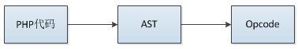

## 3.1 PHP代码的编译

PHP是解析型高级语言，事实上从Zend内核的角度来看PHP就是一个普通的C程序，它有main函数，我们写的PHP代码是这个程序的输入，然后经过内核的处理输出结果，内核将PHP代码"翻译"为C程序可识别的过程就是PHP的编译。

那么这个"翻译"过程具体都有哪些操作呢？

### 3.1.1 PHP的基本编译实现

C程序在编译时将一行行代码编译为机器码，每一个操作都认为是一条机器指令，这些指令写入到编译后的二进制程序中，执行的时候将二进制程序load进相应的内存区域(常量区、数据区、代码区)、分配运行栈，然后从代码区起始位置开始执行，这是C程序编译、执行的简单过程。

同样，PHP的编译与普通的C程序类似，只是PHP代码没有编译成机器码，而是解析成了若干条opcode数组，每条opcode就是C里面普通的struct，含义对应C程序的机器指令，执行的过程就是引擎依次执行opcode，比如我们在PHP里定义一个变量:`$a = 123;`，最终到内核里执行就是malloc一块内存，然后把值写进去。

所以PHP的解析过程任务就是将PHP代码转化为opcode数组，代码里的所有信息都保存在opcode中，然后将opcode数组交给zend引擎执行，opcode就是内核具体执行的命令，比如赋值、加减操作、函数调用等，每一条opcode都对应一个处理handle，这些handler是提前定义好的C函数。

从PHP代码到opcode是怎么实现的？最容易想到的方式就是正则匹配，当然过程没有这么简单。PHP编译过程包括词法分析、语法分析，使用re2c、bison完成，旧的PHP版本直接生成了opcode，PHP7新增了抽象语法树（AST），在语法分析阶段生成AST，然后再生成opcode数组。



re2c的示例:(http://re2c.org/examples/examples.html)
```c
#include <stdio.h>

static const char *lex(const char *YYCURSOR)
{
    const char *YYMARKER;
    /*!re2c
        re2c:define:YYCTYPE = char;
        re2c:yyfill:enable = 0;

        end = "\x00";
        bin = '0b' [01]+;
        oct = "0" [0-7]*;
        dec = [1-9][0-9]*;
        hex = '0x' [0-9a-fA-F]+;

        *       { return "err"; }
        bin end { return "bin"; }
        oct end { return "oct"; }
        dec end { return "dec"; }
        hex end { return "hex"; }
    */
}

int main(int argc, char **argv)
{
    for (int i = 1; i < argc; ++i) {
        printf ("%s: %s\n", lex(argv[i]), argv[i]);
    }
    return 0;
}
```
```
$ re2c -o example.cc 01_recognizing_integers.re
$ g++ -o example example.cc
$ ./example 0 12345678901234567890 0xAbcDEf 0x00 007 0B0 0b110101010 0x 0b ? ""
oct: 0
dec: 12345678901234567890
hex: 0xAbcDEf
hex: 0x00
oct: 007
bin: 0B0
bin: 0b110101010
err: 0x
err: 0b
err: ?
err:
```

### 3.1.2 编译过程
PHP编译阶段的基本过程如下图：


zendparse、zend_compile_top_stmt的过程没作深入研究，这里只大致说下这两个过程：zendparse是词法、语法分析过程，即前面提到的re2c、bison，这个过程将PHP代码解析为AST，解析过程确定了当前脚本定义了哪些变量，为这些变量按照顺序编号，这些值在使用时都是按照这个编号获取的，另外也将变量的初始化值、调用的函数/类/常量名称等值(称之为字面量)保存到zend_op_array.literals中，这些字面量也有一个唯一的编号，所以执行的过程实际就是根据各指令调用不同的C函数，然后根据变量、字面量、临时变量的编号对这些值进行处理加工。

PHP编译阶段最终的产物—opcode数组结构为：


```c
struct _zend_op_array {
    //common是普通函数或类成员方法对应的opcodes快速访问时使用的字段，后面分析PHP函数实现的时候会详细讲
    /* Common elements */
    zend_uchar type; //标识函数类型：1为PHP内部函数(扩展或内核提供的函数)、2为用户自定义函数(即PHP代码中写的function)
    zend_uchar arg_flags[3]; /* bitset of arg_info.pass_by_reference */
    uint32_t fn_flags;
    zend_string *function_name; //函数名
    zend_class_entry *scope; //所属class
    zend_function *prototype;
    uint32_t num_args; //参数数量
    uint32_t required_num_args; //必传参数数量
    zend_arg_info *arg_info; //参数信息
    /* END of common elements */

    uint32_t *refcount;

    uint32_t this_var;

    uint32_t last;
    //opcode指令数组
    zend_op *opcodes;

    //PHP代码里定义的变量数：op_type为IS_CV的变量，不含IS_TMP_VAR、IS_VAR的
    int last_var;
    //临时变量数:op_type为IS_TMP_VAR、IS_VAR的变量
    uint32_t T;
    //PHP变量名列表
    zend_string **vars;

    int last_brk_cont;
    int last_try_catch;
    zend_brk_cont_element *brk_cont_array;
    zend_try_catch_element *try_catch_array;

    //静态变量符号表:通过static声明的
    HashTable *static_variables;

    zend_string *filename; //PHP文件路径
    uint32_t line_start;
    uint32_t line_end;
    zend_string *doc_comment;
    uint32_t early_binding; /* the linked list of delayed declarations */

    //字面量数量
    int last_literal; 
    //字面量(常量)数组，这些都是在PHP代码定义的一些值
    zval *literals;

    //运行时缓存数组大小
    int  cache_size;
    //运行时缓存，主要用于缓存一些znode_op以便于快速获取数据，后面单独介绍这个机制
    void **run_time_cache;

    void *reserved[ZEND_MAX_RESERVED_RESOURCES];
};

struct _zend_op {
    const void *handler; //指令执行handler
    znode_op op1;   //操作数1
    znode_op op2;   //操作数2
    znode_op result; //返回值
    uint32_t extended_value; 
    uint32_t lineno; 
    zend_uchar opcode;  //opcode指令
    zend_uchar op1_type; //操作数1类型
    zend_uchar op2_type; //操作数2类型
    zend_uchar result_type; //返回值类型
};
```

opcode各字段含义下面展开说明。

#### 3.1.2.1 handler
handler为每条opcode对应的C语言编写的__处理过程__，所有opcode对应的处理过程定义在`zend_vm_def.h`中，值得注意的是这个文件并不是编译时用到的，因为opcode的__处理过程__有三种不同的提供形式：CALL、SWITCH、GOTO，默认方式为CALL，这个是什么意思呢？

每个opcode都代表了一些特定的处理操作，这个东西怎么提供呢？一种是把每种opcode负责的工作封装成一个function，然后执行器循环执行即可，这就是CALL模式的工作方式；另外一种是把所有opcode的处理方式通过C语言里面的label标签区分开，然后执行器执行的时候goto到相应的位置处理，这就是GOTO模式的工作方式；最后还有一种方式是把所有的处理方式写到一个switch下，然后通过case不同的opcode执行具体的操作，这就是SWITCH模式的工作方式。

假设opcode数组是这个样子：
```c
int op_array[] = {
    opcode_1,
    opcode_2,
    opcode_3,
    ...
};
```
各模式下的工作过程类似这样：
```c
//CALL模式
void opcode_1_handler() {...}

void opcode_2_handler() {...}
...

void execute(int []op_array)
{
    void *opcode_handler_list[] = {&opcode_1_handler, &opcode_2_handler, ...};

    while(1){
        void handler = opcode_handler_list[op_array[i]];
        handler(); //call handler
        i++;
    }
}

//GOTO模式
void execute(int []op_array)
{
    while(1){
        goto opcode_xx_handler_label;
    }

opcode_1_handler_label:
    ...

opcode_2_handler_label:
    ...
...
}

//SWITCH模式
void execute(int []op_array)
{
    while(1){
        switch(op_array[i]){
            case opcode_1:
                ...
            case opcode_2:
                ...
            ...
        }

        i++;
    }
}
```
三种模式效率是不同的，GOTO最快，怎么选择其它模式呢？下载PHP源码后不要直接编译，Zend目录下有个文件：`zend_vm_gen.php`，在编译PHP前执行：`php zend_vm_gen.php --with-vm-kind=CALL|SWITCH|GOTO`，这个脚本将重新生成:`zend_vm_opcodes.h`、`zend_vm_opcodes.c`、`zend_vm_execute.h`三个文件覆盖原来的，然后再编译PHP即可。

后面分析的过程使用的都是默认模式`CALL`，也就是opcode对应的handler为一个函数指针，编译时opcode对应的handler是如何根据opcode索引到的呢？

opcode的数值各不相同，同时可以根据两个zend_op的类型设置不同的处理handler，因此每个opcode指令最多有20个（25去掉重复的5个）对应的处理handler，所有的handler按照opcode数值的顺序定义在一个大数组中:`zend_opcode_handlers`，每25个为同一个opcode，如果对应的op_type类型handler则可以设置为空：
```c
//zend_vm_execute.h
void zend_init_opcodes_handlers(void)
{
    static const void *labels[] = {
        ZEND_NOP_SPEC_HANDLER,
        ZEND_NOP_SPEC_HANDLER,
        ...
    }；
    zend_opcode_handlers = labels;
}
```
索引的算法：
```c
//zend_vm_execute.h
static const void *zend_vm_get_opcode_handler(zend_uchar opcode, const zend_op* op)
{
        //因为op_type为2的倍数，所以这里做了下转化，转成了0-4
        static const int zend_vm_decode[] = {
            _UNUSED_CODE, /* 0              */
            _CONST_CODE,  /* 1 = IS_CONST   */
            _TMP_CODE,    /* 2 = IS_TMP_VAR */
            _UNUSED_CODE, /* 3              */
            _VAR_CODE,    /* 4 = IS_VAR     */
            _UNUSED_CODE, /* 5              */
            _UNUSED_CODE, /* 6              */
            _UNUSED_CODE, /* 7              */
            _UNUSED_CODE, /* 8 = IS_UNUSED  */
            _UNUSED_CODE, /* 9              */
            _UNUSED_CODE, /* 10             */
            _UNUSED_CODE, /* 11             */
            _UNUSED_CODE, /* 12             */
            _UNUSED_CODE, /* 13             */
            _UNUSED_CODE, /* 14             */
            _UNUSED_CODE, /* 15             */
            _CV_CODE      /* 16 = IS_CV     */
        };
        //根据op1_type、op2_type、opcode得到对应的handler
        return zend_opcode_handlers[opcode * 25 + zend_vm_decode[op->op1_type] * 5 + zend_vm_decode[op->op2_type]];
}

ZEND_API void zend_vm_set_opcode_handler(zend_op* op)
{
    //设置zend_op的handler，这个操作是在编译期间完成的
    op->handler = zend_vm_get_opcode_handler(zend_user_opcodes[op->opcode], op);
}

#define _CONST_CODE  0
#define _TMP_CODE    1
#define _VAR_CODE    2
#define _UNUSED_CODE 3
#define _CV_CODE     4
```

#### 3.1.2.2 操作数(znode_op)
操作数类型实际就是个32位整形，它主要用于存储一些变量的索引位置、数值记录等等。

```c
typedef union _znode_op {
    uint32_t      constant;
    uint32_t      var;
    uint32_t      num;
    uint32_t      opline_num; /*  Needs to be signed */
    uint32_t      jmp_offset;
} znode_op;
```
每条opcode都有两个操作数(不一定都用到)，操作数记录着当前指令的关键信息，可以用于变量的存储、访问，比如赋值语句："$a = 45;",两个操作数分别记录"$a"、"45"的存储位置，执行时根据op2取到值"45"，然后赋值给"$a"，而"$a"的位置通过op1获取到。当然操作数并不是全部这么用的，上面只是赋值时候的情况，其它操作会有不同的用法，如函数调用时的传参，op1记录的就是传递的参数是第几个，op2记录的是参数的存储位置，result记录的是函数接收参数的存储位置。

#### 3.1.2.3 操作数类型(op_type)

每个操作都有5种不同的类型：

```c
#define IS_CONST    (1<<0)  //1
#define IS_TMP_VAR  (1<<1)  //2
#define IS_VAR      (1<<2)  //4
#define IS_UNUSED   (1<<3)  //8
#define IS_CV       (1<<4)  //16
```
* IS_CONST：字面量，编译时就可确定且不会改变的值，比如:$a = "hello~"，其中字符串"hello~"就是常量
* IS_TMP_VAR：临时变量，比如：$a = "hello~" . time()，其中`"hello~" . time()`的值类型就是IS_TMP_VAR，再比如:$a = "123" + $b，`"123" + $b`的结果类型也是IS_TMP_VAR，从这两个例子可以猜测，临时变量多是执行期间其它类型组合现生成的一个中间值，由于它是现生成的，所以把IS_TMP_VAR赋值给IS_CV变量时不会增加其引用计数
* IS_VAR：PHP变量，这个很容易认为是PHP脚本里的变量，其实不是，这里PHP变量的含义可以这样理解：PHP变量是没有显式的在PHP脚本中定义的，不是直接在代码通过`$var_name`定义的。这个类型最常见的例子是PHP函数的返回值，再如`$a[0]`数组这种，它取出的值也是`IS_VAR`，再比如`$$a`这种
* IS_UNUSED：表示操作数没有用
* IS_CV：PHP脚本变量，即脚本里通过`$var_name`定义的变量，这些变量是编译阶段确定的，所以是compile variable，

`result_type`除了上面几种类型外还有一种类型`EXT_TYPE_UNUSED (1<<5)`，返回值没有使用时会用到，这个跟`IS_UNUSED`的区别是：`IS_UNUSED`表示本操作返回值没有意义(也可简单的认为没有返回值)，而`EXT_TYPE_UNUSED`的含义是有返回值，但是没有用到，比如函数返回值没有接收。

#### 3.1.2.4 字面量、变量的存储

我们先想一下C程序是如何读写字面量、变量的。

```c
#include <stdio.h>
int main()
{
    char *name = "pangudashu";

    printf("%s\n", name);
    return 0;
}
```
我们知道name的值分配在栈上，而"pangudashu"分配在常量区，那么"name"变量名分配在哪呢？

实际上C里面是不会存变量名称的，编译的过程会将变量名替换为偏移量表示：`ebp - 偏移量`或`esp + 偏移量`，将上面的代码转为汇编:
```c
.LC0:
    .string "pangudashu"
    .text
    .globl  main
    .type   main, @function
main:
.LFB0:
    pushq   %rbp
    movq    %rsp, %rbp
    subq    $16, %rsp
    movq    $.LC0, -8(%rbp)
    movq    -8(%rbp), %rax
    movq    %rax, %rdi
    call    puts
    movl    $0, %eax
    leave
```
可以看到`movq    $.LC0, -8(%rbp)`，而`-8(%rbp)`就是name变量。

虽然PHP代码不会直接编译为机器码，但编译、执行的设计跟C程序是一致的，也有常量区、变量也通过偏移量访问、也有虚拟的执行栈。


在编译时就可确定且不会改变的量称为字面量，也称作常量(IS_CONST)，这些值在编译阶段就已经分配zval，保存在`zend_op_array->literals`数组中(对应c程序的常量内存区)，访问时通过`_zend_op_array->literals + 偏移量`读取，举个例子：
```c
<?php
$a = 56;
$b = "hello";
```
`56`通过`(zval*)(_zend_op_array->literals + 0)`取到，`hello`通过`(zval*)(_zend_op_array->literals + 16)`取到,具体变量的读写操作将在执行阶段详细分析，这里只分析编译阶段的操作。
