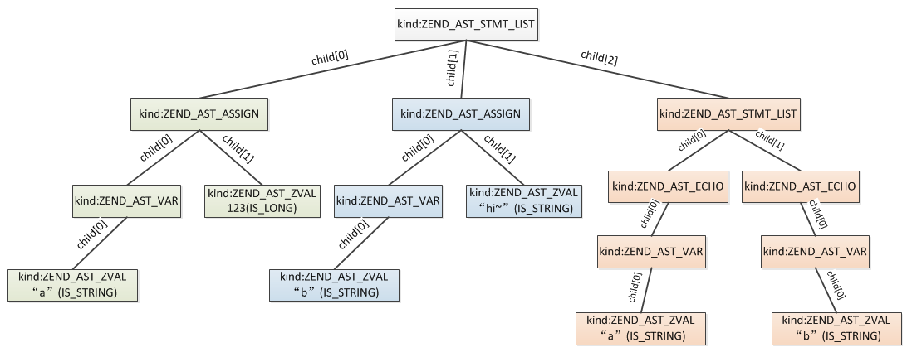
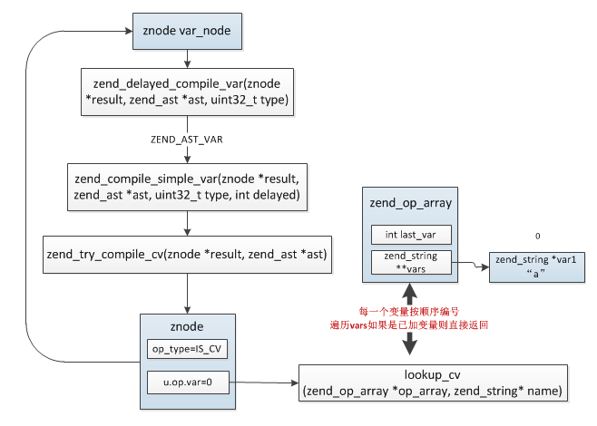
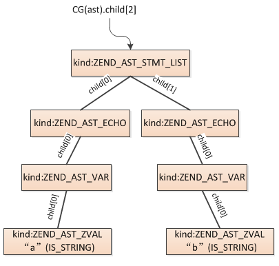
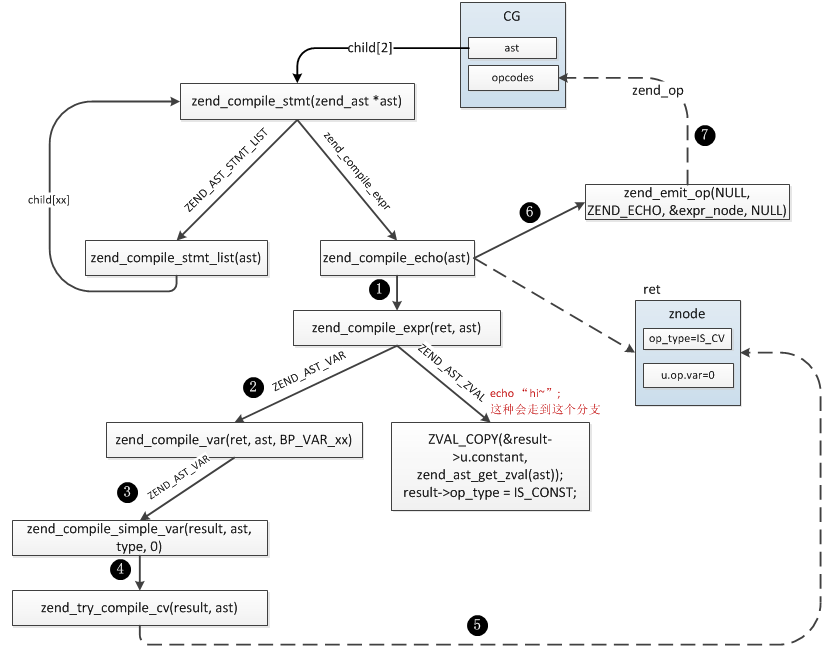

### 3.1.2 抽象语法树编译流程

上一小节我们简单介绍了从PHP代码解析为抽象语法树的过程，这一节我们再介绍下从__抽象语法树->Opcodes__的过程。

语法解析过程的产物保存于CG(AST)，接着zend引擎会把AST进一步编译为__zend_op_array__，它是编译阶段最终的产物，也是执行阶段的输入，后面我们介绍的东西基本都是围绕zend_op_array展开的，AST解析过程确定了当前脚本定义了哪些变量，并为这些变量__顺序编号__，这些值在使用时都是按照这个编号获取的，另外也将变量的初始化值、调用的函数/类/常量名称等值(称之为字面量)保存到zend_op_array.literals中，这些字面量也有一个唯一的编号，所以执行的过程实际就是根据各指令调用不同的C函数，然后根据变量、字面量、临时变量的编号对这些值进行处理加工。

我们首先看下zend_op_array的结构，明确几个关键信息，然后再看下ast编译为zend_op_array的过程。
#### 3.1.2.1 zend_op_array数据结构
PHP主脚本会生成一个zend_op_array，每个function也会编译为独立的zend_op_array，所以从二进制程序的角度看zend_op_array包含着当前作用域下的所有堆栈信息，函数调用实际就是不同zend_op_array间的切换。


```c
struct _zend_op_array {
    //common是普通函数或类成员方法对应的opcodes快速访问时使用的字段，后面分析PHP函数实现的时候会详细讲
    ...

    uint32_t *refcount;

    uint32_t this_var;

    uint32_t last;
    //opcode指令数组
    zend_op *opcodes;

    //PHP代码里定义的变量数：op_type为IS_CV的变量，不含IS_TMP_VAR、IS_VAR的
    //编译前此值为0，然后发现一个新变量这个值就加1
    int last_var;
    //临时变量数:op_type为IS_TMP_VAR、IS_VAR的变量
    uint32_t T;
    //PHP变量名数组
    zend_string **vars; //这个数组在ast编译期间配合last_var用来确定各个变量的编号，非常重要的一步操作
    ...

    //静态变量符号表:通过static声明的
    HashTable *static_variables;
    ...

    //字面量数量
    int last_literal; 
    //字面量(常量)数组，这些都是在PHP代码定义的一些值
    zval *literals;

    //运行时缓存数组大小
    int  cache_size;
    //运行时缓存，主要用于缓存一些znode_op以便于快速获取数据，后面单独介绍这个机制
    void **run_time_cache;

    void *reserved[ZEND_MAX_RESERVED_RESOURCES];
};
```
zend_op_array.opcodes指向指令列表，具体每条指令的结构如下：
```c
struct _zend_op {
    const void *handler; //指令执行handler
    znode_op op1;   //操作数1
    znode_op op2;   //操作数2
    znode_op result; //返回值
    uint32_t extended_value; 
    uint32_t lineno; 
    zend_uchar opcode;  //opcode指令
    zend_uchar op1_type; //操作数1类型
    zend_uchar op2_type; //操作数2类型
    zend_uchar result_type; //返回值类型
};

//操作数结构
typedef union _znode_op {
    uint32_t      constant;
    uint32_t      var;
    uint32_t      num;
    uint32_t      opline_num; /*  Needs to be signed */
    uint32_t      jmp_offset;
} znode_op;
```
opcode各字段含义下面展开说明。

##### 3.1.2.1.1 handler
handler为每条opcode对应的C语言编写的__处理过程__，所有opcode对应的处理过程定义在`zend_vm_def.h`中，值得注意的是这个文件并不是编译时用到的，因为opcode的__处理过程__有三种不同的提供形式：CALL、SWITCH、GOTO，默认方式为CALL，这个是什么意思呢？

每个opcode都代表了一些特定的处理操作，这个东西怎么提供呢？一种是把每种opcode负责的工作封装成一个function，然后执行器循环执行即可，这就是CALL模式的工作方式；另外一种是把所有opcode的处理方式通过C语言里面的label标签区分开，然后执行器执行的时候goto到相应的位置处理，这就是GOTO模式的工作方式；最后还有一种方式是把所有的处理方式写到一个switch下，然后通过case不同的opcode执行具体的操作，这就是SWITCH模式的工作方式。

假设opcode数组是这个样子：
```c
int op_array[] = {
    opcode_1,
    opcode_2,
    opcode_3,
    ...
};
```
各模式下的工作过程类似这样：
```c
//CALL模式
void opcode_1_handler() {...}

void opcode_2_handler() {...}
...

void execute(int []op_array)
{
    void *opcode_handler_list[] = {&opcode_1_handler, &opcode_2_handler, ...};

    while(1){
        void handler = opcode_handler_list[op_array[i]];
        handler(); //call handler
        i++;
    }
}

//GOTO模式
void execute(int []op_array)
{
    while(1){
        goto opcode_xx_handler_label;
    }

opcode_1_handler_label:
    ...

opcode_2_handler_label:
    ...
...
}

//SWITCH模式
void execute(int []op_array)
{
    while(1){
        switch(op_array[i]){
            case opcode_1:
                ...
            case opcode_2:
                ...
            ...
        }

        i++;
    }
}
```
三种模式效率是不同的，GOTO最快，怎么选择其它模式呢？下载PHP源码后不要直接编译，Zend目录下有个文件：`zend_vm_gen.php`，在编译PHP前执行：`php zend_vm_gen.php --with-vm-kind=CALL|SWITCH|GOTO`，这个脚本将重新生成:`zend_vm_opcodes.h`、`zend_vm_opcodes.c`、`zend_vm_execute.h`三个文件覆盖原来的，然后再编译PHP即可。

后面分析的过程使用的都是默认模式`CALL`，也就是opcode对应的handler为一个函数指针，编译时opcode对应的handler是如何根据opcode索引到的呢？

opcode的数值各不相同，同时可以根据两个zend_op的类型设置不同的处理handler，因此每个opcode指令最多有20个（25去掉重复的5个）对应的处理handler，所有的handler按照opcode数值的顺序定义在一个大数组中:`zend_opcode_handlers`，每25个为同一个opcode，如果对应的op_type类型handler则可以设置为空：
```c
//zend_vm_execute.h
void zend_init_opcodes_handlers(void)
{
    static const void *labels[] = {
        ZEND_NOP_SPEC_HANDLER,
        ZEND_NOP_SPEC_HANDLER,
        ...
    }；
    zend_opcode_handlers = labels;
}
```
索引的算法：

```c
//zend_vm_execute.h
static const void *zend_vm_get_opcode_handler(zend_uchar opcode, const zend_op* op)
{
        //因为op_type为2的倍数，所以这里做了下转化，转成了0-4
        static const int zend_vm_decode[] = {
            _UNUSED_CODE, /* 0              */
            _CONST_CODE,  /* 1 = IS_CONST   */
            _TMP_CODE,    /* 2 = IS_TMP_VAR */
            _UNUSED_CODE, /* 3              */
            _VAR_CODE,    /* 4 = IS_VAR     */
            _UNUSED_CODE, /* 5              */
            _UNUSED_CODE, /* 6              */
            _UNUSED_CODE, /* 7              */
            _UNUSED_CODE, /* 8 = IS_UNUSED  */
            _UNUSED_CODE, /* 9              */
            _UNUSED_CODE, /* 10             */
            _UNUSED_CODE, /* 11             */
            _UNUSED_CODE, /* 12             */
            _UNUSED_CODE, /* 13             */
            _UNUSED_CODE, /* 14             */
            _UNUSED_CODE, /* 15             */
            _CV_CODE      /* 16 = IS_CV     */
        };
        //根据op1_type、op2_type、opcode得到对应的handler
        return zend_opcode_handlers[opcode * 25 + zend_vm_decode[op->op1_type] * 5 + zend_vm_decode[op->op2_type]];
}

ZEND_API void zend_vm_set_opcode_handler(zend_op* op)
{
    //设置zend_op的handler，这个操作是在编译期间完成的
    op->handler = zend_vm_get_opcode_handler(zend_user_opcodes[op->opcode], op);
}

#define _CONST_CODE  0
#define _TMP_CODE    1
#define _VAR_CODE    2
#define _UNUSED_CODE 3
#define _CV_CODE     4
```
##### 3.1.2.1.2 操作数(znode_op)
操作数类型实际就是个32位整形，它主要用于存储一些变量的索引位置、数值记录等等。

```c
typedef union _znode_op {
    uint32_t      constant;
    uint32_t      var;
    uint32_t      num;
    uint32_t      opline_num; /*  Needs to be signed */
    uint32_t      jmp_offset;
} znode_op;
```
每条opcode都有两个操作数(不一定都用到)，操作数记录着当前指令的关键信息，可以用于变量的存储、访问，比如赋值语句："$a = 45;",两个操作数分别记录"$a"、"45"的存储位置，执行时根据op2取到值"45"，然后赋值给"$a"，而"$a"的位置通过op1获取到。当然操作数并不是全部这么用的，上面只是赋值时候的情况，其它操作会有不同的用法，如函数调用时的传参，op1记录的就是传递的参数是第几个，op2记录的是参数的存储位置，result记录的是函数接收参数的存储位置。

##### 3.1.2.1.3 操作数类型(op_type)

每个操作都有5种不同的类型：

```c
#define IS_CONST    (1<<0)  //1
#define IS_TMP_VAR  (1<<1)  //2
#define IS_VAR      (1<<2)  //4
#define IS_UNUSED   (1<<3)  //8
#define IS_CV       (1<<4)  //16
```
* IS_CONST：字面量，编译时就可确定且不会改变的值，比如:$a = "hello~"，其中字符串"hello~"就是常量
* IS_TMP_VAR：临时变量，比如：$a = "hello~" . time()，其中`"hello~" . time()`的值类型就是IS_TMP_VAR，再比如:$a = "123" + $b，`"123" + $b`的结果类型也是IS_TMP_VAR，从这两个例子可以猜测，临时变量多是执行期间其它类型组合现生成的一个中间值，由于它是现生成的，所以把IS_TMP_VAR赋值给IS_CV变量时不会增加其引用计数
* IS_VAR：PHP变量，这个很容易认为是PHP脚本里的变量，其实不是，这里PHP变量的含义可以这样理解：PHP变量是没有显式的在PHP脚本中定义的，不是直接在代码通过`$var_name`定义的。这个类型最常见的例子是PHP函数的返回值，再如`$a[0]`数组这种，它取出的值也是`IS_VAR`，再比如`$$a`这种
* IS_UNUSED：表示操作数没有用
* IS_CV：PHP脚本变量，即脚本里通过`$var_name`定义的变量，这些变量是编译阶段确定的，所以是compile variable，

`result_type`除了上面几种类型外还有一种类型`EXT_TYPE_UNUSED (1<<5)`，返回值没有使用时会用到，这个跟`IS_UNUSED`的区别是：`IS_UNUSED`表示本操作返回值没有意义(也可简单的认为没有返回值)，而`EXT_TYPE_UNUSED`的含义是有返回值，但是没有用到，比如函数返回值没有接收。

##### 3.1.2.1.4 字面量、变量的存储

我们先想一下C程序是如何读写字面量、变量的。

```c
#include <stdio.h>
int main()
{
    char *name = "pangudashu";

    printf("%s\n", name);
    return 0;
}
```
我们知道name的值分配在栈上，而"pangudashu"分配在常量区，那么"name"变量名分配在哪呢？

实际上C里面是不会存变量名称的，编译的过程会将变量名替换为偏移量表示：`ebp - 偏移量`或`esp + 偏移量`，将上面的代码转为汇编:
```c
.LC0:
    .string "pangudashu"
    .text
    .globl  main
    .type   main, @function
main:
.LFB0:
    pushq   %rbp
    movq    %rsp, %rbp
    subq    $16, %rsp
    movq    $.LC0, -8(%rbp)
    movq    -8(%rbp), %rax
    movq    %rax, %rdi
    call    puts
    movl    $0, %eax
    leave
```
可以看到`movq    $.LC0, -8(%rbp)`，而`-8(%rbp)`就是name变量。

虽然PHP代码不会直接编译为机器码，但编译、执行的设计跟C程序是一致的，也有常量区、变量也通过偏移量访问、也有虚拟的执行栈。


在编译时就可确定且不会改变的量称为字面量，也称作常量(IS_CONST)，这些值在编译阶段就已经分配zval，保存在`zend_op_array->literals`数组中(对应c程序的常量内存区)，访问时通过`_zend_op_array->literals + 偏移量`读取，举个例子：
```c
<?php
$a = 56;
$b = "hello";
```
`56`通过`(zval*)(_zend_op_array->literals + 0)`取到，`hello`通过`(zval*)(_zend_op_array->literals + 16)`取到,具体变量的读写操作将在执行阶段详细分析，这里只分析编译阶段的操作。

#### 3.1.2.2 AST->zend_op_array
上面我们介绍了zend_op_array结构，接下来我们回过头去看下语法解析(zendparse())之后的流程:

```c
ZEND_API zend_op_array *compile_file(zend_file_handle *file_handle, int type)
{
    zend_op_array *op_array = NULL; //编译出的opcodes
    ...

    if (open_file_for_scanning(file_handle)==FAILURE) {//文件打开失败
        ...
    } else {
        zend_bool original_in_compilation = CG(in_compilation);
        CG(in_compilation) = 1;

        CG(ast) = NULL;
        CG(ast_arena) = zend_arena_create(1024 * 32);
        if (!zendparse()) { //语法解析
            zval retval_zv;
            zend_file_context original_file_context; //保存原来的zend_file_context
            zend_oparray_context original_oparray_context; //保存原来的zend_oparray_context
            zend_op_array *original_active_op_array = CG(active_op_array);
            op_array = emalloc(sizeof(zend_op_array)); //分配zend_op_array结构
            init_op_array(op_array, ZEND_USER_FUNCTION, INITIAL_OP_ARRAY_SIZE);//初始化op_array
            CG(active_op_array) = op_array; //将当前正在编译op_array指向当前
            ZVAL_LONG(&retval_zv, 1);

            if (zend_ast_process) {
                zend_ast_process(CG(ast));
            }

            zend_file_context_begin(&original_file_context); //初始化CG(file_context)
            zend_oparray_context_begin(&original_oparray_context); //初始化CG(context)
            zend_compile_top_stmt(CG(ast)); //AST->zend_op_array编译流程
            zend_emit_final_return(&retval_zv); //设置最后的返回值
            op_array->line_start = 1;
            op_array->line_end = CG(zend_lineno);
            pass_two(op_array);
            zend_oparray_context_end(&original_oparray_context);
            zend_file_context_end(&original_file_context);

            CG(active_op_array) = original_active_op_array;
        }
        ...
    }
    ...

    return op_array;
}
```
compile_file()操作中有几个保存原来值的操作，这是因为这个函数在PHP脚本执行中并不会只执行一次，主脚本执行时会第一次调用，而include、require也会调用，所以需要先保存当前值，然后执行完再还原回去。

AST->zend_op_array编译是在__zend_compile_top_stmt()__中完成，这个函数是总入口，会被多次递归调用：
```c
//zend_compile.c
void zend_compile_top_stmt(zend_ast *ast)
{
    if (!ast) {
        return;
    }

    if (ast->kind == ZEND_AST_STMT_LIST) { //第一次进来一定是这种类型
        zend_ast_list *list = zend_ast_get_list(ast);
        uint32_t i;
        for (i = 0; i < list->children; ++i) {
            zend_compile_top_stmt(list->child[i]);//list各child语句相互独立，递归编译
        }
        return;
    }

    //各语句编译入口
    zend_compile_stmt(ast);

    if (ast->kind != ZEND_AST_NAMESPACE && ast->kind != ZEND_AST_HALT_COMPILER) {
        zend_verify_namespace();
    }
    //function、class两种情况的处理，非常关键的一步操作，后面分析函数、类实现的章节再详细分析
    if (ast->kind == ZEND_AST_FUNC_DECL || ast->kind == ZEND_AST_CLASS) {
        CG(zend_lineno) = ((zend_ast_decl *) ast)->end_lineno;
        zend_do_early_binding();
    }
}
```
首先从AST的根节点开始编译，根节点类型为ZEND_AST_STMT_LIST，这个类型表示当前节点下有多个独立的节点，各child都是独立的语句生成的节点，所以依次编译即可，直到到达有效节点位置(非ZEND_AST_STMT_LIST节点)，然后调用`zend_compile_stmt`编译当前节点：
```c
void zend_compile_stmt(zend_ast *ast)
{
    CG(zend_lineno) = ast->lineno;

    switch (ast->kind) {
        case xxx:
            ...
                break;
        case ZEND_AST_ECHO:
            zend_compile_echo(ast);
            break;
        ...
        default:
        {
            znode result;
            zend_compile_expr(&result, ast);
            zend_do_free(&result);
        }
    }
    
    if (FC(declarables).ticks && !zend_is_unticked_stmt(ast)) {
        zend_emit_tick();
    }
}
```
主要根据不同的节点类型(kind)作不同的处理，我们不会把每种类型的处理都讲一遍，这里还是根据上一节最后的例子挑几个看下具体的处理过程。
```php
$a = 123;
$b = "hi~";

echo $a,$b;
```
zendparse()阶段生成的AST：



下面的过程比较复杂，有的函数会多次递归调用，我们根据例子一步步去看下，如果你对PHP各个语法实现比较熟悉再去看整个AST的编译过程就会比较轻松。

> __(1)、__ 首先从根节点开始，有3个child，第一个节点类型为ZEND_AST_ASSIGN，zend_compile_stmt()中走到default分支

> __(2)、__ ZEND_AST_ASSIGN类型由zend_compile_expr()处理：

```c
void zend_compile_expr(znode *result, zend_ast *ast)
{
    CG(zend_lineno) = zend_ast_get_lineno(ast);
    switch (ast->kind) {
        case ZEND_AST_ZVAL:
            ZVAL_COPY(&result->u.constant, zend_ast_get_zval(ast));
            result->op_type = IS_CONST;
            return;
        case ZEND_AST_VAR:
            zend_compile_var(result, ast, BP_VAR_R);
            return;
        case ZEND_AST_ASSIGN:
            zend_compile_assign(result, ast);
            return;
        ...
    }
}
```
> 继续进入zend_compile_assign()：
```c
void zend_compile_assign(znode *result, zend_ast *ast)
{
    zend_ast *var_ast = ast->child[0]; //变量名
    zend_ast *expr_ast = ast->child[1];//变量值表达式

    znode var_node, expr_node;
    zend_op *opline;
    uint32_t offset;

    if (is_this_fetch(var_ast)) { //检查变量名是否为this，变量名不能是this
        zend_error_noreturn(E_COMPILE_ERROR, "Cannot re-assign $this");
    }

    //比如这样写：my_function() = 123;即：将函数的返回值作为变量名将报错
    zend_ensure_writable_variable(var_ast);

    switch (var_ast->kind) {
        case ZEND_AST_VAR:
        case ZEND_AST_STATIC_PROP:
            offset = zend_delayed_compile_begin();
            zend_delayed_compile_var(&var_node, var_ast, BP_VAR_W); //生成变量名的znode，这个结构只在这个地方临时用，所以直接分配在stack上
            zend_compile_expr(&expr_node, expr_ast); //递归编译变量值表达式，最终需要得到一个ZEND_AST_ZVAL的节点
            zend_delayed_compile_end(offset);
            zend_emit_op(result, ZEND_ASSIGN, &var_node, &expr_node); //生成一条op
            return;
        ...
    }
}
```
> 这个地方主要有三步关键操作：

>> __第1步：__ 变量赋值操作有两部分：变量名、变量值，所以首先是针对变量名的操作，介绍zend_op_array时曾提到每个PHP变量都有一个编号，变量的读写都是根据这个编号操作的，这个编号最早就是这一步生成的。



>> 中间过程我们不再细看，这里重点看下变量编号的过程，这个过程比较简单，每发现一个变量就遍历zend_op_array.vars数组，看此变量是否已经保存，没有保存的话则存入vars，然后后续变量的使用都是用的这个变量在数组中的下标，比如第一次定义的时候：`$a = 123；`将$a编号为0，然后：`echo $a;`再次使用时会遍历vars，发现已经存在，直接用其下标操作$a。
```c
static int lookup_cv(zend_op_array *op_array, zend_string* name)
{
    int i = 0;
    zend_ulong hash_value = zend_string_hash_val(name);

    //遍历op_array.vars检查此变量是否已存在
    while (i < op_array->last_var) {
        if (ZSTR_VAL(op_array->vars[i]) == ZSTR_VAL(name) ||
                (ZSTR_H(op_array->vars[i]) == hash_value &&
                 ZSTR_LEN(op_array->vars[i]) == ZSTR_LEN(name) &&
                 memcmp(ZSTR_VAL(op_array->vars[i]), ZSTR_VAL(name), ZSTR_LEN(name)) == 0)) {
            zend_string_release(name);
            return (int)(zend_intptr_t)ZEND_CALL_VAR_NUM(NULL, i);
        }
        i++;
    }
    //这是一个新变量
    i = op_array->last_var;
    op_array->last_var++;
    if (op_array->last_var > CG(context).vars_size) {
        CG(context).vars_size += 16; /* FIXME */
        op_array->vars = erealloc(op_array->vars, CG(context).vars_size * sizeof(zend_string*));//扩容vars
    }

    op_array->vars[i] = zend_new_interned_string(name);
    return (int)(zend_intptr_t)ZEND_CALL_VAR_NUM(NULL, i); //传NULL时返回的是96 + i*sizeof(zval)
}
```
>> __注意：这里变量的编号从0、1、2、3...依次递增的，但是实际使用中并不是直接用的这个下标，而是转化成了内存偏移量offset，这个是`ZEND_CALL_VAR_NUM`宏处理的，所以变量偏移量实际是96、112、128...递增的，这个96是根据zend_execute_data大小设定的(不同的平台下对应的值可能不同)，下一篇介绍zend执行流程时会详细介绍这个结构。
```c
#define ZEND_CALL_FRAME_SLOT \
    ((int)((ZEND_MM_ALIGNED_SIZE(sizeof(zend_execute_data)) + ZEND_MM_ALIGNED_SIZE(sizeof(zval)) - 1) / ZEND_MM_ALIGNED_SIZE(sizeof(zval))))

#define ZEND_CALL_VAR_NUM(call, n) \
    (((zval*)(call)) + (ZEND_CALL_FRAME_SLOT + ((int)(n))))
```
>> __第2步：__ 编译变量值表达式，再次调用zend_compile_expr()编译，示例中的情况比较简单，expr_ast.kind为ZEND_AST_ZVAL：
```c
void zend_compile_expr(znode *result, zend_ast *ast)
{
    switch (ast->kind) {
        case ZEND_AST_ZVAL:
            ZVAL_COPY(&result->u.constant, zend_ast_get_zval(ast)); //将变量值复制到znode.u.constant中
            result->op_type = IS_CONST; //类型为IS_CONST，这种value后面将会保存在zend_op_array.literals中
            return;
        ...
    }
}
```
>> __第3步：__ 上面两步已经分别生成了变量赋值的op1、op2，下面就是根据这俩值生成opcode的过程。
```c
tatic zend_op *zend_emit_op(znode *result, zend_uchar opcode, znode *op1, znode *op2)
{
    zend_op *opline = get_next_op(CG(active_op_array)); //当前zend_op_array下生成一条新的指令
    opline->opcode = opcode;

    //将op1、op2内容拷贝到zend_op中，设置op_type
    //如果znode.op_type == IS_CONST，则会将znode.u.contstant值转移到zend_op_array.literals中
    if (op1 == NULL) {
        SET_UNUSED(opline->op1);
    } else {
        SET_NODE(opline->op1, op1);
    }

    if (op2 == NULL) {
        SET_UNUSED(opline->op2);
    } else {
        SET_NODE(opline->op2, op2);
    }

    //如果此指令有返回值则想变量那样为返回值编号（后面分配局部变量时将根据这个编号索引）
    if (result) {
        zend_make_var_result(result, opline);
    }
    return opline;
}

static inline void zend_make_var_result(znode *result, zend_op *opline)
{
    opline->result_type = IS_VAR; //返回值类型固定为IS_VAR
    opline->result.var = get_temporary_variable(CG(active_op_array)); //为返回值编个号，这个编号记在临时变量T上，上面介绍zend_op_array时说过T、last_var的区别
    GET_NODE(result, opline->result);
}
```
>> 到这我们示例中的第1条赋值语句就算编译完了，第2条同样是赋值，过程与上面相同，我们直接看最好一条输出的语句。

> __(3)、__ echo语句的编译:`echo $a,$b;`实际从编译后的语法树就可以看出，一次echo多个也被编译为多次echo了，所以示例中的用法与：`echo $a; echo $b;`等价，我们只分析其中一个就可以了。



> `zend_compile_stmt()`中首先发现节点类型是`ZEND_AST_STMT_LIST`，然后调用`zend_compile_stmt_list()`分别编译child，具体的流程如下图所示：



> 最后生成`zend_op`的过程：
```c
void zend_compile_echo(zend_ast *ast)
{       
    zend_op *opline;
    zend_ast *expr_ast = ast->child[0];

    znode expr_node;
    zend_compile_expr(&expr_node, expr_ast);

    opline = zend_emit_op(NULL, ZEND_ECHO, &expr_node, NULL);//生成1条新的opcode
    opline->extended_value = 0;
} 
```

最终`zend_compile_top_stmt()`编译完成后`CG(active_op_array)`结构：


