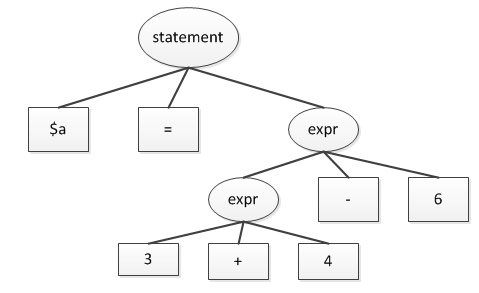
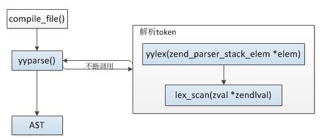

### 3.1.1 词法解析、语法解析
这一节我们分析下PHP的解析阶段，即__PHP代码->抽象语法树(AST)__的过程。

PHP使用re2c、bison完成这个阶段的工作:
* __re2c__：词法分析器，将输入分割为一个个有意义的词块，称为token
* __bison__：语法分析器，确定词法分析器分割出的token是如何彼此关联的

例如：
```php
$a = 2 + 3;
```
词法分析器将上面的语句分解为这些token：$a、=、2、+、3，接着语法分析器确定了`2+3`是一个表达式，而这个表达式被赋值给了`a`，我们可以这样定义词法解析规则：
```c
/*!re2c
    LABEL   [a-zA-Z_\x7f-\xff][a-zA-Z0-9_\x7f-\xff]*
    LNUM    [0-9]+

    //规则
    "$"{LABEL} {return T_VAR;}
    {LNUM} {return T_NUM;}
*/
```
然后定义语法解析规则：
```c
//token定义
%token T_VAR
%token T_NUM

//语法规则
statement:
    T_VAR '=' T_NUM '+' T_NUM {ret = str2int($3) + str2int($5);printf("%d",ret);}
;
```
上面的语法规则只能识别两个数值相加，假如我们希望支持更复杂的运算，比如：
```php
$a = 3 + 4 - 6;
```
则可以配置递归规则：
```c
//语法规则
statement:
    T_VAR '=' expr {}
;
expr:
    T_NUM {...}
    |expr '?' T_NUM {}
;
```
这样将支持若干表达式，用语法分析树表示：



这里不再对re2c、bison作更多解释，想要了解更多的推荐看下《flex与bison》这本书，接下来我们看下PHP具体的解析过程。

PHP编译阶段流程：


其中__zendparse()__就是词法、语法解析过程，这个函数实际就是bison中提供的语法解析函数__yyparse()__：
```c
#define yyparse         zendparse
```
__yyparse()__不断调用__yylex()__得到token，然后根据token匹配语法规则：



```c
#define yylex           zendlex

//zend_compile.c
int zendlex(zend_parser_stack_elem *elem)
{
    zval zv;
    int retval;
    ...

again:
    ZVAL_UNDEF(&zv);
    retval = lex_scan(&zv);
    if (EG(exception)) {
        //语法错误
        return T_ERROR;
    }
    ...

    if (Z_TYPE(zv) != IS_UNDEF) {
        //如果在分割token中有zval生成则将其值复制到zend_ast_zval结构中
        elem->ast = zend_ast_create_zval(&zv);
    }

    return retval;
}
```
这里两个关键点需要注意：
__(1) token值__：词法解析器解析到的token值内容就是token值，这些值统一通过__zval__存储，上面的过程中可以看到调用lex_scan参数是是个zval*，在具体的命中规则总会将解析到的token保存到这个值，从而传递给语法解析器使用，比如PHP中的解析变量的规则：`$a;`，其词法解析规则为：
```c
<ST_IN_SCRIPTING,ST_DOUBLE_QUOTES,ST_HEREDOC,ST_BACKQUOTE,ST_VAR_OFFSET>"$"{LABEL} {
    //将匹配到的token值保存在zval中
    zend_copy_value(zendlval, (yytext+1), (yyleng-1)); //只保存{LABEL}内容，不包括$，所以是yytext+1
    RETURN_TOKEN(T_VARIABLE);
}
```
zendlval就是我们传入的zval*，yytext指向命中的token值起始位置，yyleng为token值的长度。

__(2) 语义值类型__：bison调用re2c分割token有两个含义，第一个是token类型，另一个是token值，token类型一般以yylex的返回值告诉bison，而token值就是语义值，这个值一般定义为固定的类型，这个类型就是语义值类型，默认为int，可以通过__YYSTYPE__定义，而PHP中这个类型是__zend_parser_stack_elem__，这就是为什么zendlex的参数为zend_parser_stack_elem的原因。
```c
#define YYSTYPE zend_parser_stack_elem

typedef union _zend_parser_stack_elem {
    zend_ast *ast;
    zend_string *str;
    zend_ulong num;
} zend_parser_stack_elem;
```
实际这是个union，ast类型用的比较多(其它两种类型暂时没发现有地方在用)，这样可以通过%token、%type将对应的值修改为elem.ast，所以在zend_language_parser.y中使用的$$、$1、$2......多数都是__zend_parser_stack_elem.ast__：
```c
%token <ast> T_LNUMBER   "integer number (T_LNUMBER)"
%token <ast> T_DNUMBER   "floating-point number (T_DNUMBER)"
%token <ast> T_STRING    "identifier (T_STRING)"
%token <ast> T_VARIABLE  "variable (T_VARIABLE)"

%type <ast> top_statement namespace_name name statement function_declaration_statement
%type <ast> class_declaration_statement trait_declaration_statement
%type <ast> interface_declaration_statement interface_extends_list
```

