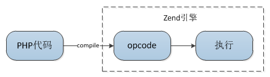
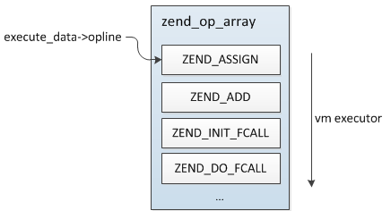
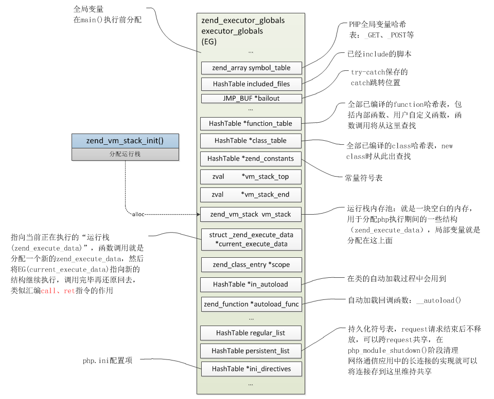
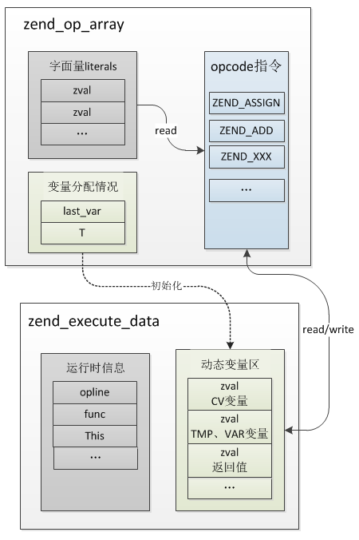
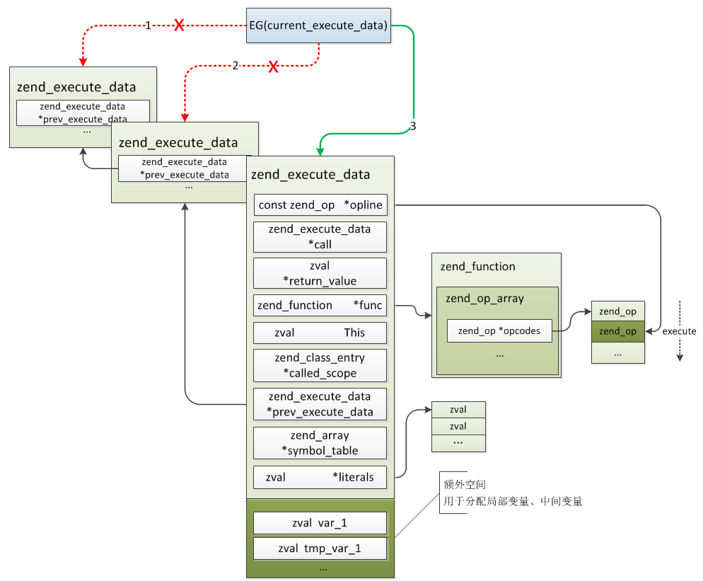
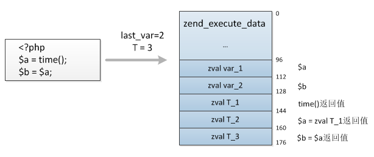
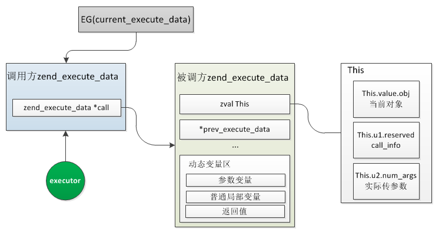
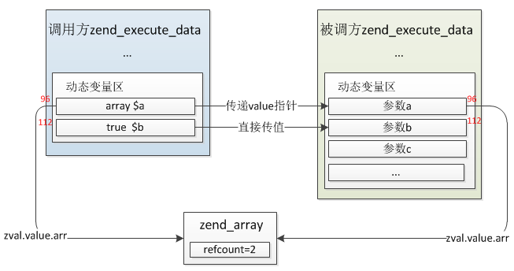
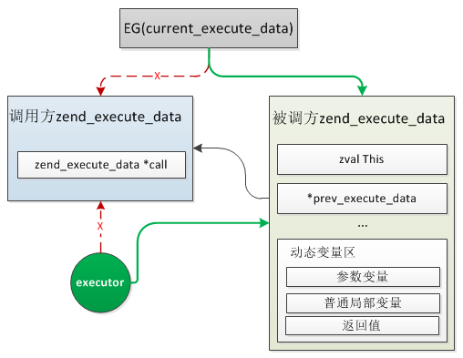
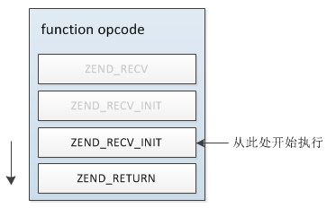

## 3.3 Zend引擎执行过程
Zend引擎主要包含两个核心部分：编译、执行：



前面分析了Zend的编译过程以及PHP用户函数的实现，接下来分析下Zend引擎的执行过程。

### 3.3.1 数据结构
执行流程中有几个重要的数据结构，先看下这几个结构。

#### 3.3.1.1 opcode
opcode是将PHP代码编译产生的Zend虚拟机可识别的指令，php7共有173个opcode，定义在`zend_vm_opcodes.h`中，PHP中的所有语法实现都是由这些opcode组成的。

```c
struct _zend_op {
    const void *handler; //对应执行的C语言function，即每条opcode都有一个C function处理
    znode_op op1;   //操作数1
    znode_op op2;   //操作数2
    znode_op result; //返回值
    uint32_t extended_value; 
    uint32_t lineno; 
    zend_uchar opcode;  //opcode指令
    zend_uchar op1_type; //操作数1类型
    zend_uchar op2_type; //操作数2类型
    zend_uchar result_type; //返回值类型
};
```

#### 3.3.1.2 zend_op_array
`zend_op_array`是Zend引擎执行阶段的输入，整个执行阶段的操作都是围绕着这个结构，关于其具体结构前面我们已经讲过了。



这里再重复说下zend_op_array几个核心组成部分：
* __opcode指令__：即PHP代码具体对应的处理动作，与二进制程序中的代码段对应
* __字面量存储__：PHP代码中定义的一些变量初始值、调用的函数名称、类名称、常量名称等等称之为字面量，这些值用于执行时初始化变量、函数调用等等
* __变量分配情况__：与字面量类似，这里指的是当前opcodes定义了多少变量、临时变量，每个变量都有一个对应的编号，执行初始化按照总的数目一次性分配zval，使用时也完全按照编号索引，而不是根据变量名索引

#### 3.3.1.3 zend_executor_globals
`zend_executor_globals executor_globals`是PHP整个生命周期中最主要的一个结构，是一个全局变量，在main执行前分配(非ZTS下)，直到PHP退出，它记录着当前请求全部的信息，经常见到的一个宏`EG`操作的就是这个结构。
```c
//zend_compile.c
#ifndef ZTS
ZEND_API zend_compiler_globals compiler_globals;
ZEND_API zend_executor_globals executor_globals;
#endif

//zend_globals_macros.h
# define EG(v) (executor_globals.v)
```
`zend_executor_globals`结构非常大，定义在`zend_globals.h`中，比较重要的几个字段含义如下图所示：



#### 3.3.1.4 zend_execute_data
`zend_execute_data`是执行过程中最核心的一个结构，每次函数的调用、include/require、eval等都会生成一个新的结构，它表示当前的作用域、代码的执行位置以及局部变量的分配等等，等同于机器码执行过程中stack的角色，后面分析具体执行流程的时候会详细分析其作用。

```c
#define EX(element)             ((execute_data)->element)

//zend_compile.h
struct _zend_execute_data {
    const zend_op       *opline;  //指向当前执行的opcode，初始时指向zend_op_array起始位置
    zend_execute_data   *call;             /* current call                   */
    zval                *return_value;  //返回值指针 */
    zend_function       *func;          //当前执行的函数（非函数调用时为空）
    zval                 This;          //这个值并不仅仅是面向对象的this，还有另外两个值也通过这个记录：call_info + num_args，分别存在zval.u1.reserved、zval.u2.num_args
    zend_class_entry    *called_scope;  //当前call的类
    zend_execute_data   *prev_execute_data; //函数调用时指向调用位置作用空间
    zend_array          *symbol_table; //全局变量符号表
#if ZEND_EX_USE_RUN_TIME_CACHE
    void               **run_time_cache;   /* cache op_array->run_time_cache */
#endif
#if ZEND_EX_USE_LITERALS
    zval                *literals;  //字面量数组，与func.op_array->literals相同
#endif
};
```
zend_execute_data与zend_op_array的关联关系：



### 3.3.2 执行流程
Zend的executor与linux二进制程序执行的过程是非常类似的，在C程序执行时有两个寄存器ebp、esp分别指向当前作用栈的栈顶、栈底，局部变量全部分配在当前栈，函数调用、返回通过`call`、`ret`指令完成，调用时`call`将当前执行位置压入栈中，返回时`ret`将之前执行位置出栈，跳回旧的位置继续执行，在Zend VM中`zend_execute_data`就扮演了这两个角色，`zend_execute_data.prev_execute_data`保存的是调用方的信息，实现了`call/ret`，`zend_execute_data`后面会分配额外的内存空间用于局部变量的存储，实现了`ebp/esp`的作用。

注意：在执行前分配内存时并不仅仅是分配了`zend_execute_data`大小的空间，除了`sizeof(zend_execute_data)`外还会额外申请一块空间，用于分配局部变量、临时(中间)变量等，具体的分配过程下面会讲到。

__Zend执行opcode的简略过程：__
* __step1:__ 为当前作用域分配一块内存，充当运行栈，zend_execute_data结构、所有局部变量、中间变量等等都在此内存上分配
* __step2:__ 初始化全局变量符号表，然后将全局执行位置指针EG(current_execute_data)指向step1新分配的zend_execute_data，然后将zend_execute_data.opline指向op_array的起始位置
* __step3:__ 从EX(opline)开始调用各opcode的C处理handler(即_zend_op.handler)，每执行完一条opcode将`EX(opline)++`继续执行下一条，直到执行完全部opcode，函数/类成员方法调用、if的执行过程：
    * __step3.1:__ if语句将根据条件的成立与否决定`EX(opline) + offset`所加的偏移量，实现跳转
    * __step3.2:__ 如果是函数调用，则首先从EG(function_table)中根据function_name取出此function对应的编译完成的zend_op_array，然后像step1一样新分配一个zend_execute_data结构，将EG(current_execute_data)赋值给新结构的`prev_execute_data`，再将EG(current_execute_data)指向新的zend_execute_data，最后从新的`zend_execute_data.opline`开始执行，切换到函数内部，函数执行完以后将EG(current_execute_data)重新指向EX(prev_execute_data)，释放分配的运行栈，销毁局部变量，继续从原来函数调用的位置执行
    * __step3.3:__ 类方法的调用与函数基本相同，后面分析对象实现的时候再详细分析
* __step4:__ 全部opcode执行完成后将step1分配的内存释放，这个过程会将所有的局部变量"销毁"，执行阶段结束



接下来详细看下整个流程。

Zend执行入口为位于`zend_vm_execute.h`文件中的__zend_execute()__：

```c
ZEND_API void zend_execute(zend_op_array *op_array, zval *return_value)
{
    zend_execute_data *execute_data;

    if (EG(exception) != NULL) {
        return;
    }

    //分配zend_execute_data
    execute_data = zend_vm_stack_push_call_frame(ZEND_CALL_TOP_CODE,
            (zend_function*)op_array, 0, zend_get_called_scope(EG(current_execute_data)), zend_get_this_object(EG(current_execute_data)));
    if (EG(current_execute_data)) {
        execute_data->symbol_table = zend_rebuild_symbol_table();
    } else {
        execute_data->symbol_table = &EG(symbol_table);
    }
    EX(prev_execute_data) = EG(current_execute_data); //=> execute_data->prev_execute_data = EG(current_execute_data);
    i_init_execute_data(execute_data, op_array, return_value); //初始化execute_data
    zend_execute_ex(execute_data); //执行opcode
    zend_vm_stack_free_call_frame(execute_data); //释放execute_data:销毁所有的PHP变量
}

```
上面的过程分为四步：

#### (1)分配stack
由`zend_vm_stack_push_call_frame`函数分配一块用于当前作用域的内存空间，返回结果是`zend_execute_data`的起始位置。
```c
//zend_execute.h
static zend_always_inline zend_execute_data *zend_vm_stack_push_call_frame(uint32_t call_info, zend_function *func, uint32_t num_args, ...)
{
    uint32_t used_stack = zend_vm_calc_used_stack(num_args, func);

    return zend_vm_stack_push_call_frame_ex(used_stack, call_info,
        func, num_args, called_scope, object);
}
```
首先根据`zend_execute_data`、当前`zend_op_array`中局部/临时变量数计算需要的内存空间：
```c
//zend_execute.h
static zend_always_inline uint32_t zend_vm_calc_used_stack(uint32_t num_args, zend_function *func)
{
    uint32_t used_stack = ZEND_CALL_FRAME_SLOT + num_args; //内部函数只用这么多，临时变量是编译过程中根据PHP的代码优化出的值，比如:`"hi~".time()`，而在内部函数中则没有这种情况

    if (EXPECTED(ZEND_USER_CODE(func->type))) { //在php脚本中写的function
        used_stack += func->op_array.last_var + func->op_array.T - MIN(func->op_array.num_args, num_args);
    }
    return used_stack * sizeof(zval);
}

//zend_compile.h
#define ZEND_CALL_FRAME_SLOT \
    ((int)((ZEND_MM_ALIGNED_SIZE(sizeof(zend_execute_data)) + ZEND_MM_ALIGNED_SIZE(sizeof(zval)) - 1) / ZEND_MM_ALIGNED_SIZE(sizeof(zval))))
```
回想下前面编译阶段zend_op_array的结果，在编译过程中已经确定当前作用域下有多少个局部变量(func->op_array.last_var)、临时/中间/无用变量(func->op_array.T)，从而在执行之初就将他们全部分配完成：

* __last_var__：PHP代码中定义的变量数，zend_op.op{1|2}_type = IS_CV 或 result_type & IS_CV的全部数量
* __T__：表示用到的临时变量、无用变量等，zend_op.op{1|2}_type = IS_TMP_VAR|IS_VAR 或resulte_type & (IS_TMP_VAR|IS_VAR)的全部数量

比如赋值操作：`$a = 1234;`，编译后`last_var = 1，T = 1`，`last_var`有`$a`，这里为什么会有`T`？因为赋值语句有一个结果返回值，只是这个值没有用到，假如这么用结果就会用到了`if(($a = 1234) == true){...}`，这时候`$a = 1234;`的返回结果类型是`IS_VAR`，记在`T`上。

`num_args`为函数调用时的实际传入参数数量，`func->op_array.num_args`为全部参数数量，所以`MIN(func->op_array.num_args, num_args)`等于`num_args`，在自定义函数中`used_stack=ZEND_CALL_FRAME_SLOT + func->op_array.last_var + func->op_array.T`，而在调用内部函数时则只需要分配实际传入参数的空间即可，内部函数不会有临时变量的概念。

最终分配的内存空间如下图：



这里实际分配内存时并不是直接`malloc`的，还记得上面EG结构中有个`vm_stack`吗？实际内存是从这里获取的，每次从`EG(vm_stack_top)`处开始分配，分配完再将此指针指向`EG(vm_stack_top) + used_stack`，这里不再对vm_stack作更多分析，更下层实际就是Zend的内存池(zend_alloc.c)，后面也会单独分析。

```c
static zend_always_inline zend_execute_data *zend_vm_stack_push_call_frame_ex(uint32_t used_stack, ...)
{
    zend_execute_data *call = (zend_execute_data*)EG(vm_stack_top);
    ...
    
    //当前vm_stack是否够用
    if (UNEXPECTED(used_stack > (size_t)(((char*)EG(vm_stack_end)) - (char*)call))) {
        call = (zend_execute_data*)zend_vm_stack_extend(used_stack); //新开辟一块vm_stack
        ...
    }else{ //空间够用，直接分配
        EG(vm_stack_top) = (zval*)((char*)call + used_stack);
        ...
    }

    call->func = func;
    ...
    return call;
}
```

#### (2)初始化zend_execute_data
注意，这里的初始化是整个php脚本最初的那个，并不是指函数调用时的，这一步的操作主要是设置几个指针:`opline`、`call`、`return_value`，同时将PHP的全局变量添加到`EG(symbol_table)`中去：
```c
//zend_execute.c
static zend_always_inline void i_init_execute_data(zend_execute_data *execute_data, zend_op_array *op_array, zval *return_value)
{
    EX(opline) = op_array->opcodes;
    EX(call) = NULL;
    EX(return_value) = return_value;

    if (UNEXPECTED(EX(symbol_table) != NULL)) {
        ...
        zend_attach_symbol_table(execute_data);//将全局变量添加到EG(symbol_table)中一份，因为此处的execute_data是PHP脚本最初的那个，不是function的，所以所有的变量都是全局的
    }else{ //这个分支的情况还未深入分析，后面碰到再补充
        ...
    }
}
```

#### (3)执行opcode
这一步开始具体执行opcode指令，这里调用的是`zend_execute_ex`，这是一个函数指针，如果此指针没有被任何扩展重新定义那么将由默认的`execute_ex`处理：
```c
# define ZEND_OPCODE_HANDLER_ARGS_PASSTHRU execute_data

ZEND_API void execute_ex(zend_execute_data *ex)
{
    zend_execute_data *execute_data = ex;

    while(1) {
        int ret;
        if (UNEXPECTED((ret = ((opcode_handler_t)EX(opline)->handler)(execute_data /*ZEND_OPCODE_HANDLER_ARGS_PASSTHRU*/)) != 0)) {
            if (EXPECTED(ret > 0)) { //调到新的位置执行：函数调用时的情况
                execute_data = EG(current_execute_data);
            }else{
                return;
            }
        }
    }
}
```
大概的执行过程上面已经介绍过了，这里只分析下整体执行流程，至于PHP各语法具体的handler处理后面会单独列一章详细分析。

#### (4)释放stack
这一步就比较简单了，只是将申请的`zend_execute_data`内存释放给内存池(注意这里并不是变量的销毁)，具体的操作只需要修改几个指针即可：

```c
static zend_always_inline void zend_vm_stack_free_call_frame_ex(uint32_t call_info, zend_execute_data *call)
{
    ZEND_ASSERT_VM_STACK_GLOBAL;

    if (UNEXPECTED(call_info & ZEND_CALL_ALLOCATED)) {
        zend_vm_stack p = EG(vm_stack);

        zend_vm_stack prev = p->prev;

        EG(vm_stack_top) = prev->top;
        EG(vm_stack_end) = prev->end;
        EG(vm_stack) = prev;
        efree(p);

    } else {
        EG(vm_stack_top) = (zval*)call;
    }

    ZEND_ASSERT_VM_STACK_GLOBAL;
}

static zend_always_inline void zend_vm_stack_free_call_frame(zend_execute_data *call)
{
    zend_vm_stack_free_call_frame_ex(ZEND_CALL_INFO(call), call);
}
```

### 3.3.3 函数的执行流程
（这里的函数指用户自定义的PHP函数，不含内部函数）
上一节我们介绍了zend执行引擎的几个关键步骤，也简单的介绍了函数的调用过程，这里再单独总结下：

* __【初始化阶段】__这个阶段首先查找到函数的zend_function，普通function就是到EG(function_table)中查找，成员方法则先从EG(class_table)中找到zend_class_entry，然后再进一步在其function_table找到zend_function，接着就是根据zend_op_array新分配__zend_execute_data__结构并设置上下文切换的指针
* __【参数传递阶段】__如果函数没有参数则跳过此步骤，有的话则会将函数所需参数传递到__初始化阶段__新分配的__zend_execute_data动态变量区__
* __【函数调用阶段】__这个步骤主要是做上下文切换，将执行器切换到调用的函数上，可以理解会在这个阶段__递归调用zend_execute_ex__函数实现call的过程(实际并一定是递归，默认是在while(1){...}中切换执行空间的，但如果我们在扩展中重定义了zend_execute_ex用来介入执行流程则就是递归调用)
* __【函数执行阶段】__被调用函数内部的执行过程，首先是接收参数，然后开始执行opcode
* __【函数返回阶段】__被调用函数执行完毕返回过程，将返回值传递给调用方的zend_execute_data变量区，然后释放zend_execute_data以及分配的局部变量，将上下文切换到调用前，回到调用的位置继续执行，这个实际是函数执行中的一部分，不算是独立的一个过程

接下来我们一个具体的例子详细分析下各个阶段的处理过程：
```php
function my_function($a, $b = false, $c = "hi"){
    return $c;
}

$a = array();
$b = true;

my_function($a, $b);
```
主脚本、my_function的opcode为：


#### 3.3.3.1 初始化阶段
此阶段的主要工作有两个：查找函数zend_function、分配zend_execute_data。

上面的例子此过程执行的opcode为`ZEND_INIT_FCALL`，根据op_type计算可得handler为`ZEND_INIT_FCALL_SPEC_CONST_HANDLER`：
```c
static ZEND_OPCODE_HANDLER_RET ZEND_FASTCALL ZEND_INIT_FCALL_SPEC_CONST_HANDLER(ZEND_OPCODE_HANDLER_ARGS)
{
    USE_OPLINE

    zval *fname = EX_CONSTANT(opline->op2); //调用的函数名称通过操作数2记录
    zval *func;
    zend_function *fbc;
    zend_execute_data *call;

    //这里牵扯到zend的一种缓存机制：运行时缓存，后面我们会单独分析，这里忽略即可
    ...
        //首先根据函数名去EG(function_table)索引zend_function
        func = zend_hash_find(EG(function_table), Z_STR_P(fname));
        if (UNEXPECTED(func == NULL)) {
            SAVE_OPLINE();
            zend_throw_error(NULL, "Call to undefined function %s()", Z_STRVAL_P(fname));
            HANDLE_EXCEPTION();
        }
        fbc = Z_FUNC_P(func); //(*func).value.func
    ...

    //分配zend_execute_data
    call = zend_vm_stack_push_call_frame_ex(
        opline->op1.num, ZEND_CALL_NESTED_FUNCTION,
        fbc, opline->extended_value, NULL, NULL);
    call->prev_execute_data = EX(call);
    EX(call) = call; //将当前正在运行的zend_execute_data.call指向新分配的zend_execute_data
    
    ZEND_VM_NEXT_OPCODE();
}
```
当前zend_execute_data及新生成的zend_execute_data关系：



注意__This__这个值，它并不仅仅指的是面向对象中那个this，此外它还记录着其它两个信息：
* __call_info：__调用信息，通过__This.u1.reserved__记录，因为我们的主脚本、用户自定义函数调用、内核函数调用、include/require/eval等都会生成一个zend_execute_data，这个值就是用来区分这些不同类型的，对应的具体值为：ZEND_CALL_TOP_CODE、ZEND_CALL_NESTED_FUNCTION、ZEND_CALL_TOP_FUNCTION、ZEND_CALL_NESTED_CODE，这个信息是在分配zend_execute_data时显式声明的
* __num_args：__函数调用实际传入的参数数量，通过__This.u2.num_args__记录，比如示例中我们定义的函数有3个参数，其中1个是必传的，而我们调用时传入了2个，所以这个例子中的num_args就是2，这个值在编译时知道的，保存在__zend_op->extended_value__中

#### 3.3.3.2 参数传递阶段
这个过程就是将当前作用空间下的变量值"复制"到新的zend_execute_data动态变量区中，那么调用方怎么知道要把值传递到新zend_execute_data哪个位置呢？实际这个地方是有固定规则的，zend_execute_data的动态变量区最前面是参数变量，按照参数的顺序依次分配，接着才是普通的局部变量、临时变量等，所以调用方就可以根据传的是第几个参数来确定其具体的存储位置。

另外这里的"复制"并不是硬拷贝，而是传递的value指针(当然bool/int/double类型不需要)，通过引用计数管理，当在被调函数内部改写参数的值时将重新拷贝一份，与普通的变量用法相同。



图中画的只是上面示例那种情况，比如`my_function(array());`直接传值则会是__literals区->新zend_execute_data动态变量区__的传递。

#### 3.3.3.3 函数调用阶段
这个过程主要是进行一些上下文切换，将执行器切换到调用的函数上。

上面例子对应的opcode为`ZEND_DO_UCALL`，handler为`ZEND_DO_UCALL_SPEC_HANDLER`：
```c
static ZEND_OPCODE_HANDLER_RET ZEND_FASTCALL ZEND_DO_UCALL_SPEC_HANDLER(ZEND_OPCODE_HANDLER_ARGS)
{
    USE_OPLINE
    zend_execute_data *call = EX(call);
    zend_function *fbc = call->func;
    zval *ret;

    SAVE_OPLINE();
    EX(call) = call->prev_execute_data;

    EG(scope) = NULL;
    ret = NULL;
    call->symbol_table = NULL;
    if (RETURN_VALUE_USED(opline)) {
        ret = EX_VAR(opline->result.var); //函数返回值的存储位置
        ZVAL_NULL(ret);
        Z_VAR_FLAGS_P(ret) = 0;
    }

    call->prev_execute_data = execute_data; //将新zend_execute_data->prev_execute_data指向当前data
    i_init_func_execute_data(call, &fbc->op_array, ret, 0);

    ZEND_VM_ENTER();
}

//zend_execute.c
static zend_always_inline void i_init_func_execute_data(zend_execute_data *execute_data, zend_op_array *op_array, zval *return_value, int check_this)
{
    uint32_t first_extra_arg, num_args;
    ZEND_ASSERT(EX(func) == (zend_function*)op_array);

    EX(opline) = op_array->opcodes;
    EX(call) = NULL;
    EX(return_value) = return_value;

    first_extra_arg = op_array->num_args; //函数的总参数数量，示例中为3
    num_args = EX_NUM_ARGS(); //实际传入参数数量，示例中为2
    if (UNEXPECTED(num_args > first_extra_arg)) {
        ...
    } else if (EXPECTED((op_array->fn_flags & ZEND_ACC_HAS_TYPE_HINTS) == 0)) {
        //跳过前面几个已经传参的参数接收的指令，因为已经显式的传递参数了，无需再接收默认值
        EX(opline) += num_args;
    }

    //初始化动态变量区，将所有变量(除已经传入的外)设置为IS_UNDEF
    if (EXPECTED((int)num_args < op_array->last_var)) {
        zval *var = EX_VAR_NUM(num_args);
        zval *end = EX_VAR_NUM(op_array->last_var);

        do {
            ZVAL_UNDEF(var);
            var++;
        } while (var != end);
    }
    ...

    //分配运行时缓存，此机制后面再单独说明
    if (UNEXPECTED(!op_array->run_time_cache)) {
        op_array->run_time_cache = zend_arena_alloc(&CG(arena), op_array->cache_size);
        memset(op_array->run_time_cache, 0, op_array->cache_size);
    }
    EX_LOAD_RUN_TIME_CACHE(op_array); //execute_data.run_time_cache = op_array.run_time_cache
    EX_LOAD_LITERALS(op_array); //execute_data.literals = op_array.literals

    //EG(current_execute_data)为执行器当前执行空间，将执行器切到函数内
    EG(current_execute_data) = execute_data; 
}
```



#### 3.3.3.4 函数执行阶段
这个过程就是函数内部opcode的执行流程，没什么特别的，唯一的不同就是前面会接收未传的参数，如下图所示。



#### 3.3.3.5 函数返回阶段
实际此过程可以认为是3.3.3.4的一部分，这个阶段就是函数调用结束，返回调用处的过程，这个过程中有三个关键工作：拷贝返回值、执行器切回调用位置、释放清理局部变量。

上面例子此过程opcode为`ZEND_RETURN`，对应的handler为`ZEND_RETURN_SPEC_CV_HANDLER`：
```c
static ZEND_OPCODE_HANDLER_RET ZEND_FASTCALL ZEND_RETURN_SPEC_CV_HANDLER(ZEND_OPCODE_HANDLER_ARGS)
{
    USE_OPLINE
    zval *retval_ptr;
    zend_free_op free_op1;

    //获取返回值
    retval_ptr = _get_zval_ptr_cv_undef(execute_data, opline->op1.var);
    if (IS_CV == IS_CV && UNEXPECTED(Z_TYPE_INFO_P(retval_ptr) == IS_UNDEF)) {
        //返回值未定义，返回NULL
        retval_ptr = GET_OP1_UNDEF_CV(retval_ptr, BP_VAR_R);
        if (EX(return_value)) {
            ZVAL_NULL(EX(return_value));
        }
    } else if(!EX(return_value)){
        //无返回值
        ...
    }else{ //返回值正常
        ...

        ZVAL_DEREF(retval_ptr); //如果retval_ptr是引用则将找到其具体引用的zval
        ZVAL_COPY(EX(return_value), retval_ptr); //将返回值复制给调用方接收值：EX(return_value)
        ...
    }

    ZEND_VM_TAIL_CALL(zend_leave_helper_SPEC(ZEND_OPCODE_HANDLER_ARGS_PASSTHRU));
}
```
继续看下`zend_leave_helper_SPEC`，执行器切换、局部变量清理就是在这个函数中完成的。
```c
static ZEND_OPCODE_HANDLER_RET ZEND_FASTCALL zend_leave_helper_SPEC(ZEND_OPCODE_HANDLER_ARGS)
{
    zend_execute_data *old_execute_data;
    uint32_t call_info = EX_CALL_INFO();

    if (EXPECTED(ZEND_CALL_KIND_EX(call_info) == ZEND_CALL_NESTED_FUNCTION)) {
        //普通的函数调用将走到这个分支

        i_free_compiled_variables(execute_data);
        ...
    }
    //include、eval及整个脚本的结束(main函数)走到下面
    //...
    
    //将执行器切回调用的位置
    EG(current_execute_data) = EX(prev_execute_data);
}

//zend_execute.c
//清理局部变量的过程
static zend_always_inline void i_free_compiled_variables(zend_execute_data *execute_data)
{
    zval *cv = EX_VAR_NUM(0);
    zval *end = cv + EX(func)->op_array.last_var;
    while (EXPECTED(cv != end)) {
        if (Z_REFCOUNTED_P(cv)) {
            if (!Z_DELREF_P(cv)) { //引用计数减一后为0
                zend_refcounted *r = Z_COUNTED_P(cv);
                ZVAL_NULL(cv);
                zval_dtor_func_for_ptr(r); //释放变量值
            } else {
                GC_ZVAL_CHECK_POSSIBLE_ROOT(cv); //引用计数减一后>0，启动垃圾检查机制，清理循环引用导致无法回收的垃圾
            }
        }
        cv++;
    }
}
```
除了函数调用完成时有return操作，其它还有两种情况也会有此过程：
* __1.PHP主脚本执行结束时：__ 也就是PHP脚本开始执行的入口脚本(PHP没有显式的main函数，这种就可以认为是main函数)，但是这种情况并不会在return时清理，因为在main函数中定义的变量并非纯碎的局面变量，它们都是全局变量，与$__GET、$__POST是一类，这些全局变量的清理是在request_shutdown阶段处理
* __2.include、eval：__ 以include为例，如果include的文件中定义了全局变量，那么这些变量实际与上面1的情况一样，它们的存储位置是在一起的

所以实际上面说的这两种情况属于一类，它们并不是局部变量的清理，而是 __全局变量的清理__ ，另外局部变量的清理也并非只有return一个时机，另外还有一个更重要的时机就是变量分离时，这种情况我们在《PHP语法实现》一节再具体说明。

