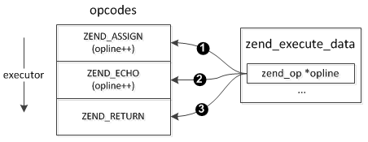

### 3.3.4 全局execute_data和opline
Zend执行器在opcode的执行过程中，会频繁的用到execute_data和opline两个变量，execute_data为zend_execute_data结构，opline为当前执行的指令。普通的处理方式在执行每条opcode指令的handler时，会把execute_data地址作为参数传给handler使用，使用时先从当前栈上获取execute_data地址，然后再从堆上获取变量的数据，这种方式下Zend执行器展开后是下面这样：
```c
ZEND_API void execute_ex(zend_execute_data *ex)
{
    zend_execute_data *execute_data = ex;

    while (1) {
        int ret;

        if (UNEXPECTED((ret = ((opcode_handler_t)execute_data->opline->handler)(execute_data)) != 0)) {
            if (EXPECTED(ret > 0)) {
                execute_data = EG(current_execute_data);
            } else {
                return;
            }
        }
    }
}
```
执行器实际是一个大循环，从第一条opcode开始执行，execute_data->opline指向当前执行的指令，执行完以后指向下一条指令，opline类似eip(或rip)寄存器的作用。通过这个循环，ZendVM完成opcode指令的执行。opcode执行完后以后指向下一条指令的操作是在当前handler中完成，也就是说每条执行执行完以后会主动更新opline，这里会有下面几个不同的动作：
```c
ZEND_VM_CONTINUE()
ZEND_VM_ENTER()
ZEND_VM_LEAVE()
ZEND_VM_RETURN()
```
ZEND_VM_CONTINUE()表示继续执行下一条opcode；ZEND_VM_ENTER()/ZEND_VM_LEAVE()是调用函数时的动作，普通模式下ZEND_VM_ENTER()实际就是return 1，然后execute_ex()中会将execute_data切换到被调函数的结构上，对应的，在函数调用完成后ZEND_VM_LEAVE()会return 2，再将execute_data切换至原来的结构；ZEND_VM_RETURN()表示执行完成，比如exit，这时候execute_ex()将退出执行。下面看一个具体的例子：
```php
$a = "hi~";
echo $a;
```
执行过程如下图所示：



以ZEND_ASSIGN这条赋值指令为例，其handler展开前如下：
```c
static ZEND_OPCODE_HANDLER_RET ZEND_FASTCALL ZEND_ASSIGN_SPEC_CV_CONST_HANDLER(ZEND_OPCODE_HANDLER_ARGS)
{
    USE_OPLINE
    ...
    ZEND_VM_NEXT_OPCODE_CHECK_EXCEPTION();
}
```
所有opcode的handler定义格式都是相同的，其参数列表通过ZEND_OPCODE_HANDLER_ARGS宏定义，展开后实际只有一个execute_data；ZEND_FASTCALL这个宏是用于指定C语言函数调用方式的，这里指定的是fastcall方式，GNU C下就是__attribute__((fastcall))。去掉一些非关键操作展开后：
```c
static int  __attribute__((fastcall)) ZEND_ASSIGN_SPEC_CV_CONST_HANDLER(zend_execute_data *execute_data)
{
    //USE_OPLINE
    const zend_op *opline = execute_data->opline;
    ...

    //ZEND_VM_NEXT_OPCODE_CHECK_EXCEPTION()
    execute_data->opline = execute_data->opline + 1;
    return 0;
}
```
从这个例子可以很清楚的看到，执行完以后会将execute_data->opline加1，也就是指向下一条opcode，然后返回0给execute_ex()，接着执行器在下一次循环时执行下一条opcode，依次类推，直至所有的opcode执行完成。这个处理过程比较简单，并没有不好理解的地方，而且整个过程看起来也都那么顺理成章。PHP7针对execute_data、opline两个变量的存储位置进行了优化，那就是使用全局寄存器保存这两个变量的地址，以实现更高效率的读取。这种方式下execute_data、opline直接从寄存器读取地址，在性能上大概有5%的提升(官方说法)。在分析PHP7的优化之前，我们先简单介绍下什么是寄存器变量。

寄存器变量存放在CPU的寄存器中，使用时，不需要访问内存直接从寄存器中读写，与存储在内存中的变量相比，寄存器变量具有更快的访问速度，在计算机的存储层次中，寄存器的速度最快，其>次是内存，最慢的是内存。C语言中使用关键字register来声明局部变量为寄存器变量，需要注意的是，只有局部自动变量和形式参数才能够被定义为寄存器变量，全局变量和局部静态变量都不能被定义为寄存器变量。而且，一个计算机中寄存器数量是有限的，一般为2到3个，因此寄存器变量的数量不能太多。对于在一个函数中说明的多于2到3个的寄存器变量，Ｃ编译程序会自动地将寄存器变量变为自动变量。 受硬件寄存器长度的限制，寄存器变量只能是char、int或指针型，而不能使其他复杂数据类型。由于register变量使用的是硬件CPU中的寄存器，寄存器变量无地址，所以不能使用取地址运算符"&"求寄存器变量的地址。

GCC从4.8.0版本开始支持了另外一项特性：全局寄存器变量，也就是可以把全局变量定义为寄存器变量，从而可以实现函数间共享数据。可以通过下面的语法告诉编译器使用寄存器来保存数据：
```c
register int *foo asm ("r12"); //r12、%r12
```
或者：
```c
register int *foo __asm__ ("r12"); //r12、%r12
```
这里r12就是指定使用的寄存器，它必须是运行平台上有效的寄存器，这样就可以像使用普通的变量一样使用foo，但是foo同样没有地址，也就是无法通过&获取它的地址，在gdb调试时也无法使用foo符号，只能使用对应的寄存器获取数据。举个例子来看：
```c
//main.c
#include <stdlib.h>

typedef struct _execute_data {
    int ip;
}zend_execute_data;


register zend_execute_data* execute_data __asm__ ("%r14");

int main(void)
{
    execute_data = (zend_execute_data  *)malloc(sizeof(zend_execute_data));
    execute_data->ip = 9999;

    return 0;
}
```
编译：`$ gcc -o main -g main.c`，然后通过gdb看下：
```sh
$ gdb main
(gdb) break main
(gdb) r
Starting program: /home/qinpeng/c/php/main 

Breakpoint 1, main () at main.c:12
12      execute_data = (zend_execute_data  *)malloc(sizeof(zend_execute_data));
(gdb) n
13      execute_data->ip = 9999;
(gdb) n
15      return 0;
```
这时我们就无法再像普通变量那样直接使用execute_data访问数据，只能通过r14寄存器读取：
```sh
(gdb) p execute_data
Missing ELF symbol "execute_data".
(gdb) info register r14
r14            0x601010 6295568
(gdb) p ((zend_execute_data *)$r14)->ip
$3 = 9999
```

