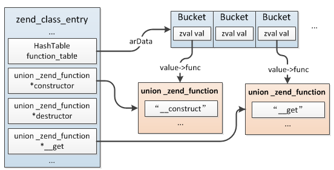

### 3.4.5 魔术方法
PHP在类的成员方法中预留了一些特殊的方法，它们会在一些特殊的时机被调用(比如创建对象之初、访问成员属性时...)，这类方法称为：魔术方法，包括：__construct()、__destruct()、__call()、__callStatic()、__get()、__set()、__isset()、__unset()、__sleep()、__wakeup()、__toString()、__invoke()、 __set_state()、 __clone() 和 __debugInfo()，关于这些方法的用法这里不作说明，不清楚的可以翻下官方文档。

魔术方法实际是PHP提供的一些特殊操作时的钩子函数，与普通成员方法无异，它们只是与一些操作的口头约定，并没有什么字段标识它们，比如我们定义了一个函数：my_function()，我们希望在这个函数处理对象时首先调用其成员方法my_magic()，那么my_magic()也可以认为是一个魔术方法。

魔术方法与普通成员方法一样保存在`zend_class_entry.function_table`中，另外针对一些内核常用到的成员方法在zend_class_entry中还有一些单独的指针指向具体的成员方法：
```c
struct _zend_class_entry {
    ...
    union _zend_function *constructor;
    union _zend_function *destructor;
    union _zend_function *clone;
    union _zend_function *__get;
    union _zend_function *__set;
    union _zend_function *__unset;
    union _zend_function *__isset;
    union _zend_function *__call;
    union _zend_function *__callstatic;
    union _zend_function *__tostring;
    union _zend_function *__debugInfo;
    ...
}
```
在编译成员方法时如果发现与这些魔术方法名称一致，则除了插入`zend_class_entry.function_table`哈希表以外，还会设置zend_class_entry中对应的指针。



具体在编译成员方法时设置：zend_begin_method_decl()。
```c
void zend_begin_method_decl(zend_op_array *op_array, zend_string *name, zend_bool has_body)
{
    ...
    //插入类的function_table中
    if (zend_hash_add_ptr(&ce->function_table, lcname, op_array) == NULL) {
        zend_error_noreturn(..);
    }

    if (!in_trait && zend_string_equals_ci(lcname, ce->name)) {
        if (!ce->constructor) {
            ce->constructor = (zend_function *) op_array;
        }
    } else if (zend_string_equals_literal(lcname, ZEND_CONSTRUCTOR_FUNC_NAME)) {
        ce->constructor = (zend_function *) op_array;
    } else if (zend_string_equals_literal(lcname, ZEND_DESTRUCTOR_FUNC_NAME)) {
        ce->destructor = (zend_function *) op_array;
    } else if (zend_string_equals_literal(lcname, ZEND_CLONE_FUNC_NAME)) {
        ce->clone = (zend_function *) op_array;
    } else if (zend_string_equals_literal(lcname, ZEND_CALL_FUNC_NAME)) {
        ce->__call = (zend_function *) op_array;
    } else if (zend_string_equals_literal(lcname, ZEND_CALLSTATIC_FUNC_NAME)) {
        ce->__callstatic = (zend_function *) op_array;
    } else if (...){
        ...
    }
    ...
}
```
除了这几个其它魔术方法都没有单独的指针指向，比如：__sleep()、__wakeup()，这两个主要是serialize()、unserialize()序列化、反序列化时调用的，它们是在这俩函数中写死的，我们简单看下serialize()的实现，这个函数是通过扩展提供的：
```c
//file: ext/standard/var.c
PHP_FUNCTION(serialize)
{       
    zval *struc;
    php_serialize_data_t var_hash;
    smart_str buf = {0};

    if (zend_parse_parameters(ZEND_NUM_ARGS(), "z", &struc) == FAILURE) {
        return;
    }

    php_var_serialize(&buf, struc, &var_hash);
    ...
}
```
最终由`php_var_serialize_intern()`处理，这个函数会根据不同的类型选择不同的处理方式：
```c
static void php_var_serialize_intern(smart_str *buf, zval *struc, php_serialize_data_t var_hash)
{
    ...
    switch (Z_TYPE_P(struc)) {
        case IS_FALSE: 
            ...
        case IS_TRUE:
            ...
        case IS_NULL:
            ...
        case IS_LONG:
            ...
    }
}
```
其中类型是对象时将先检查`zend_class_function.function_table`中是否定义了`__sleep()`，如果有的话则调用：
```c
if (ce != PHP_IC_ENTRY && zend_hash_str_exists(&ce->function_table, "__sleep", sizeof("__sleep")-1)) {
    ZVAL_STRINGL(&fname, "__sleep", sizeof("__sleep") - 1);
    //调用用户自定义的__sleep()方法
    res = call_user_function_ex(CG(function_table), struc, &fname, &retval, 0, 0, 1, NULL);

    if (res == SUCCESS) {
        if (Z_TYPE(retval) != IS_UNDEF) {
            if (HASH_OF(&retval)) {
                php_var_serialize_class(buf, struc, &retval, var_hash);
            } else {
                smart_str_appendl(buf,"N;", 2);
            }
            zval_ptr_dtor(&retval);
        }
        return;
    }
}
//后面会走到IS_ARRAY分支继续序列化处理
...
```
其它魔术方法与__sleep()类似，都是在一些特殊操作中固定调用的。
