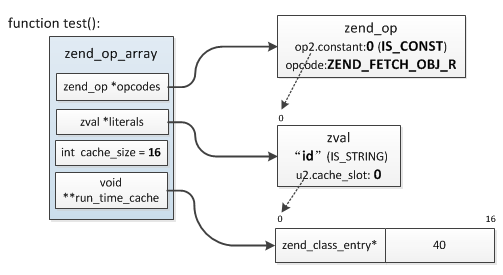

## 3.5 运行时缓存
在执行期间，PHP经常需要根据名称去不同的哈希表中查找常量、函数、类、成员方法、成员属性等，因此PHP提供了一种缓存机制用于缓存根据名称查找到的结果，以便再次执行同一opcode时直接复用上次缓存的值，无需再次查找，从而提高执行效率。举个例子具体说明下：
```php
class my_class {
    public $id = 123;

    public function test() {
        echo $this->id;
    }
}

$obj = new my_class;
$obj->test();
$obj->test();
```
这个例子中我们定义了一个类，然后两次调用同一个成员方法，这个成员方法输出了一个成员属性，用到运行时缓存的地方在成员属性的查找，前面我们已经讲过成员属性的查找过程："首先根据对象找到所属zend_class_entry，然后再根据属性名查找`zend_class_entry.properties_info`哈希表，得到`zend_property_info`，最后根据这个结构的offset定位属性值的存储位置"，这个地方PHP会缓存两个东西：zend_class_entry、zend_property_info.offset，这样再次执行时直接根据操作数从缓存数组中取出这两个值使用，从而避免再次查找。

所以运行时缓存机制是在同一opcode执行多次的情况下才会生效，特别注意这里的同一opcode指的并不是opcode值相同，而是指内存里的同一份数据，比如：`echo $a; echo $a;`这种就不算，因为这是两条opcode。

此缓存机制主要针对的就是通过静态名称查找HashTable的情况，那么缓存是如何保存和索引的呢？

运行时缓存是基于CONST操作数存储的，也就是说只有包含IS_CONST类型的操作数才有可能用到此机制，缓存的存储格式是一个数组，用于保存缓存的数据指针，而指针在数组中的起始存储位置则保存在CONST操作数对应的`zval.u2.cache_slot`中(前面讲过，CONST操作数对应值的zval保存在zend_op_array->literals数组中)。上面那个例子对应的缓存结构：



* __(1)__ 第一次执行`echo $this->id;`时首先根据$this取出zend_class_entry，然后根据“id”查找zend_class_entry.properties_info找到属性zend_property_info，取出此结构的offset，第一次执行后将zend_class_entry及offset保存到了test()函数的zend_op_array->run_time_cache中，占用16字节，起始位置为0，这个值记录在“id”的zval.u2.cache_slot中；
* __(2)__ 之后再次执行`echo $this->id;`时直接根据opline从zend_op_literals中取出“id”的zval，得到缓存数据保存位置：0，然后去zend_op_array->run_time_cache取出缓存的zend_class_entry、offset。

这个例子缓存数据占用了16字节(2个sizeof(void*))大小的空间，而有的只需要8字节，取决于操作类型：

* 8字节：常量、函数、类
* 16字节：成员属性、成员方法、类常量

另外一个问题是这些操作数的缓存位置(zval.u2.cache_slot)是在什么阶段确定的呢？实际上这个值是在编译阶段确定的，通过zend_op_array.cache_size记录缓存可用起始位置，编译过程中如果发现当前操作适用缓存机制，则根据缓存数据的大小从cache_size开始分配8或16字节给那个操作数，cache_size向后移动对应大小，然后将起始位置保存于CONST操作数的zval.u2.cache_slot中，执行时直接根据这个值读写缓存。

具体缓存的读写通过以下几个宏完成：
```c
//设置缓存
CACHE_PTR(Z_CACHE_SLOT_P(EX_CONSTANT(opline->op1/2)), 缓存的数据指针);

//读取缓存
CACHED_PTR(Z_CACHE_SLOT_P(EX_CONSTANT(opline->op1/2)));

//EX_CONSTANT(opline->op1/2)是取当前IS_CONST操作数对应数据的zval
```
