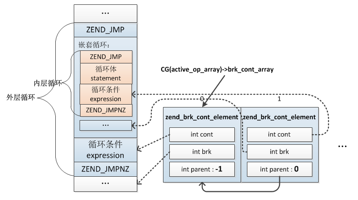
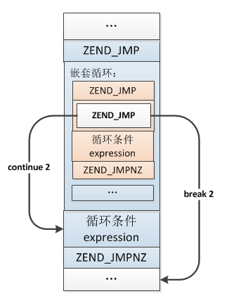

## 4.4 中断及跳转
PHP中的中断及跳转语句主要有break、continue、goto，这几种语句的实现基础都是跳转。

### 4.4.1 break与continue
break用于结束当前for、foreach、while、do-while 或者 switch 结构的执行；continue用于跳过本次循环中剩余代码，进行下一轮循环。break、continue是非常相像的，它们都可以接受一个可选数字参数来决定跳过的循环层数，两者的不同点在于break是跳到循环结束的位置，而continue是跳到循环判断条件的位置，本质在于跳转位置的不同。

break、continue的实现稍微有些复杂，下面具体介绍下其编译过程。

上一节我们已经介绍过循环语句的编译，其中在各种循环编译过程中有两个特殊操作：zend_begin_loop()、zend_end_loop()，分别在循环编译前以及编译后调用，这两步操作就是为break、continue服务的。

在每层循环编译时都会创建一个`zend_brk_cont_element`的结构：
```c
typedef struct _zend_brk_cont_element {
    int start;
    int cont;
    int brk;
    int parent;
} zend_brk_cont_element;
```
cont记录的是当前循环判断条件opcode起始位置，brk记录的是当前循环结束的位置，parent记录的是父层循环`zend_brk_cont_element`结构的存储位置，也就是说多层嵌套循环会生成一个`zend_brk_cont_element`的链表，每层循环编译结束时更新自己的`zend_brk_cont_element`结构，所以break、continue的处理过程实际就是根据跳出的层级索引到那一层的`zend_brk_cont_element`结构，然后得到它的cont、brk进行相应的opcode跳转。

各循环的`zend_brk_cont_element`结构保存在`zend_op_array->brk_cont_array`数组中，实际这个数组在编译前就已经分配好了，编译各循环时依次申请一个`zend_brk_cont_element`，`zend_op_array->last_brk_cont`记录此数组第一个可用位置，每申请一个元素last_brk_cont就相应的增加1，parent记录的就是父层循环在`zend_op_array->brk_cont_array`中的位置。

示例：
```php
$i = 0;
while(1){
    while(1){
        if($i > 10){
            break 2;
        }
        ++$i
    }
}
```
循环编译完以后对应的内存结构：



介绍完编译循环结构时为break、continue做的准备，接下来我们具体分析下break、continue的编译。

有了前面的准备，break、continue的编译过程就比较简单了，主要就是各生成一条临时opcode：ZEND_BRK、ZEND_CONT，这条opcode记录着两个重要信息：
* __op1:__ 记录着当前循环`zend_brk_cont_element`结构的存储位置(在循环编译过程中CG(context).current_brk_cont记录着当前循环zend_brk_cont_element的位置)
* __op2:__ 记录着要跳出循环的层级，如果break/continue没有加数字，则默认为1

```c
void zend_compile_break_continue(zend_ast *ast)
{
    zend_ast *depth_ast = ast->child[0];

    zend_op *opline;
    int depth;

    if (depth_ast) {
        zval *depth_zv;
        ...
        depth = Z_LVAL_P(depth_zv);
    } else {
        depth = 1;
    }
    ...
    
    //生成opcode
    opline = zend_emit_op(NULL, ast->kind == ZEND_AST_BREAK ? ZEND_BRK : ZEND_CONT, NULL, NULL);
    opline->op1.num = CG(context).current_brk_cont; //break、continue所在循环层
    opline->op2.num = depth;  //要跳出的层数
}
```
`zend_compile_break_continue()`到这一步完成整个break、continue的编译还没有完成，因为`CG(active_op_array)->brk_cont_array`这个数组只是编译期间使用的一个临时结构，break、continue编译生成的opcode：ZEND_BRK、ZEND_CONT并不是运行时直接执行的，这条opcode在整个脚本编译完成后、执行前被优化为 __ZEND_JMP__ ，这个操作在`pass_two()`中完成，关于这个过程在《3.1.2.2 AST->zend_op_array》一节曾经介绍过。

```c
ZEND_API zend_op_array *compile_file(zend_file_handle *file_handle, int type)
{
    //语法解析
    zendparse();

    //AST->opcodes
    zend_compile_top_stmt(CG(ast));

    pass_two(op_array);
    ...
}
```
```c
ZEND_API int pass_two(zend_op_array *op_array)
{
    ...

    opline = op_array->opcodes;
    end = opline + op_array->last;
    while (opline < end) {
        switch (opline->opcode) {
            ...
            case ZEND_BRK:
            case ZEND_CONT:
            {
                //计算跳转位置
                uint32_t jmp_target = zend_get_brk_cont_target(op_array, opline);
                ...
                //将opcode修改为ZEND_JMP
                opline->opcode = ZEND_JMP;
                opline->op1.opline_num = jmp_target;
                opline->op2.num = 0;

                //将绝对跳转opcode位置修改为相对当前opcode的位置
                ZEND_PASS_TWO_UPDATE_JMP_TARGET(op_array, opline, opline->op1);
            }
            break;
            ...
        }
    }

    op_array->fn_flags |= ZEND_ACC_DONE_PASS_TWO;
    return 0;
}
```
从上面的过程可以看出，如果opcode为：ZEND_BRK或ZEND_CONT则统一设置opcode为`ZEND_JMP`，新opcode的op1记录的是break、continue跳到opcode的位置，这个值根据编译期间的`zend_brk_cont_element`计算得到，首先从op1、op2取出break、continue所在循环的zend_brk_cont_element结构以及要跳过的层级，然后根据`zend_brk_cont_element.parent`及层级数找到具体要跳出层的`zend_brk_cont_element`结构，从这个结构中获得那层循环判断条件及循环结束的opcode的位置。
```c
static uint32_t zend_get_brk_cont_target(const zend_op_array *op_array, const zend_op *opline) {
    int nest_levels = opline->op2.num; //跳出的层级：break n;
    int array_offset = opline->op1.num;//break、continue所属循环zend_brk_cont_element的存储下标
    zend_brk_cont_element *jmp_to;
    do {
        jmp_to = &op_array->brk_cont_array[array_offset];
        if (nest_levels > 1) {
            array_offset = jmp_to->parent;
        }
    } while (--nest_levels > 0);

    return opline->opcode == ZEND_BRK ? jmp_to->brk : jmp_to->cont;
}
```
上面那个例子最终执行前的opcode如下图：



执行时直接跳到对应的opcode位置即可。

### 4.4.2 goto
goto 操作符可以用来跳转到程序中的另一位置。该目标位置可以用目标名称加上冒号来标记，而跳转指令是 goto 之后接上目标位置的标记。PHP 中的 goto 有一定限制，目标位置只能位于同一个文件和作用域，也就是说无法跳出一个函数或类方法，也无法跳入到另一个函数，可以跳出循环但无法跳入循环，多层循环中通常会用goto代替多层break。


