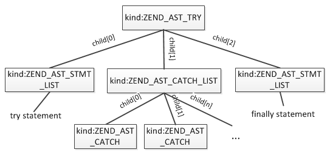
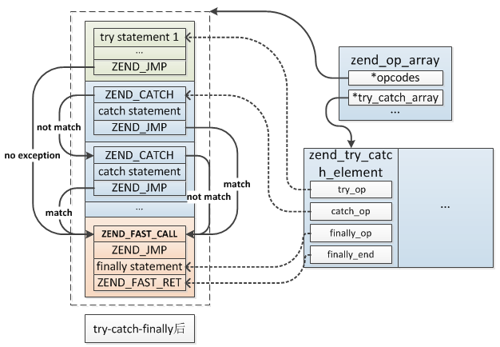
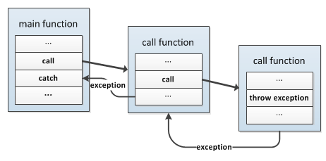
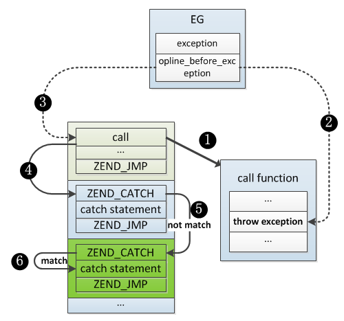

## 4.6 异常处理
PHP的异常处理与其它语言的类似，在程序中可以抛出、捕获一个异常，异常抛出必须只有定义在try{...}块中才可以被捕获，捕获以后将跳到catch块中进行处理，不再执行try中抛出异常之后的代码。

异常可以在任意位置抛出，然后将由最近的一个try所捕获，如果在当前执行空间没有进行捕获，那么将调用栈一直往上抛，比如在一个函数内部抛出一个异常，但是函数内没有进行try，而在函数调用的位置try了，那么就由调用处的catch捕获。

接下来我们从两个方面介绍下PHP异常处理的实现。

### 4.6.1 异常处理的编译
异常捕获及处理的语法：
```php
try{
    try statement;
}catch(exception_class_1 $e){
    catch statement 1;
}catch(exception_class_2 $e){
    catch statement 2;
}finally{
    finally statement;
}
```
try表示要捕获try statement中可能抛出的异常；catch是捕获到异常后的处理，可以定义多个，当try中抛出异常时会依次检查各个catch的异常类是否与抛出的匹配，如果匹配则有命中的那个catch块处理；finally为最后执行的代码，不管是否有异常抛出都会执行。

语法规则：
```c
statement:
    ...
    |   T_TRY '{' inner_statement_list '}' catch_list finally_statement
            { $$ = zend_ast_create(ZEND_AST_TRY, $3, $5, $6); }
    ...
;
catch_list:
        /* empty */
            { $$ = zend_ast_create_list(0, ZEND_AST_CATCH_LIST); }
    |   catch_list T_CATCH '(' name T_VARIABLE ')' '{' inner_statement_list '}'
            { $$ = zend_ast_list_add($1, zend_ast_create(ZEND_AST_CATCH, $4, $5, $8)); }
;
finally_statement:
        /* empty */ { $$ = NULL; }
    |   T_FINALLY '{' inner_statement_list '}' { $$ = $3; }
;
```
从语法规则可以看出，try-catch-finally最终编译为一个`ZEND_AST_TRY`节点，包含三个子节点，分别是：try statement、catch list、finally statement，try statement、finally statement就是普通的`ZEND_AST_STMT_LIST`节点，catch list包含多个`ZEND_AST_CATCH`节点，每个节点有三个子节点：exception class、exception object及catch statement，最终生成的AST：



具体的编译过程如下：

* __(1)__ 向所属zend_op_array注册一个zend_try_catch_element结构，所有try都会注册一个这样的结构，与循环结构注册的zend_brk_cont_element类似，当前zend_op_array所有定义的异常保存在zend_op_array->try_catch_array数组中，这个结构用来记录try、catch以及finally开始的位置，具体结构：
```c
typedef struct _zend_try_catch_element {
    uint32_t try_op;     //try开始的opcode位置
    uint32_t catch_op;   //第1个catch块的opcode位置
    uint32_t finally_op; //finally开始的opcode位置
    uint32_t finally_end;//finally结束的opcode位置
} zend_try_catch_element;
```
* __(2)__ 编译try statement，编译完以后如果定义了catch块则编译一条`ZEND_JMP`，此opcode的作用时当无异常抛出时跳过所有catch跳到finally或整个异常之外的，因为catch块是在try statement之后编译的，所以具体的跳转值目前还无法确定；

* __(3)__ 依次编译各个catch块，如果没有定义则跳过此步骤，每个catch编译时首先编译一条`ZEND_CATCH`，此opcode保存着此catch的exception class、exception object以及下一个catch块开始的位置，编译第1个catch时将此opcode的位置记录在zend_try_catch_element.catch_op上，接着编译catch statement，最后编译一条`ZEND_JMP`(最后一个catch不需要)，此opcode的作用与步骤(2)的相同；

* __(4)__ 将步骤(2)、步骤(3)中`ZEND_JMP`跳转值设置为finally第1条opcode或异常定义之外的代码，如果没有定义finally则结束编译，否则编译finally块，首先编译一条`ZEND_FAST_CALL`及`ZEND_JMP`，接着编译finally statement，最后编译一条`ZEND_FAST_RET`。

编译完以后的结构：



异常的抛出通过throw一个异常对象来实现，这个对象必须继承>自Exception类，抛出异常的语法：
```php
throw exception_object;
```
throw的编译比较简单，最终只编译为一条opcode：`ZEND_THROW`。

### 4.6.2 异常的抛出与捕获
上一小节我们介绍了exception结构在编译阶段的处理，接下来我们再介绍下运行时exception的处理过程，这个过程相对比较复杂，整体的讲其处理流程整体如下：

* __(1)__ 检查抛出的是否是object，否则将导致error错误；
* __(2)__ 将EG(exception)设置为抛出的异常对象，同时将当前stack(即:zend_execute_data)接下来要执行的opcode设置为`ZEND_HANDLE_EXCEPTION`；
* __(3)__ 执行`ZEND_HANDLE_EXCEPTION`，查找匹配的catch：
  * __(3.1)__ 首先遍历当前zend_op_array下定义的所有异常捕获，即`zend_op_array->try_catch_array`数组，然后根据throw的位置、try开始的位置、catch开始的位置、finally开始的位置判断判断异常是否在try范围内，如果同时命中了多个try(即嵌套try的情况)则选择最后那个(也就是最里层的)，遍历完以后如果命中了则进入步骤(3.2)处理，如果没有命中当前stack下任何try则进入步骤(4)；
  * __(3.2)__ 到这一步表示抛出的异常在当前zend_op_array下有try拦截(注意这里只是表示异常在try中抛出的，但是抛出的异常并一定能被catch)，然后根据当前try块的`zend_try_catch_element`结构取出第一个catch的位置，将opcode设置为zend_try_catch_element.catch_op，跳到第一个catch块开始的位置执行，即:执行`ZEND_CATCH`；
  * __(3.3)__ 执行`ZEND_CATCH`，检查抛出的异常对象是否与当前catch的类型匹配，检查的过程为判断两个类是否存在父子关系，如果匹配则表示异常被成功捕获，将EG(exception)清空，如果没有则跳到下一个catch的位置重复步骤(3.3)，如果到最后一个catch仍然没有命中则在这个catch的位置抛出一个异常(实际还是原来按个异常，只是将抛出的位置转移了当前catch的位置)，然后回到步骤(3);
* __(4)__ 当前zend_op_array没能成功捕获异常，需要继续往上抛：回到调用位置，将接下来要执行的opcode设置为`ZEND_HANDLE_EXCEPTION`，比如函数中抛出了一个异常没有在函数中捕获，则跳到调用的位置继续捕获，回到步骤(3)；如果到最终主脚本也没有被捕获则将结束执行并导致error错误。



这个过程最复杂的地方在于异常匹配、传递的过程，主要为`ZEND_HANDLE_EXCEPTION`、`ZEND_CATCH`两条opcode之间的调用，当抛出一个异常时会终止后面opcode的执行，转向执行`ZEND_HANDLE_EXCEPTION`，根据异常抛出的位置定位到最近的一个try的catch位置，如果这个catch没有匹配则跳到下一个catch块，然后再次执行`ZEND_HANDLE_EXCEPTION`，如果到最后一个catch仍没有匹配则将异常抛出前位置EG(opline_before_exception)更新为最后一个catch的位置，再次执行`ZEND_HANDLE_EXCEPTION`，由于异常抛出的位置已经更新了所以不会再匹配上次检查过的那个catch，这个过程实际就是不断递归执行`ZEND_HANDLE_EXCEPTION`、`ZEND_CATCH`；如果当前zend_op_array都无法捕获则将异常抛向上一个调用栈继续捕获，下面根据一个例子具体说明下：
```php
function my_func(){
    //...
    throw new Exception("This is a exception from my_func()");
}

try{
    my_func();
}catch(ErrorException $e){
    echo "ErrorException";
}catch(Exception $e){
    echo "Exception";
}
```
my_func()中抛出了一个异常，首先在my_func()中抛出一个异常，然后在my_func()的zend_op_array中检查是不是能够捕获，发现没有，则回到调用的位置，再次检查，第1次匹配到`catch(ErrorException $e)`，检查后发现并不匹配，然后跳到下一个catch块继续匹配，第2次匹配到`catch(Exception $e)`，检查后发现命中，捕获成功。



上面的过程并没有提到finally的执行时机，首先要明确finally在哪些情况下会执行，命中catch的情况比较简单，即在catch statement执行完以后跳到finally执行，另外一种情况是如果一个异常在try中但没有命中任何catch那么其finally也是会被执行的，这种情况的finally实际是在步骤(3)中执行的，最后一个catch检查完以后会更新异常抛出位置：EG(opline_before_exception)，然后会再次执行`ZEND_HANDLE_EXCEPTION`，再次检查时就会发现没有命中任何catch但命中finally了(因为异常位置更新了)，这时候就会将异常对象保存在finally块中，然后执行finally，执行完再将异常对象还原继续捕获，下面看下步骤(3)的具体处理过程：

```c
static ZEND_OPCODE_HANDLER_RET ZEND_FASTCALL ZEND_HANDLE_EXCEPTION_SPEC_HANDLER(ZEND_OPCODE_HANDLER_ARGS)
{
    //op_num为异常抛出的位置，根据异常抛出前最后一条opcode与第一条opcode计算得出
    uint32_t op_num = EG(opline_before_exception) - EX(func)->op_array.opcodes;

    uint32_t catch_op_num = 0, finally_op_num = 0, finally_op_end = 0;

    //查找异常是不是被try了：找最近的一层try
    for (i = 0; i < EX(func)->op_array.last_try_catch; i++) {
        if (EX(func)->op_array.try_catch_array[i].try_op > op_num) {
            //try在抛出之后
            break;
        }
        in_finally = 0;
        //异常抛出位置在try后且比第一个catch位置小，表明这个try有可能捕获异常
        if (op_num < EX(func)->op_array.try_catch_array[i].catch_op) {
            //第一个catch的位置
            catch_op_num = EX(func)->op_array.try_catch_array[i].catch_op;
        }
        //当前try有finally
        if (op_num < EX(func)->op_array.try_catch_array[i].finally_op) {
            finally_op_num = EX(func)->op_array.try_catch_array[i].finally_op;
            finally_op_end = EX(func)->op_array.try_catch_array[i].finally_end;
        }
        if (op_num >= EX(func)->op_array.try_catch_array[i].finally_op &&
                op_num < EX(func)->op_array.try_catch_array[i].finally_end) {
            finally_op_end = EX(func)->op_array.try_catch_array[i].finally_end;
            in_finally = 1;
        }
    }

    cleanup_unfinished_calls(execute_data, op_num);

    //异常命中了try但没有命中任何catch且那个try定义了finally：需要执行finally
    //catch_op_num >= finally_op_num是嵌套try的情况，因为finally是检查完所有catch、更新异常抛出位置之后再执行的
    //所以检查完内层try再检查外层循环时会出现这种情况
    if (finally_op_num && (!catch_op_num || catch_op_num >= finally_op_num)) {
        zval *fast_call = EX_VAR(EX(func)->op_array.opcodes[finally_op_end].op1.var);
        
        cleanup_live_vars(execute_data, op_num, finally_op_num);
        if (in_finally && Z_OBJ_P(fast_call)) {
            zend_exception_set_previous(EG(exception), Z_OBJ_P(fast_call));
        }
        //临时将EG(exception)转移到finally下，执行完finally再抛出
        Z_OBJ_P(fast_call) = EG(exception);
        EG(exception) = NULL;
        fast_call->u2.lineno = (uint32_t)-1;
        ZEND_VM_SET_OPCODE(&EX(func)->op_array.opcodes[finally_op_num]);
        ZEND_VM_CONTINUE();
    }else{
        //这个是善后处理，因为异常抛出后后面的opcode将不再执行，但有些情况下还需要把一些资源释放掉
        //比如前面我们介绍goto时提到的foreach中是不能直接跳出的，throw也是类似
        cleanup_live_vars(execute_data, op_num, catch_op_num);
        ...
        if (catch_op_num) {
            //匹配到catch(但不一定命中)，跳到catch处执行ZEND_CATCH进行判断
            ZEND_VM_SET_OPCODE(&EX(func)->op_array.opcodes[catch_op_num]);
            ZEND_VM_CONTINUE();
        } else if (UNEXPECTED((EX(func)->op_array.fn_flags & ZEND_ACC_GENERATOR) != 0)) {
            ...
        } else {
            //当前zend_op_array下已经没有匹配到的try了，如果异常仍没有被捕获则将在zend_leave_helper_SPEC()将异常抛给prev_execute_data继续捕获
            ZEND_VM_TAIL_CALL(zend_leave_helper_SPEC(ZEND_OPCODE_HANDLER_ARGS_PASSTHRU));
        }
    }
}
```

具体的实现过程还有很多额外的处理，这里不再展开，感兴趣的可以详细研究下`ZEND_HANDLE_EXCEPTION`、`ZEND_CATCH`两条opcode以及zend_exception.c中具体逻辑。

### 4.6.3 内核的异常处理
前面介绍的异常处理是PHP语言层面的实现，在内核中也有一套供内核使用的异常处理模型，也就是C语言异常处理的实现，如：
```c
static int php_start_sapi(void)
{
    ...

    zend_try {
        ...
    } zend_catch {
        ...
    } zend_end_try();
    ...
}
```
C语言并没有在语言层面提供try-catch机制，那么PHP中的是如何实现的呢？这个主要利用sigsetjmp()、siglongjmp()两个函数实现堆栈的保存、还原，在try的位置通过sigsetjmp()将当前位置的堆栈保存在一个变量中，异常抛出通过siglongjmp()跳回原位置，具体看下这几个宏的定义：
```c
#define zend_try                                                \
    {                                                           \
        JMP_BUF *__orig_bailout = EG(bailout);                  \
        JMP_BUF __bailout;                                      \
                                                                \
        EG(bailout) = &__bailout;                               \
        if (SETJMP(__bailout)==0) {
#define zend_catch                                              \
        } else {                                                \
            EG(bailout) = __orig_bailout;
#define zend_end_try()                                          \
        }                                                       \
        EG(bailout) = __orig_bailout;                           \
    }


# define JMP_BUF sigjmp_buf
# define SETJMP(a) sigsetjmp(a, 0)
# define LONGJMP(a,b) siglongjmp(a, b)
# define JMP_BUF sigjmp_buf
```
展开后：
```c
{
    //保存上一个zend_try记录的JMP_BUF，目的是实现多层嵌套try
    JMP_BUF *__orig_bailout = EG(bailout);
    JMP_BUF __bailout;
    
    //将当前堆栈保存在__bailout
    EG(bailout) = &__bailout;
    if (SETJMP(__bailout)==0) {
        //try中的代码
        //抛出异常调用：LONGJMP()
    }else { //异常抛出后到这个分支
        EG(bailout) = __orig_bailout;
    }
    EG(bailout) = __orig_bailout;
}
```

