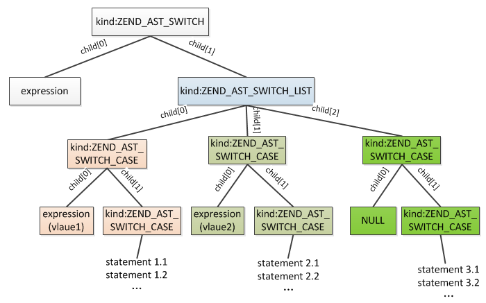
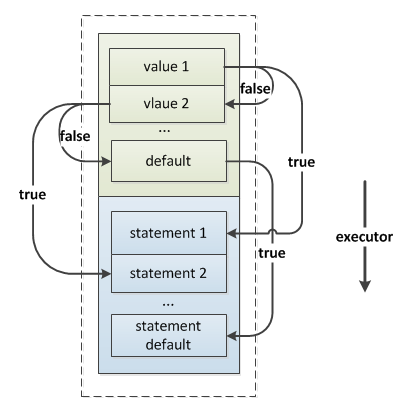

## 4.2 选择结构
程序并不都是顺序执行的，选择结构用于判断给定的条件，根据判断的结果来控制程序的流程。PHP中通过if、elseif、else和switch语句实现条件控制。这一节我们具体分析下这几条语句的执行过程。

### 4.2.1 if语句
If语句用法：
```php
if(Condition1){
    Statement1;
}elseif(Condition2){
    Statement2;
}else{
    Statement3;
}
```
IF语句有两部分组成：condition(条件)、statement(声明)，每个条件分支对应一组这样的组合，其中最后的else比较特殊，它没有条件，编译时也是按照这个逻辑编译为一组组的condition和statement，其具体的语法规则如下：
```c
if_stmt:
        if_stmt_without_else %prec T_NOELSE { $$ = $1; }
    |   if_stmt_without_else T_ELSE statement 
            { $$ = zend_ast_list_add($1, zend_ast_create(ZEND_AST_IF_ELEM, NULL, $3)); }
;

if_stmt_without_else:
        T_IF '(' expr ')' statement { $$ = zend_ast_create_list(1, ZEND_AST_IF,
                                        zend_ast_create(ZEND_AST_IF_ELEM, $3, $5)); }
    |   if_stmt_without_else T_ELSEIF '(' expr ')' statement 
            { $$ = zend_ast_list_add($1, zend_ast_create(ZEND_AST_IF_ELEM, $4, $6)); }
;
```
从上面的语法规则可以看出，编译if语句时首先会创建一个`ZEND_AST_IF`的节点，这个节点是一个list，用于保存各个分支的condition、statement，编译每个分支时将创建一个`ZEND_AST_IF_ELEM`的节点，它有两个子节点，分别用来记录：condition、statement，然后把这个节点插入到`ZEND_AST_IF`下，最终生成的AST：


编译opcode时顺序编译每个分支的condition、statement即可，编译过程大致如下：

* __(1)__ 编译当前分支的condition语句，这里可能会有多个条件，但最终会归并为一个true/false的结果；
* __(2)__ 编译完condition后编译一条ZEND_JMPZ的opcode，这条opcode用来判断当前condition最终为true还是false，如果当前condition成立直接继续执行本组statement即可，无需进行跳转，但是如果不成立就需要跳过本组的statement，所以这条opcode还需要知道该往下跳过多少条opcode，而跳过的这些opcode就是本组的statement，因此这个值需要在编译完本组statement后才能确定，现在还无法确定；
* __(3)__ 编译当前分支的statement列表，其节点类型ZEND_AST_STMT_LIST，就是普通语句的编译；
* __(4)__ 编译完statement后编译一条ZEND_JMP的opcode，这条opcode是当condition成立执行完本组statement时跳出if的，因为当前分支既然条件成立就不需要再跳到其他分支，执行完当前分支的statement后将直接跳出if，所以ZEND_JMP需要知道该往下跳过多少opcode，而跳过的这些opcode是后面所有分支的opcode数，只有编译完全部分支后才能确定；
* __(5)__ 编译完statement后再设置步骤(2)中条件不成立时ZEND_JMPZ应该跳过的opcode数；
* __(6)__ 重复上面的过程依次编译后面的condition、statement，编译完全部分支后再设置各分支在步骤(4)中ZEND_JMP跳出if的opcode位置。

具体的编译过程在`zend_compile_if()`中，过程比较清晰:
```c
void zend_compile_if(zend_ast *ast)
{
    zend_ast_list *list = zend_ast_get_list(ast);
    uint32_t i;
    uint32_t *jmp_opnums = NULL;

    //用来保存每个分支在步骤(4)中的ZEND_JMP opcode
    if (list->children > 1) {
        jmp_opnums = safe_emalloc(sizeof(uint32_t), list->children - 1, 0);
    }
    //依次编译各个分支
    for (i = 0; i < list->children; ++i) {
        zend_ast *elem_ast = list->child[i];
        zend_ast *cond_ast = elem_ast->child[0]; //条件
        zend_ast *stmt_ast = elem_ast->child[1]; //声明

        znode cond_node;
        uint32_t opnum_jmpz;
        if (cond_ast) {
            //编译condition
            zend_compile_expr(&cond_node, cond_ast);
            //编译condition跳转opcode：ZEND_JMPZ
            opnum_jmpz = zend_emit_cond_jump(ZEND_JMPZ, &cond_node, 0);
        }
        //编译statement
        zend_compile_stmt(stmt_ast);
        //编译statement执行完后跳出if的opcode：ZEND_JMP(最后一个分支无需这条opcode)
        if (i != list->children - 1) {
            jmp_opnums[i] = zend_emit_jump(0);
        }
        if (cond_ast) {
            //设置ZEND_JMPZ跳过opcode数
            zend_update_jump_target_to_next(opnum_jmpz);
        }
    }

    if (list->children > 1) {
        //设置前面各分支statement执行完后应跳转的位置
        for (i = 0; i < list->children - 1; ++i) {
            zend_update_jump_target_to_next(jmp_opnums[i]); //设置每组stmt最后一条jmp跳转为if外
        }
        efree(jmp_opnums);
    }
}
```
最终if语句编译后基本是这样的结构：


执行时依次判断各分支条件是否成立，成立则执行当前分支statement，执行完后跳到if外语句；不成立则调到下一分支继续判断是否成立，以此类推。不管各分支条件有几个，其最终都会归并为一个结果，也就是每个分支只需要判断最终的条件值是否为true即可，而多个条件计算得到最终值的过程就是普通的逻辑运算。

> __Note:__ 注意elseif与else if，上面介绍的是elseif的编译，而else if则实际相当于嵌套了一个if，也就是说一个if的分支中包含了另外一个if，在编译、执行的过程中这两个是有差别的。

### 4.2.2 switch语句
switch语句与if类似，都是条件语句，很多时候需要将一个变量或者表达式与不同的值进行比较，根据不同的值执行不同的代码，这种场景下用if、switch都可以实现，但switch相对更加直观。

switch语法：
```php
switch(expression){
    case value1:
        statement1;
    case value2:
        statement2;
    ...
    default:
        statementn;
}
```
这里并没有将break加入到switch的语法中，因为严格意义上break并不是switch的一部分，break属于另外一类单独的语法：中断语法，PHP中如果没有在switch中加break则执行时会从命中的那个case开始一直执行到结束，这与很多其它的语言不同(比如：golang)。

从switch的语法可以看出，switch主要包含两部分：expression、case list，case list包含多个case，每个case包含value、statement两部分。expression是一个表达式，但它将在case对比前执行，所以switch最终执行时就是拿expression的值逐个与case的value比较，如果相等则从命中case的statement开始向下执行。

下面看下switch的语法规则：
```c
statement:
    ...
    |   T_SWITCH '(' expr ')' switch_case_list { $$ = zend_ast_create(ZEND_AST_SWITCH, $3, $5); }
    ...
;

switch_case_list:
        '{' case_list '}'                   { $$ = $2; }
    |   '{' ';' case_list '}'               { $$ = $3; }
    |   ':' case_list T_ENDSWITCH ';'       { $$ = $2; }
    |   ':' ';' case_list T_ENDSWITCH ';'   { $$ = $3; }
;

case_list:
        /* empty */ { $$ = zend_ast_create_list(0, ZEND_AST_SWITCH_LIST); }
    |   case_list T_CASE expr case_separator inner_statement_list
            { $$ = zend_ast_list_add($1, zend_ast_create(ZEND_AST_SWITCH_CASE, $3, $5)); }
    |   case_list T_DEFAULT case_separator inner_statement_list
            { $$ = zend_ast_list_add($1, zend_ast_create(ZEND_AST_SWITCH_CASE, NULL, $4)); }
;

case_separator:
        ':'
    |   ';'
;
```
从语法解析规则可以看出，switch最终被解析为一个`ZEND_AST_SWITCH`节点，这个节点主要包含两个子节点：expression、case list，其中expression节点比较简单，case list节点对应一个`ZEND_AST_SWITCH_LIST`节点，这个节点是一个list，有多个case子节点，每个case节点对应一个`ZEND_AST_SWITCH_CASE`节点，包括value（或expr）、statement两个子节点，生成的AST如下：



与if不同，switch不会像if那样依次把每个分支编译为一组组的condition、statement，而是会先编译全部case的value表达式，再编译全部case的statement，编译过程大致如下：

* (1)首先编译expression，其最终将得到一个固定的value；
* (2)依次编译每个case的value，如果value是一个表达式则编译expression，与(1)相同，执行时其最终也是一个固定的value，每个case编译一条ZEND_CASE的opcode，除了这条opcode还会编译出一条ZEND_JMPNZ的opcode，这条opcode用来跳到当前case的statement的开始位置，但是statement在这时还未编译，所以ZEND_JMPNZ的跳转值暂不确定；
* (3)编译完全部case的value后接着从头开始编译每个case的statement，编译前首先设置步骤(2)中ZEND_JMPNZ的跳转值为当前statement起始位置。

具体编译过程在`zend_compile_switch()`中，这里不再展开，编译后的基本结构如下：



执行时首先如果switch的是一个表达式则会首先执行表达式的语句，然后再拿最终的结果逐个与case的值比较，如果case也是一个表达式则也先执行表达式，执行完再与switch的值比较，比较结果如果为true则跳到当前case的statement位置开始顺序执行，如果结果为false则继续向下执行，与下一个case比较，以此类推。

> __Note:__
>
> __(1)__ case不管是表达式还是固定的值其最终比较时是一样的，如果是表达式则将其执行完以后再作比较，也就是说switch并不支持case多个值的用法，比如：case value1 || value2 : statement，这么写首先是会执行(value1 || value2)，然后把结果与switch的值比较，并不是指switch的值等于value1或value2，这个地方一定要注意，如果想命中多个value只能写到不同case下
>
> __(2)__ switch的value与case的value比较用的是"=="，而不是"==="


