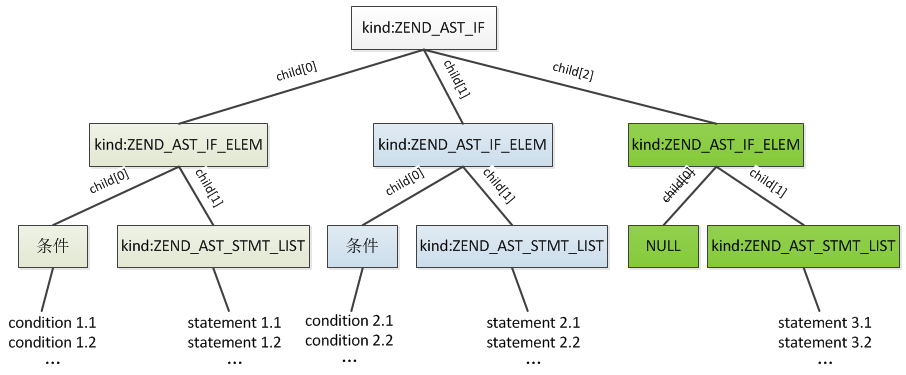
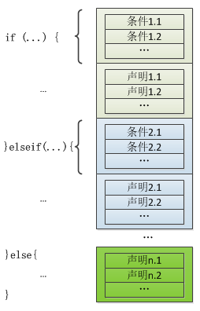
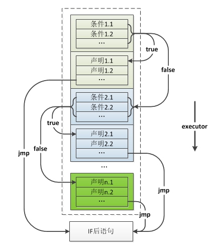

## 4.2 选择结构
程序并不都是顺序执行的，选择结构用于判断给定的条件，根据判断的结果来控制程序的流程。PHP中通过if、elseif、else和switch语句实现条件控制。这一节我们具体分析下这几条语句的执行过程。

### 4.2.1 if语句
If语句用法：
```php
if(Condition1){
    Statement1;
}elseif(Condition2){
    Statement2;
}else{
    Statement3;
}
```
各语句的条件可以有多个。

IF语句有两部分组成：condition(条件)、statement(声明)，每个if、elseif对应一组这样的组合，其中最后的else比较特殊，它没有条件，编译时也是按照这个逻辑编译为一组组的condition和statement，其具体的语法规则如下：
```c
if_stmt:
        if_stmt_without_else %prec T_NOELSE { $$ = $1; }
    |   if_stmt_without_else T_ELSE statement 
            { $$ = zend_ast_list_add($1, zend_ast_create(ZEND_AST_IF_ELEM, NULL, $3)); }
;

if_stmt_without_else:
        T_IF '(' expr ')' statement { $$ = zend_ast_create_list(1, ZEND_AST_IF,
                                        zend_ast_create(ZEND_AST_IF_ELEM, $3, $5)); }
    |   if_stmt_without_else T_ELSEIF '(' expr ')' statement 
            { $$ = zend_ast_list_add($1, zend_ast_create(ZEND_AST_IF_ELEM, $4, $6)); }
;
```
从上面的语法规则可以看出，编译if语句时首先会创建一个`ZEND_AST_IF`的节点，这个节点是一个list，编译if、elseif、else时创建一个`ZEND_AST_IF_ELEM`的节点，这个节点中包含condition、statement两部分，然后把这个节点插入到`ZEND_AST_IF`下，最终生成的AST：



所以整体来看if语句编译后是这样的结构：





### 4.2.2 switch语句
