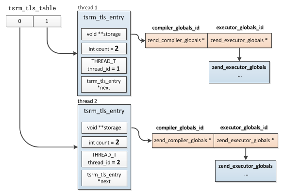

## 6.1 介绍
在C语言中声明在任何函数之外的变量为全局变量，全局变量为各线程共享，不同的线程引用同一地址空间，如果一个线程修改了全局变量就会影响所有的线程。所以线程安全是指多线程环境下如何安全的获取公共资源。

PHP的SAPI多数是单线程环境，比如cli、fpm、cgi，每个进程只启动一个主线程，这种模式下是不存在线程安全问题的，但是也有多线程的环境，比如Apache，或用户自己嵌入PHP实现的环境，这种情况下就需要考虑线程安全的问题了，因为PHP中有很多全局变量，比如最常见的：EG、CG，如果多个线程共享同一个变量将会冲突，所以PHP为多线程的应用模型提供了一个安全机制：Zend线程安全(Zend Thread Safe, ZTS)。

## 6.2 线程安全资源管理器
PHP中专门为解决线程安全的问题抽象出了一个线程安全资源管理器(Thread Safe Resource Mananger, TSRM)，实现原理比较简单：既然共用资源这么困难那么就干脆不共用，各线程不再共享同一份全局变量，而是各复制一份，使用数据时各线程各取自己的副本，互不干扰。

### 6.2.1 基本实现
TSRM核心思想就是为不同的线程分配独立的内存空间，如果一个资源会被多线程使用，那么首先需要预先向TSRM注册资源，然后TSRM为这个资源分配一个唯一的编号，并把这种资源的大小、初始化函数等保存到一个`tsrm_resource_type`结构中，各线程只能通过TSRM分配的那个编号访问这个资源；然后当线程拿着这个编号获取资源时TSRM如果发现是第一次请求，则会根据注册时的资源大小分配一块内存，然后调用初始化函数进行初始化，并把这块资源保存下来供这个线程后续使用。

TSRM中通过两个结构分别保存资源信息以及具体的资源：tsrm_resource_type、tsrm_tls_entry，前者是用来记录资源大小、初始化函数等信息的，具体分配资源内存时会用到，而后者用来保存各线程所拥有的全部资源：
```c
struct _tsrm_tls_entry {
    void **storage; //资源数组
    int count; //拥有的资源数:storage数组大小
    THREAD_T thread_id; //所属线程id
    tsrm_tls_entry *next;
};

typedef struct {
    size_t size; //资源的大小
    ts_allocate_ctor ctor; //初始化函数
    ts_allocate_dtor dtor;
    int done;
} tsrm_resource_type;
```
每个线程拥有一个`tsrm_tls_entry`结构，当前线程的所有资源保存在storage数组中，下标就是各资源的id。

另外所有线程的`tsrm_tls_entry`结构通过一个数组保存：tsrm_tls_table，这是个全局变量，所以操作这个变量时需要加锁。这个值在TSRM初始化时按照预设置的线程数分配，每个线程的tsrm_tls_entry结构在这个数组中的位置是根据线程id与预设置的线程数(tsrm_tls_table_size)取模得到的，也就是说有可能多个线程保存在tsrm_tls_table同一位置，所以tsrm_tls_entry是个链表，查找资源时首先根据:`线程id % tsrm_tls_table_size`得到一个tsrm_tls_entry，然后开始遍历链表比较thread_id确定是否是当前线程的。

#### 6.2.1.1 初始化
在使用TSRM之前需要主动开启，一般这个步骤在sapi启动时执行，主要工作就是分配tsrm_tls_table、resource_types_table内存以及创建线程互斥锁，下面具体看下TSRM初始化的过程(以pthread为例)：
```c
TSRM_API int tsrm_startup(int expected_threads, int expected_resources, int debug_level, char *debug_filename)
{
    pthread_key_create( &tls_key, 0 );

    //分配tsrm_tls_table
    tsrm_tls_table_size = expected_threads;
    tsrm_tls_table = (tsrm_tls_entry **) calloc(tsrm_tls_table_size, sizeof(tsrm_tls_entry *));
    ...
    //初始化资源的递增id，注册资源时就是用的这个值
    id_count=0;

    //分配资源类型数组：resource_types_table
    resource_types_table_size = expected_resources;
    resource_types_table = (tsrm_resource_type *) calloc(resource_types_table_size, sizeof(tsrm_resource_type));
    ...
    //创建锁
    tsmm_mutex = tsrm_mutex_alloc();
}
```
#### 6.2.1.2 资源注册
初始化完成各模块就可以各自进行资源注册了，注册后TSRM会给注册的资源分配唯一id，之后对此资源的操作只能依据此id，接下来我们以EG为例具体看下其注册过程。
```c
#ifdef ZTS
ZEND_API int executor_globals_id;
#endif

int zend_startup(zend_utility_functions *utility_functions, char **extensions)
{
    ...
#ifdef ZTS
    ts_allocate_id(&executor_globals_id, sizeof(zend_executor_globals), (ts_allocate_ctor) executor_globals_ctor, (ts_allocate_dtor) executor_globals_dtor);
    
    executor_globals = ts_resource(executor_globals_id);
    ...
#endif
}
```
资源注册调用`ts_allocate_id()`完成，此函数有4个参数有，第一个就是定义的资源id指针，注册之后会把分配的id写到这里，第二个是资源类型的大小，EG资源的结构是`zend_executor_globals`，所以这个值就是sizeof(zend_executor_globals)，后面两个分别是资源的初始化函数以及销毁函数，因为TSRM并不关心资源的具体类型，分配资源时它只按照size大小分配内存，然后回调各资源自己定义的ctor进行初始化。
```c
TSRM_API ts_rsrc_id ts_allocate_id(ts_rsrc_id *rsrc_id, size_t size, ts_allocate_ctor ctor, ts_allocate_dtor dtor)
{
    //加锁，保证各线程串行调用此函数
    tsrm_mutex_lock(tsmm_mutex);

    //分配id，即id_count当前值，然后把id_count加1
    *rsrc_id = TSRM_SHUFFLE_RSRC_ID(id_count++);

    //检查resource_types_table数组当前大小是否已满
    if (resource_types_table_size < id_count) {
        //需要对resource_types_table扩容
        resource_types_table = (tsrm_resource_type *) realloc(resource_types_table, sizeof(tsrm_resource_type)*id_count);
        ...
        //把数组大小修改新的大小
        resource_types_table_size = id_count;
    }

    //将新注册的资源插入resource_types_table数组，下标就是分配的资源id
    resource_types_table[TSRM_UNSHUFFLE_RSRC_ID(*rsrc_id)].size = size;
    resource_types_table[TSRM_UNSHUFFLE_RSRC_ID(*rsrc_id)].ctor = ctor;
    resource_types_table[TSRM_UNSHUFFLE_RSRC_ID(*rsrc_id)].dtor = dtor;
    resource_types_table[TSRM_UNSHUFFLE_RSRC_ID(*rsrc_id)].done = 0;
    ...
}
```
到这里并没有结束，所有的资源并不是统一时机注册的，所以注册一个新资源时可能有线程已经分配先前注册的资源了，因此需要对各线程的storage数组进行扩容，否则storage将没有空间容纳新的资源。扩容的过程比较简单：遍历各线程的tsrm_tls_entry，检查storage当时是否有空闲空间，有的话跳过，没有的话则扩展。
```c
for (i=0; i<tsrm_tls_table_size; i++) {
    tsrm_tls_entry *p = tsrm_tls_table[i];
    
    //tsrm_tls_table[i]可能保存着多个线程，需要遍历链表
    while (p) {
        if (p->count < id_count) {
            int j;

            //将storage扩容
            p->storage = (void *) realloc(p->storage, sizeof(void *)*id_count);
            //分配并初始化新注册的资源，实际这里只会执行一次，不清楚为什么用循环
            //另外这里不分配内存也可以，可以放到使用时再去分配
            for (j=p->count; j<id_count; j++) {
                p->storage[j] = (void *) malloc(resource_types_table[j].size);
                if (resource_types_table[j].ctor) {
                    //回调初始化函数进行初始化
                    resource_types_table[j].ctor(p->storage[j]);
                }
            }
            p->count = id_count;
        }
        p = p->next;
    }
}
```
最后将锁释放，完成注册。

#### 6.2.1.3 获取资源
资源的id在注册后需要保存下来，根据id可以通过`ts_resource()`获取到对应资源的值，比如EG，这里暂不考虑EG宏展开的结果，只分析最底层的根据资源id获取资源的操作。
```c
zend_executor_globals *executor_globals;

executor_globals = ts_resource(executor_globals_id);
```
这样获取的`executor_globals`值就是各线程分离的了，对它的操作将不会再影响其它线程。根据资源id获取当前线程资源的过程：首先是根据线程id哈希得到当前线程的tsrm_tls_entry在tsrm_tls_table哪个槽中，然后开始遍历比较id，直到找到当前线程的tsrm_tls_entry，这个查找过程是需要加锁的，最后根据资源id从storage中对应位置取出资源的地址，这个时候如果发现当前线程还没有创建此资源则会从resource_types_table根据资源id取出资源注册时的大小、初始化函数，然后分配内存、调用初始化函数进行初始化并插入所属线程的storage中。
```c
TSRM_API void *ts_resource_ex(ts_rsrc_id id, THREAD_T *th_id)
{
    THREAD_T thread_id;
    int hash_value;
    tsrm_tls_entry *thread_resources;

    //step 1：获取线程id
    if (!th_id) {
        //获取当前线程通过specific data保存的tsrm_tls_entry，暂时忽略
        thread_resources = tsrm_tls_get();
        if(thread_resources){
            //找到线程的tsrm_tls_entry了
            TSRM_SAFE_RETURN_RSRC(thread_resources->storage, id, thread_resources->count); //直接返回
        }
        //pthread_self()，当前线程id
        thread_id = tsrm_thread_id();
    }else{
        thread_id = *th_id;
    }

    //step 2:查找线程tsrm_tls_entry
    tsrm_mutex_lock(tsmm_mutex); //加锁

    //实际就是thread_id % tsrm_tls_table_size
    hash_value = THREAD_HASH_OF(thread_id, tsrm_tls_table_size);
    //链表头部
    thread_resources = tsrm_tls_table[hash_value];
    if (!thread_resources) {
        //当前线程第一次使用资源还未分配：先分配tsrm_tls_entry
        allocate_new_resource(&tsrm_tls_table[hash_value], thread_id);
        //分配完再次调用，这时候将走到下面的分支
        return ts_resource_ex(id, &thread_id);
    }else{
        //遍历查找当前线程的tsrm_tls_entry
        do {
            //找到了
            if (thread_resources->thread_id == thread_id) {
                break;
            }
            if (thread_resources->next) {
                thread_resources = thread_resources->next;
            } else {
                //遍历到最后也没找到，与上面的一致，先分配再查找
                allocate_new_resource(&thread_resources->next, thread_id);
                return ts_resource_ex(id, &thread_id);
            }
        } while (thread_resources);
    }
    //解锁
    tsrm_mutex_unlock(tsmm_mutex);
    
    //step 3：返回资源
    TSRM_SAFE_RETURN_RSRC(thread_resources->storage, id, thread_resources->count);
}
```
首先是获取线程id，如果没有传的话就是当前线程，然后在tsrm_tls_table中查找当前线程的tsrm_tls_entry，不存在则表示当前线程第一次使用资源，则需要调用`allocate_new_resource()`为当前线程分配tsrm_tls_entry，并插入tsrm_tls_table，这个过程还会为当前已注册的所有资源分配内存：
```c
static void allocate_new_resource(tsrm_tls_entry **thread_resources_ptr, THREAD_T thread_id)
{
    (*thread_resources_ptr) = (tsrm_tls_entry *) malloc(sizeof(tsrm_tls_entry));
    (*thread_resources_ptr)->storage = NULL;
    //根据已注册资源数分配storage数组大小，注意这里并不是分配为各资源分配空间
    if (id_count > 0) {
        (*thread_resources_ptr)->storage = (void **) malloc(sizeof(void *)*id_count);
    }
    (*thread_resources_ptr)->count = id_count;
    (*thread_resources_ptr)->thread_id = thread_id;

    //将当前线程的tsrm_tls_entry保存到线程本地存储(Thread Local Storage, TLS)
    tsrm_tls_set(*thread_resources_ptr);

    //为全部资源分配空间
    for (i=0; i<id_count; i++) {
        ...
        (*thread_resources_ptr)->storage[i] = (void *) malloc(resource_types_table[i].size);
        ...
    }
    ...
}
```
这里还用到了一个多线程中经常用到的一个东西：线程本地存储(Thread Local Storage, TLS)，在创建完当前线程的tsrm_tls_entry后会把这个值保存到当前线程的TLS中(即：tsrm_tls_set(*thread_resources_ptr)操作)，这样在`ts_resource()`中就可以通过`tsrm_tls_get()`直接取到了，节省加锁检索的时间。

> __线程本地存储(Thread Local Storage, TLS):__ 我们知道在一个进程中，所有线程是共享同一个地址空间的。所以，如果一个变量是全局的或者是静态的，那么所有线程访问的是同一份，如果某一个线程对其进行了修改，也就会影响到其他所有的线程。不过我们可能并不希望这样，所以更多的推荐用基于堆栈的自动变量或函数参数来访问数据，因为基于堆栈的变量总是和特定的线程相联系的。TLS在各平台下实现方式不同，主要分为两类：静态TLS、动态TLS，pthread中pthread_setspecific()、pthread_getspecific()的实现就可以认为是动态TLS的实现。

比如tsrm_tls_table_size初始化时设置为了2，当前有2个thread：thread 1、thread 2，假如注册了CG、EG两个资源，则存储结构如下图：



### 6.2.2 Native-TLS
上一节我们介绍了资源的注册以及根据资源id获取资源的方法，那么PHP内核每次使用对应的资源时难道都需要调用`ts_resource()`吗？如果是这样的话那么多次在使用EG时实际都会调一次这个方法，相当于我们需要调用一个函数来获取一个变量，这在性能上是不可接受的，那么有什么办法解决呢？

`ts_resource()`最核心的操作就是根据线程id获取各线程对应的storage数组，这也是最耗时的部分，至于接下来根据资源id从storage数组读取资源就是普通的内存读取了，这并不影响性能，所以解决上面那个问题的关键就在于 __尽可能的减少线程storage的检索__ 。这一节我们来分析下PHP是如果解决这个问题的，在介绍PHP7实现方式之前我们先看下PHP5.x的处理方式。

PHP5的解决方式非常简单，我们还是以EG为例，EG在内核中随处可见，不是要减少对各线程storage的检索次数吗，那么我就只要检索过一次就把已获取的storage指针传给接下来调用的函数用，其它函数再一级级往下传，这样一来各函数如果发现storage通过参数传进来了就直接用，无需再检索了，也就是通过层层传递的方式减少解决这个问题的。这样以来岂不是每个函数都得带这么一个参数？调用别的函数也得把这个值带上？是的。即使这个函数自己不用它也得需要这个值，因为有可能调用别的函数的时候其它函数会用。

如果你对PHP5有所了解的话一定经常看到这两个宏：TSRMLS_DC、TSRMLS_CC，这两个宏就是用来传递storage指针的，TSRMLS_DC用在定义函数的参数中，实际上它就是一个普通的参数定义，TSRMLS_CC用在调用函数时，它就是一个普通的变量值，我们看下它的展开结果：
```c
#define TSRMLS_DC   , void ***tsrm_ls
#define TSRMLS_CC   , tsrm_ls
```
它的用法是第一个检索到storage的函数把它的指针传递给了下面的函数，参数是tsrm_ls，后面的函数直接根据接收的参数使用获取再传给其它函数，当然也可以不传，那样的话就得重新调用ts_resource()获取了。现在我们再看下EG宏展开的结果：
```c
# define EG(v) TSRMG(executor_globals_id, zend_executor_globals *, v)

#define TSRMG(id, type, element)    (((type) (*((void ***) tsrm_ls))[TSRM_UNSHUFFLE_RSRC_ID(id)])->element)
```
比如：`EG(function_table) => (((zend_executor_globals *) (*((void ***) tsrm_ls))[executor_globals_id-1])->function_table)`，这样我们在传了tsrm_ls的函数中就可能读取内存使用了。

PHP5的这种处理方式简单但是很不优雅，不管你用不用TSRM都不得不在函数中加上那两个宏，而且很容易遗漏。后来Anatol Belski在PHP的rfc提交了一种新的处理方式：[https://wiki.php.net/rfc/native-tls](https://wiki.php.net/rfc/native-tls)，新的处理方式最终在PHP7版本得以实现，通过静态TLS将各线程的storage保存在全局变量中，各函数中使用时直接读取即可。

linux下这种全局变量通过加上`__thread`定义，这样各线程更新这个变量就不会冲突了，实际这是gcc提供的，详细的内容这里不再展开，有兴趣的可以再查下详细的资料。举个例子：
```c
#include <stdio.h>
#include <stdlib.h>
#include <pthread.h>
#include <unistd.h>

__thread int num = 0;

void* worker(void* arg){
    while(1){
        printf("thread:%d\n", num);
        sleep(1);
    }
}

int main(void)
{
    pthread_t tid;
    int ret;

    if ((ret = pthread_create(&tid, NULL, worker, NULL)) != 0){
        return 1;
    }

    while(1){
        num = 4;
        printf("main:%d\n", num);
        sleep(1);
    }

    return 0;
}
```
这个例子有两个线程，其中主线程修改了全局变量num，但是并没有影响另外一个线程。

PHP7中用于缓存各线程storage的全局变量定义在`Zend/zend.c`:
```c
#ifdef ZTS
//这些都是全局变量
ZEND_API int compiler_globals_id;
ZEND_API int executor_globals_id;
static HashTable *global_function_table = NULL;
static HashTable *global_class_table = NULL;
static HashTable *global_constants_table = NULL;
static HashTable *global_auto_globals_table = NULL;
static HashTable *global_persistent_list = NULL;
ZEND_TSRMLS_CACHE_DEFINE() //=>TSRM_TLS void *TSRMLS_CACHE = NULL; 展开后： __thread void *_tsrm_ls_cache = NULL; _tsrm_ls_cache就是各线程storage的地址
#endif
```
比如EG：
```c
# define EG(v) ZEND_TSRMG(executor_globals_id, zend_executor_globals *, v)

#define ZEND_TSRMG TSRMG_STATIC
#define TSRMG_STATIC(id, type, element) (TSRMG_BULK_STATIC(id, type)->element)
#define TSRMG_BULK_STATIC(id, type) ((type) (*((void ***) TSRMLS_CACHE))[TSRM_UNSHUFFLE_RSRC_ID(id)])
```
EG(xxx)最终展开：((zend_executor_globals *) (*((void ***) _tsrm_ls_cache))[executor_globals_id-1]->xxx)。

