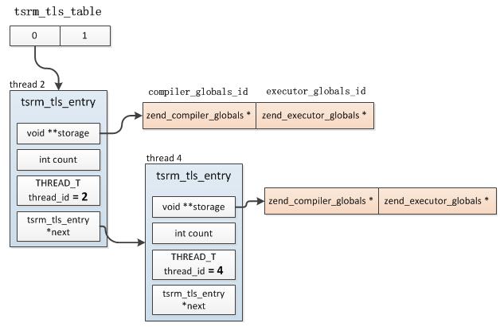

## 6.1 介绍
在C语言中声明在任何函数之外的变量为全局变量，全局变量为各线程共享，不同的线程引用同一地址空间，如果一个线程修改了全局变量就会影响所有的线程。所以线程安全是指多线程环境下如何安全的获取公共资源。

PHP的SAPI多数是单线程环境，比如cli、fpm、cgi，每个进程只启动一个主线程，这种模式下是不存在线程安全问题的，但是也有多线程的环境，比如Apache，或用户自己嵌入PHP实现的环境，这种情况下就需要考虑线程安全的问题了，因为PHP中有很多全局变量，比如最常见的：EG、CG，如果多个线程共享同一个变量将会冲突，所以PHP为多线程的应用模型提供了一个安全机制：Zend线程安全(Zend Thread Safe, ZTS)。

## 6.2 线程安全资源管理器
PHP中专门为解决线程安全的问题抽象出了一个线程安全资源管理器(Thread Safe Resource Mananger, TSRM)，实现原理比较简单：各线程不再共享同一份全局变量，而是各复制一份，使用数据时各线程各取自己的副本，互不干扰。

### 6.2.1 基本实现
TSRM核心思想就是为不同的线程分配独立的内存空间，如果一个资源会被多线程使用，那么首先需要预先向TSRM注册资源，然后TSRM为这个资源分配一个唯一的编号，并把这种资源的大小、初始化函数等保存到一个`tsrm_resource_type`结构中，各线程只能通过TSRM分配的那个编号访问这个资源；然后当线程拿着这个编号获取资源时TSRM如果发现是第一次请求，则会根据注册时的资源大小分配一块内存，然后调用初始化函数进行初始化，并把这块资源保存下来供这个线程后续使用。

TSRM中通过两个结构分别保存资源信息以及具体的资源：tsrm_resource_type、tsrm_tls_entry，前者是用来记录资源大小、初始化函数等信息的，具体分配资源内存时会用到，而后者用来保存各线程所拥有的全部资源：
```c
struct _tsrm_tls_entry {
    void **storage; //资源数组
    int count; //拥有的资源数:storage数组大小
    THREAD_T thread_id; //所属线程id
    tsrm_tls_entry *next;
};

typedef struct {
    size_t size; //资源的大小
    ts_allocate_ctor ctor; //初始化函数
    ts_allocate_dtor dtor;
    int done;
} tsrm_resource_type;
```
每个线程拥有一个`tsrm_tls_entry`结构，当前线程的所有资源保存在storage数组中，下标就是各资源的id。

另外所有线程的`tsrm_tls_entry`结构通过一个数组保存：tsrm_tls_table，这是个全局变量，所以操作这个变量时需要加锁。这个值在TSRM初始化时按照预设置的线程数分配，每个线程的tsrm_tls_entry结构在这个数组中的位置是根据线程id与预设置的线程数(tsrm_tls_table_size)取模得到的，也就是说有可能多个线程保存在tsrm_tls_table同一位置，所以tsrm_tls_entry是个链表，查找资源时首先根据:`线程id % tsrm_tls_table_size`得到一个tsrm_tls_entry，然后开始遍历链表比较thread_id确定是否是当前线程的。

比如tsrm_tls_table_size=2，则thread 2、thread 4将保存在tsrm_tls_table[0]中，如果只有CG、EG两个资源，则存储结构如下图：



### 6.2.2 Native-TLS


