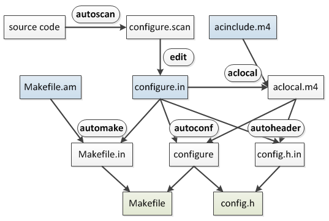

## 7.3 扩展的构成及编译

### 7.3.1 扩展的构成
扩展首先需要创建一个`zend_module_entry`结构，这个变量必须是全局变量，且变量名必须是：`扩展名称_module_entry`，内核通过这个结构得到这个扩展都提供了哪些功能，换句话说，一个扩展可以只包含一个`zend_module_entry`结构，相当于定义了一个什么功能都没有的扩展。
```c
//zend_modules.h
struct _zend_module_entry {
    unsigned short size; //sizeof(zend_module_entry)
    unsigned int zend_api; //ZEND_MODULE_API_NO
    unsigned char zend_debug; //是否开启debug
    unsigned char zts; //是否开启线程安全
    const struct _zend_ini_entry *ini_entry;
    const struct _zend_module_dep *deps;
    const char *name; //扩展名称，不能重复
    const struct _zend_function_entry *functions; //扩展提供的内部函数列表
    int (*module_startup_func)(INIT_FUNC_ARGS); //扩展初始化回调函数，PHP_MINIT_FUNCTION或ZEND_MINIT_FUNCTION定义的函数
    int (*module_shutdown_func)(SHUTDOWN_FUNC_ARGS); //扩展关闭时回调函数
    int (*request_startup_func)(INIT_FUNC_ARGS); //请求开始前回调函数
    int (*request_shutdown_func)(SHUTDOWN_FUNC_ARGS); //请求结束时回调函数
    void (*info_func)(ZEND_MODULE_INFO_FUNC_ARGS); //php_info展示的扩展信息处理函数
    const char *version; //版本
    ...
    unsigned char type;
    void *handle;
    int module_number; //扩展的唯一编号
    const char *build_id;
};
```
这个结构包含很多成员，但并不是所有的都需要自己定义，经常用到的主要有下面几个：
* __name:__ 扩展名称，不能重复
* __functions:__ 扩展定义的内部函数entry
* __module_startup_func:__ PHP在模块初始化时回调的hook函数，可以使扩展介入module startup阶段
* __module_shutdown_func:__ 在模块关闭阶段回调的函数
* __request_startup_func:__ 在请求初始化阶段回调的函数
* __request_shutdown_func:__ 在请求结束阶段回调的函数
* __info_func:__ php_info()函数时调用，用于展示一些配置、运行信息
* __version:__ 扩展版本

除了上面这些需要手动设置的成员，其它部分可以通过`STANDARD_MODULE_HEADER`、`STANDARD_MODULE_PROPERTIES`宏统一设置，扩展提供的内部函数及四个执行阶段的钩子函数是扩展最常用到的部分，几乎所有的扩展都是基于这两部分实现的。有了这个结构还需要提供一个接口来获取这个结构变量，这个接口是统一的，扩展中通过`ZEND_GET_MODULE(extension_name)`完成这个接口的定义:
```
//zend_API.h
#define ZEND_GET_MODULE(name) \
    BEGIN_EXTERN_C()\
    ZEND_DLEXPORT zend_module_entry *get_module(void) { return &name##_module_entry; }\
    END_EXTERN_C()
```
展开后可以看到，实际就是定义了一个get_module()函数，返回扩展zend_module_entry结构的地址，这就是为什么这个结构的变量名必须是`扩展名称_module_entry`这种格式的原因。

有了扩展的zend_module_entry结构以及获取这个结构的接口一个合格的扩展就编写完成了，只是这个扩展目前还什么都干不了：
```c
#include "php.h"
#include "php_ini.h"
#include "ext/standard/info.h"

zend_module_entry mytest_module_entry = {
    STANDARD_MODULE_HEADER,
    "mytest",
    NULL, //mytest_functions,
    NULL, //PHP_MINIT(mytest),
    NULL, //PHP_MSHUTDOWN(mytest),
    NULL, //PHP_RINIT(mytest),
    NULL, //PHP_RSHUTDOWN(mytest),
    NULL, //PHP_MINFO(mytest),
    "1.0.0",
    STANDARD_MODULE_PROPERTIES
};

ZEND_GET_MODULE(mytest)
```
编译、安装后执行`php -m`就可以看到my_test这个扩展了。

### 7.3.2 编译工具
PHP提供了几个脚本工具用于简化扩展的实现：ext_skel、phpize、php-config，后面两个脚本主要配合autoconf、automake生成Makefile。在介绍这几个工具之前，我们先看下PHP安装后的目录结构，因为很多脚本、配置都放置在安装后的目录中，比如PHP的安装路径为：/usr/local/php7，则此目录的主要结构：
```c
|---php7
|   |---bin //php编译生成的二进制程序目录
|       |---php //cli模式的php
|       |---phpize      
|       |---php-config
|       |---...
|   |---etc     //一些sapi的配置    
|   |---include //php源码的头文件
|       |---php
|           |---main    //PHP中的头文件
|           |---Zend    //Zend头文件
|           |---TSRM    //TSRM头文件
|           |---ext     //扩展头文件
|           |---sapi    //SAPI头文件
|           |---include
|   |---lib //依赖的so库
|       |---php
|           |---extensions  //扩展so保存目录
|           |---build       //编译时的工具、m4配置等，编写扩展是会用到
|               |---acinclude.m4    //PHP自定义的autoconf宏
|               |---libtool.m4      //libtool定义的autoconf宏，acinclude.m4、libtool.m4会被合成aclocal.m4
|               |---phpize.m4       //PHP核心configure.in配置
|               |---...
|           |---...
|   |---php
|   |---sbin //SAPI编译生成的二进制程序，php-fpm会放在这
|   |---var  //log、run日志
```

#### 7.3.2.1 ext_skel
这个脚本位于PHP源码/ext目录下，它的作用是用来生成扩展的基本骨架，帮助开发者快速生成一个规范的扩展结构，可以通过以下命令生成一个扩展结构：
```c
./ext_skel --extname=扩展名称
```
执行完以后会在ext目录下新生成一个扩展目录，比如extname是mytest，则将生成以下文件：
```c
|---mytest 
|   |---config.m4     //autoconf规则的编译配置文件
|   |---config.w32    //windows环境的配置
|   |---CREDITS
|   |---EXPERIMENTAL
|   |---include       //依赖库的include头文件，可以不用
|   |---mytest.c      //扩展源码
|   |---php_mytest.h  //头文件
|   |---mytest.php    //用于在PHP中测试扩展是否可用，可以不用
|   |---tests         //测试用例，执行make test时将执行、验证这些用例
|       |---001.phpt
```
这个脚本主要生成了编译需要的配置以及扩展的基本结构，初步生成的这个扩展可以成功的编译、安装、使用，实际开发中我们可以使用这个脚本生成一个基本结构，然后根据具体的需要逐步完善。
### 7.3.2.2 php-config
这个脚本为PHP源码中的/script/php-config.in，PHP安装后被移到安装路径的/bin目录下，并重命名为php-config，这个脚本主要是获取PHP的安装信息的，主要有：
* __PHP安装路径__
* __PHP版本__
* __PHP源码的头文件目录：__ main、Zend、ext、TSRM中的头文件，编写扩展时会用到这些头文件，这些头文件保存在PHP安装位置/include/php目录下
* __LDFLAGS：__ 外部库路径，比如：`-L/usr/bib -L/usr/local/lib`
* __依赖的外部库：__ 告诉编译器要链接哪些文件，`-lcrypt   -lresolv -lcrypt`等等
* __扩展存放目录：__ 扩展.so保存位置，安装扩展make install时将安装到此路径下
* __编译的SAPI：__ 如cli、fpm、cgi等
* __PHP编译参数：__ 执行./configure时带的参数
* ...

这个脚本在编译扩展时会用到，执行`./configure --with-php-config=xxx`生成Makefile时作为参数传入即可，它的作用是提供给configure.in获取上面几个配置，生成Makefile。

#### 7.3.2.3 phpize
这个脚本主要是操作复杂的autoconf/automake/autoheader/autolocal等系列命令，用于生成configure文件，GNU auto系列的工具众多，这里简单介绍下基本的使用：

__(1)autoscan：__ 在源码目录下扫描，生成configure.scan，然后把这个文件重名为为configure.in，可以在这个文件里对依赖的文件、库进行检查以及配置一些编译参数等。

__(2)aclocal：__ automake中有很多宏可以在configure.in或其它.m4配置中使用，这些宏必须定义在aclocal.m4中，否则将无法被autoconf识别，aclocal可以根据configure.in自动生成aclocal.m4，另外，autoconf提供的特性不可能满足所有的需求，所以autoconf还支持自定义宏，用户可以在acinclude.m4中定义自己的宏，然后在执行aclocal生成aclocal.m4时也会将acinclude.m4加载进去。

__(3)autoheader：__ 它可以根据configure.in、aclocal.m4生成一个C语言"define"声明的头文件模板(config.h.in)供configure执行时使用，比如很多程序会通过configure提供一些enable/disable的参数，然后根据不同的参数决定是否开启某些选项，这种就可以根据编译参数的值生成一个define宏，比如：`--enabled-xxx`生成`#define ENABLED_XXX 1`，否则默认生成`#define ENABLED_XXX 0`，代码里直接使用这个宏即可。比如configure.in文件内容如下：
```sh
AC_PREREQ([2.63])
AC_INIT([FULL-PACKAGE-NAME], [VERSION], [BUG-REPORT-ADDRESS])

AC_CONFIG_HEADERS([config.h])

AC_ARG_ENABLE(xxx, "--enable-xxx if enable xxx",[
    AC_DEFINE([ENABLED_XXX], [1], [enabled xxx])
],
[
    AC_DEFINE([ENABLED_XXX], [0], [disabled xxx])
])

AC_OUTPUT
```
执行autoheader后将生成一个config.h.in的文件，里面包含`#undef ENABLED_XXX`，最终执行`./configure --enable-xxx`后将生成一个config.h文件，包含`#define ENABLED_XXX 1`。

__(4)autoconf：__ 将configure.in中的宏展开生成configure、config.h，此过程会用到aclocal.m4中定义的宏。

__(5)automake：__ 将Makefile.am中定义的结构建立Makefile.in，然后configure脚本将生成的Makefile.in文件转换为Makefile。

各步骤之间的转化关系如下图：



编写PHP扩展时并不需要操作上面全部的步骤，PHP提供了两个编辑好的配置：configure.in、acinclude.m4，这两个配置是从PHP安装路径/lib/php/build目录下的phpize.m4、acinclude.m4复制生成的，其中configure.in中定义了一些PHP内核相关的配置检查项，另外这个文件会include每个扩展各自的配置:config.m4，所以编写扩展时我们只需要在config.m4中定义扩展自己的配置就可以了，不需要关心依赖的PHP内核相关的配置，在扩展所在目录下执行phpize就可以生成扩展的configure、config.h文件了。

configure.in(phpize.m4)：
```sh
AC_PREREQ(2.59)
AC_INIT(config.m4)
...
#--with-php-config参数
PHP_ARG_WITH(php-config,,
[  --with-php-config=PATH  Path to php-config [php-config]], php-config, no)

PHP_CONFIG=$PHP_PHP_CONFIG
...
#加载扩展配置
sinclude(config.m4)
...
AC_CONFIG_HEADER(config.h)

AC_OUTPUT()
```
__phpize中的主要操作：__

__(1)phpize_check_configm4:__ 检查扩展的config.m4是否存在。

__(2)phpize_check_build_files:__ 检查php安装路径下的lib/php/build/，这个目录下包含PHP自定义的autoconf宏文件acinclude.m4以及libtool；检查扩展所在目录。

__(3)phpize_print_api_numbers:__ 输出PHP Api Version、Zend Module Api No、Zend Extension Api No信息。
```sh
phpize_get_api_numbers()
{
  # extracting API NOs:
  PHP_API_VERSION=`grep '#define PHP_API_VERSION' $includedir/main/php.h|$SED 's/#define PHP_API_VERSION//'`
  ZEND_MODULE_API_NO=`grep '#define ZEND_MODULE_API_NO' $includedir/Zend/zend_modules.h|$SED 's/#define ZEND_MODULE_API_NO//'`
  ZEND_EXTENSION_API_NO=`grep '#define ZEND_EXTENSION_API_NO' $includedir/Zend/zend_extensions.h|$SED 's/#define ZEND_EXTENSION_API_NO//'`
}
```
__(4)phpize_copy_files:__ 将PHP安装位置/lib/php/build目录下的mkdep.awk scan_makefile_in.awk shtool libtool.m4四个文件拷到扩展的build目录下，然后将acinclude.m4 Makefile.global config.sub config.guess ltmain.sh run-tests*.php文件拷到扩展根目录，最后将acinclude.m4、build/libtool.m4合并到扩展目录下的aclocal.m4文件中。
```sh
phpize_copy_files()
{
  test -d build || mkdir build

  (cd "$phpdir" && cp $FILES_BUILD "$builddir"/build)
  (cd "$phpdir" && cp $FILES "$builddir")
  #acinclude.m4、libtool.m4合并到aclocal.m4
  (cd "$builddir" && cat acinclude.m4 ./build/libtool.m4 > aclocal.m4) 
}
```
__(5)phpize_replace_prefix:__ 将PHP安装位置/lib/php/build/phpize.m4拷贝到扩展目录下，将文件中的prefix替换为PHP安装路径，然后重命名为configure.in。
```sh
phpize_replace_prefix()
{
  $SED \
  -e "s#/usr/local/php7#$prefix#" \
  < "$phpdir/phpize.m4" > configure.in
}
```
__(6)phpize_check_shtool:__ 检查/build/shtool。

__(7)phpize_check_autotools:__ 检查autoconf、autoheader。

__(8)phpize_autotools__ 执行autoconf生成configure，然后再执行autoheader生成config.h。

### 7.3.3 编写扩展的基本步骤
编写一个PHP扩展主要分为以下几步：
* 通过ext目录下ext_skel脚本生成扩展的基本框架：`./ext_skel --extname`；
* 修改config.m4配置：设置编译配置参数、设置扩展的源文件、依赖库/函数检查等等；
* 编写扩展要实现的功能：按照PHP扩展的格式以及PHP提供的API编写功能；
* 生成configure：扩展编写完成后执行phpize脚本生成configure及其它配置文件；
* 编译&安装：./configure、make、make install，然后将扩展的.so路径添加到php.ini中。

最后就可以在PHP中使用这个扩展了。

### 7.3.4 config.m4
config.m4是扩展的编译配置文件，它被include到configure.in文件中，最终被autoconf编译为configure，编写扩展时我们只需要在config.m4中修改配置即可，一个简单的扩展配置只需要包含以下内容：
```c
PHP_ARG_WITH(扩展名称, for mytest support,
Make sure that the comment is aligned:
[  --with-扩展名称             Include xxx support])

if test "$PHP_扩展名称" != "no"; then
    PHP_NEW_EXTENSION(扩展名称, 源码文件列表, $ext_shared,, -DZEND_ENABLE_STATIC_TSRMLS_CACHE=1)
fi
```
PHP在acinclude.m4中基于autoconf/automake的宏封装了很多可以直接使用的宏，下面介绍几个比较常用的宏：

__(1)PHP_ARG_WITH(arg_name,check message,help info):__ 定义一个`--with-feature[=arg]`这样的编译参数，调用的是autoconf的AC_ARG_WITH，这个宏有5个参数，常用的是前三个，分别表示：参数名、执行./configure是展示信息、执行--help时展示信息，第4个参数为默认值，如果不定义默认为"no"，通过这个宏定义的参数可以在config.m4中通过`$PHP_参数名(大写)`访问，比如：
```sh
PHP_ARG_WITH(aaa, aaa-configure, help aa)

#后面通过$PHP_AAA就可以读取到--with-aaa=xxx设置的值了
```
__(2)PHP_ARG_ENABLE(arg_name,check message,help info):__ 定义一个`--enable-feature[=arg]`或`--disable-feature`参数，`--disable-feature`等价于`--enable-feature=no`，这个宏与PHP_ARG_WITH类似，通常情况下如果配置的参数需要额外的arg值会使用PHP_ARG_WITH，而如果不需要arg值，只用于开关配置则会使用PHP_ARG_ENABLE。

__(3)AC_MSG_CHECKING()/AC_MSG_RESULT()/AC_MSG_ERROR():__ ./configure时输出结果，其中error将会中断configure执行。

__(4)AC_DEFINE(variable, value, [description]):__ 定义一个宏，比如：`AC_DEFINE(IS_DEBUG, 1, [])`，执行autoheader时将在头文件中生成：`#define IS_DEBUG 1`。

__(5)PHP_ADD_INCLUDE(path):__ 添加include路径，即：`gcc -Iinclude_dir`，`#include "file";`将先在通过-I指定的目录下查找，扩展引用了外部库或者扩展下分了多个目录的情况下会用到这个宏。

__(6)PHP_CHECK_LIBRARY(library, function [, action-found [, action-not-found [, extra-libs]]]):__ 检查依赖的库中是否存在需要的function，action-found为存在时执行的动作，action-not-found为不存在时执行的动作，比如扩展里使用到线程pthread，检查pthread_create()，如果没找到则终止./configure执行：
```sh
PHP_CHECK_LIBRARY(pthread, pthread_create, [], [
    AC_MSG_ERROR([not find pthread_create() in lib pthread])
])
```
__(7)AC_CHECK_FUNC(function, [action-if-found], [action-if-not-found]):__ 检查函数是否存在。
__(8)PHP_ADD_LIBRARY_WITH_PATH($LIBNAME, $XXX_DIR/$PHP_LIBDIR, XXX_SHARED_LIBADD):__ 添加链接库。

__(9)PHP_NEW_EXTENSION(extname, sources [, shared [, sapi_class [, extra-cflags [, cxx [, zend_ext]]]]]):__ 注册一个扩展，添加扩展源文件，确定此扩展是动态库还是静态库，每个扩展的config.m4中都需要通过这个宏完成扩展的编译配置。

更多autoconf及PHP封装的宏大家可以在用到的时候再自行检索，同时ext目录下有大量的示例可供参考。
