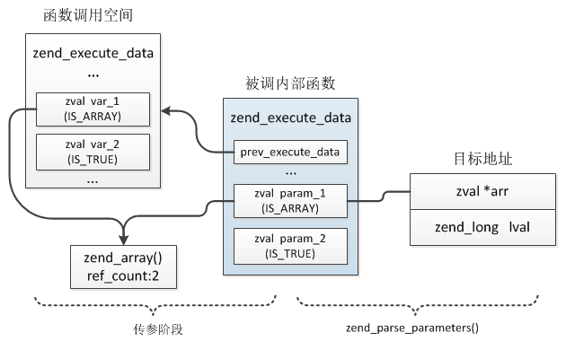

## 7.6 函数
### 7.6.1 内部函数注册
通过扩展可以将C语言实现的函数提供给PHP脚本使用，如同大量PHP内置函数一样，这些函数统称为内部函数(internal function)，与PHP脚本中定义的用户函数不同，它们无需经历用户函数的编译过程，同时执行时也不像用户函数那样每一个指令都调用一次C语言编写的handler函数，因此，内部函数的执行效率更高。除了性能上的优势，内部函数还可以拥有更高的控制权限，可发挥的作用也更大，能够完成很多用户函数无法实现的功能。

前面介绍PHP函数的编译时曾经详细介绍过PHP函数的实现，函数通过`zend_function`来表示，这是一个联合体，用户函数使用`zend_function.op_array`，内部函数使用`zend_function.internal_function`，两者具有相同的头部用来记录函数的基本信息。不管是用户函数还是内部函数，其最终都被注册到EG(function_table)中，函数被调用时根据函数名称向这个符号表中查找。从内部函数的注册、使用过程可以看出，其定义实际非常简单，我们只需要定义一个`zend_internal_function`结构，然后注册到EG(function_table)中即可，接下来再重新看下内部函数的结构：
```c
typedef struct _zend_internal_function {
    /* Common elements */
    zend_uchar type;
    zend_uchar arg_flags[3]; /* bitset of arg_info.pass_by_reference */
    uint32_t fn_flags;
    zend_string* function_name;
    zend_class_entry *scope;
    zend_function *prototype;
    uint32_t num_args;
    uint32_t required_num_args;
    zend_internal_arg_info *arg_info;
    /* END of common elements */

    void (*handler)(INTERNAL_FUNCTION_PARAMETERS); //函数指针，展开：void (*handler)(zend_execute_data *execute_data, zval *return_value)
    struct _zend_module_entry *module;
    void *reserved[ZEND_MAX_RESERVED_RESOURCES];
} zend_internal_function;
```
Common elements就是与用户函数相同的头部，用来记录函数的基本信息：函数类型、参数信息、函数名等，handler是此内部函数的具体实现，PHP提供了一个宏用于此handler的定义：`PHP_FUNCTION(function_name)`或`ZEND_FUNCTION()`，展开后：
```c
void *zif_function_name(zend_execute_data *execute_data, zval *return_value)
{
    ...
}
```
PHP为函数名加了"zif_"前缀，gdb调试时记得加上这个前缀；另外内部函数定义了两个参数：execute_data、return_value，execute_data不用再说了，return_value是函数的返回值，这两个值在扩展中会经常用到。

比如要在扩展中定义两个函数：my_func_1()、my_func_2()，首先是编写函数：
```c
PHP_FUNCTION(my_func_1)
{
    printf("Hello, I'm my_func_1\n");
}

PHP_FUNCTION(my_func_2)
{
    printf("Hello, I'm my_func_2\n");
}    
```
函数定义完了就需要向PHP注册了，这里并不需要扩展自己注册，PHP提供了一个内部函数注册结构：zend_function_entry，扩展只需要为每个内部函数生成这样一个结构，然后把它们保存到扩展`zend_module_entry.functions`即可，在加载扩展中会自动向EG(function_table)注册。
```c
typedef struct _zend_function_entry {
    const char *fname;  //函数名称
    void (*handler)(INTERNAL_FUNCTION_PARAMETERS); //handler实现
    const struct _zend_internal_arg_info *arg_info;//参数信息
    uint32_t num_args; //参数数目
    uint32_t flags;
} zend_function_entry;
```
zend_function_entry结构可以通过`PHP_FE()`或`ZEND_FE()`定义：
```c
const zend_function_entry mytest_functions[] = {
    PHP_FE(my_func_1,   NULL)
    PHP_FE(my_func_2,   NULL)
    PHP_FE_END //末尾必须加这个
};
```
这几个宏的定义为：
```c
#define ZEND_FE(name, arg_info)                     ZEND_FENTRY(name, ZEND_FN(name), arg_info, 0)
#define ZEND_FENTRY(zend_name, name, arg_info, flags)   { #zend_name, name, arg_info, (uint32_t) (sizeof(arg_info)/sizeof(struct _zend_internal_arg_info)-1), flags },
#define ZEND_FN(name) zif_##name
```
最后将`zend_module_entry->functions`设置为`mytest_functions`即可：
```c
zend_module_entry mytest_module_entry = {
    STANDARD_MODULE_HEADER,
    "mytest",
    mytest_functions, //functions
    NULL, //PHP_MINIT(mytest),
    NULL, //PHP_MSHUTDOWN(mytest),
    NULL, //PHP_RINIT(mytest),
    NULL, //PHP_RSHUTDOWN(mytest),
    NULL, //PHP_MINFO(mytest),
    "1.0.0",
    STANDARD_MODULE_PROPERTIES
};
```
下面来测试下这两个函数能否使用，编译安装后在PHP脚本中调用这两个函数：
```php
//test.php
my_func_1();
my_func_2();
```
cli模式下执行`php test.php`将输出：
```
Hello, I'm my_func_1
Hello, I'm my_func_2
```
大功告成，函数已经能够正常工作了，后续的工作就是不断完善handler实现扩展自己的功能了。

### 7.6.2 函数参数解析
上面我们定义的函数没有接收任何参数，那么扩展定义的内部函数如何读取参数呢？首先回顾下函数参数的实现：用户自定义函数在编译时会为每个参数创建一个`zend_arg_info`结构，这个结构用来记录参数的名称、是否引用传参、是否为可变参数等，在存储上函数参数与局部变量相同，都分配在zend_execute_data上，且最先分配的就是函数参数，调用函数时首先会进行参数传递，按参数次序依次将参数的value从调用空间传递到被调函数的zend_execute_data，函数内部像访问普通局部变量一样通过存储位置访问参数，这是用户自定义函数的参数实现。

内部函数与用户自定义函数最大的不同在于内部函数就是一个普通的C函数，除函数参数以外在zend_execute_data上没有其他变量的分配，函数参数是从PHP用户空间传到函数的，它们与用户自定义函数完全相同，包括参数的分配方式、传参过程，也是按照参数次序依次分配在zend_execute_data上，所以在扩展中定义的函数直接按照顺序从zend_execute_data上读取对应的值即可，PHP中通过`zend_parse_parameters()`这个函数解析zend_execute_data上保存的参数：
```c
zend_parse_parameters(int num_args, const char *type_spec, ...);
```
* num_args为实际传参数，通过`ZEND_NUM_ARGS()`获取：zend_execute_data->This.u2.num_args，前面曾介绍过`zend_execute_data->This`这个zval的用途；
* type_spec是一个字符串，用来标识解析参数的类型，比如:"la"表示第一个参数为整形，第二个为数组，将按照这个解析到指定变量；
* 后面是一个可变参数，用来指定解析到的变量，这个值与type_spec配合使用，即type_spec用来指定解析的变量类型，可变参数用来指定要解析到的变量，这个值必须是指针。

i解析的过程也比较容易理解，调用函数时首先会把参数拷贝到调用函数的zend_execute_data上，所以解析的过程就是按照type_spec指定的各个类型，依次从zend_execute_data上获取参数，然后将参数地址赋给目标变量，比如下面这个例子：
```c
PHP_FUNCTION(my_func_1)
{
    zend_long   lval;
    zval        *arr;
    
    if(zend_parse_parameters(ZEND_NUM_ARGS(), "la", &lval, &arr) == FAILURE){
        RETURN_FALSE;
    }
    ...
}
```
对应的内存关系：



注意：解析时除了整形、浮点型、布尔型是直接硬拷贝value外，其它解析到的变量只能是指针，arr为zend_execute_data上param_1的地址，即：`zval *arr = &param_1`，也就是说参数始终存储在zend_execute_data上，解析获取的是这些参数的地址。`zend_parse_parameters()`调用了`zend_parse_va_args()`进行处理，简单看下解析过程：
```c
//va就是定义的要解析到的各个变量的地址
static int zend_parse_va_args(int num_args, const char *type_spec, va_list *va, int flags)
{
    const  char *spec_walk;
    int min_num_args = -1; //最少参数数
    int max_num_args = 0; //要解析的参数总数
    int post_varargs = 0;
    zval *arg;
    int arg_count; //实际传参数
    
    //遍历type_spec计算出min_num_args、max_num_args
    for (spec_walk = type_spec; *spec_walk; spec_walk++) {
        ...
    }
    ...
    //检查数目是否合法
    if (num_args < min_num_args || (num_args > max_num_args && max_num_args >= 0)) {
        ...
    }
    //获取实际传参数：zend_execute_data.This.u2.num_args
    arg_count = ZEND_CALL_NUM_ARGS(EG(current_execute_data));
    ...
    i = 0;
    //逐个解析参数
    while (num_args-- > 0) {
        ...
        //获取第i个参数的zval地址：arg就是在zend_execute_data上分配的局部变量
        arg = ZEND_CALL_ARG(EG(current_execute_data), i + 1);

        //解析第i个参数
        if (zend_parse_arg(i+1, arg, va, &type_spec, flags) == FAILURE) {
            if (varargs && *varargs) {
                *varargs = NULL;
            }
            return FAILURE;
        }
        i++;
    }
}
```
接下来详细看下不同类型的解析方式。

#### 7.6.2.1 整形：l、L
整形通过"l"、"L"标识，表示解析的参数为整形，解析到的变量类型必须是`zend_long`，不能解析其它类型，如果输入的参数不是整形将按照类型转换规则将其转为整形：
```c
zend_long   lval;

if(zend_parse_parameters(ZEND_NUM_ARGS(), "l", &lval){
    ...
}
printf("lval:%d\n", lval);
```
如果在标识符后加"!"，即："l!"、"L!"，则必须再提供一个zend_bool变量的地址，通过这个值可以判断传入的参数是否为NULL，如果为NULL则将要解析到的zend_long值设置为0，同时zend_bool设置为1：
```c
zend_long   lval; //如果参数为NULL则此值被设为0
zend_bool   is_null; //如果参数为NULL则此值为1，否则为0

if(zend_parse_parameters(ZEND_NUM_ARGS(), "l!", &lval, &is_null){
    ...
}
```
具体的解析过程：
```c
//zend_API.c #line:519
case 'l':
case 'L':
{
    //这里获取解析到的变量地址取的是zend_long *，所以只能解析到zend_long
    zend_long *p = va_arg(*va, zend_long *);
    zend_bool *is_null = NULL;
    
    //后面加"!"时check_null为1
    if (check_null) {
        is_null = va_arg(*va, zend_bool *);
    }

    if (!zend_parse_arg_long(arg, p, is_null, check_null, c == 'L')) {
        return "integer";
    }
}
```
```c
static zend_always_inline int zend_parse_arg_long(zval *arg, zend_long *dest, zend_bool *is_null, int check_null, int cap)
{
    if (check_null) {
        *is_null = 0;
    }
    if (EXPECTED(Z_TYPE_P(arg) == IS_LONG)) {
        //传参为整形，无需转化
        *dest = Z_LVAL_P(arg);
    } else if (check_null && Z_TYPE_P(arg) == IS_NULL) {
        //传参为NULL
        *is_null = 1;
        *dest = 0;
    } else if (cap) {
        //"L"的情况
        return zend_parse_arg_long_cap_slow(arg, dest);
    } else {
        //"l"的情况
        return zend_parse_arg_long_slow(arg, dest);
    }
    return 1;
}
```
> __Note:__ "l"与"L"的区别在于，当传参不是整形且转为整形后超过了整形的大小范围时，"L"将值调整为整形的最大或最小值，而"l"将报错，比如传的参数是字符串"9223372036854775808"(0x7FFFFFFFFFFFFFFF + 1)，转整形后超过了有符号int64的最大值：0x7FFFFFFFFFFFFFFF，所以如果是"L"将解析为0x7FFFFFFFFFFFFFFF。

#### 7.6.2.2 布尔型：b
通过"b"标识符表示将传入的参数解析为布尔型，解析到的变量必须是zend_bool：
```c
zend_bool   ok;

if(zend_parse_parameters(ZEND_NUM_ARGS(), "b", &ok, &is_null) == FAILURE){
    ...
}
```
"b!"的用法与整形的完全相同，也必须再提供一个zend_bool的地址用于获取传参是否为NULL，如果为NULL，则zend_bool为0，用于获取是否NULL的zend_bool为1。

#### 7.6.2.3 浮点型：d

通过"d"标识符表示将参数解析为浮点型，解析的变量类型必须为double：
```c
double  dval;

if(zend_parse_parameters(ZEND_NUM_ARGS(), "d", &dval) == FAILURE){
    ...
}
```
具体解析过程不再展开，"d!"与整形、布尔型用法完全相同。

#### 7.6.2.4 字符串：s、S、p、P
字符串解析有两种形式：char*、zend_string，其中"s"将参数解析到`char*`，且需要额外提供一个size_t类型的变量用于获取字符串长度，"S"将解析到zend_string：
```c
char    *str;
size_t  str_len;

if(zend_parse_parameters(ZEND_NUM_ARGS(), "s", &str, &str_len) == FAILURE){
    ...
}
```
```c
zend_string    *str;

if(zend_parse_parameters(ZEND_NUM_ARGS(), "S", &str) == FAILURE){
    ...
}
```
"s!"、"S!"与整形、布尔型用法不同，字符串时不需要额外提供zend_bool的地址，如果参数为NULL，则char*、zend_string将设置为NULL。除了"s"、"S"之外还有两个类似的："p"、"P"，从解析规则来看主要用于解析路径，实际与普通字符串没什么区别，尚不清楚这俩有什么特殊用法。

#### 7.6.2.5 数组：a、A、h、H
数组的解析也有两类，一类是解析到zval层面，另一类是解析到HashTable，其中"a"、"A"解析到的变量必须是zval，"h"、"H"解析到HashTable，这两类是等价的：
```c
zval        *arr;   //必须是zval指针，不能是zval arr，因为参数保存在zend_execute_data上，arr为此空间上参数的地址
HashTable   *ht;

if(zend_parse_parameters(ZEND_NUM_ARGS(), "ah", &arr, &ht) == FAILURE){
    ...
} 
```
具体解析过程：
```c
case 'A':
case 'a':
{
    //解析到zval *
    zval **p = va_arg(*va, zval **);

    if (!zend_parse_arg_array(arg, p, check_null, c == 'A')) {
        return "array";
    }
}
break;

case 'H':
case 'h':
{
    //解析到HashTable *
    HashTable **p = va_arg(*va, HashTable **);

    if (!zend_parse_arg_array_ht(arg, p, check_null, c == 'H')) {
        return "array";
    }
}
break;
```
"a!"、"A!"、"h!"、"H!"的用法与字符串一致，也不需要额外提供别的地址，如果传参为NULL，则对应解析到的zval*、HashTable*也为NULL。
> __Note:__ 
>
> 1、"a"与"A"当传参为数组时没有任何差别，它们的区别在于：如果传参为对象"A"将按照对象解析到zval，而"a"将报错
>
> 2、"h"与"H"当传参为数组时同样没有差别，当传参为对象时，"H"将把对象的成员参数数组解析到目标变量，"h"将报错

#### 7.6.2.6 对象：o、O
如果参数是一个对象则可以通过"o"、"O"将其解析到目标变量，注意：只能解析为zval*，无法解析为zend_object*。
```c
zval    *obj;

if(zend_parse_parameters(ZEND_NUM_ARGS(), "o", &obj) == FAILURE){
    ...
}
```
"O"是要求解析指定类或其子类的对象，类似传参时显式的声明了参数类型的用法：`function my_func(MyClass $obj){...}`，如果参数不是指定类的实例化对象则无法解析。

"o!"、"O!"与字符串用法相同。

#### 7.6.2.7 资源：r
如果参数为资源则可以通过"r"获取其zval的地址，但是无法直接解析到zend_resource的地址，与对象相同。
```c
zval    *res;

if(zend_parse_parameters(ZEND_NUM_ARGS(), "r", &res) == FAILURE){
    ...
}
```
"r!"与字符串用法相同。

#### 7.6.2.8 类：C
如果参数是一个类则可以通过"C"解析出zend_class_entry地址：`function my_func(stdClass){...}`，这里有个地方比较特殊，解析到的变量可以设定为一个类，这种情况下解析时将会找到的类与指定的类之间的父子关系，只有存在父子关系才能解析，如果只是想根据参数获取类型的zend_class_entry地址，记得将解析到的地址初始化为NULL，否则将会不可预料的错误。
```c
zend_class_entry    *ce = NULL; //初始为NULL

if(zend_parse_parameters(ZEND_NUM_ARGS(), "C", &ce) == FAILURE){
    RETURN_FALSE;
}
```
#### 7.6.2.9 callable：f
callable指函数或成员方法，如果参数是函数名称字符串、array(对象/类,成员方法)，则可以通过"f"标识符解析出`zend_fcall_info`结构，这个结构是调用函数、成员方法时的唯一输入。
```c
zend_fcall_info         callable; //注意，这两个结构不能是指针
zend_fcall_info_cache   call_cache;

if(zend_parse_parameters(ZEND_NUM_ARGS(), "f", &callable, &call_cache) == FAILURE){
    RETURN_FALSE;
}
```
函数调用：
```php
my_func_1("func_name");
//或
my_func_1(array('class_name', 'static_method'));
//或
my_func_1(array($object, 'method'));
```
解析出`zend_fcall_info`后就可以通过`zend_call_function()`调用函数、成员方法了，提供"f"解析到`zend_fcall_info`的用意是简化函数调用的操作，否则需要我们自己去查找函数、检查是否可被调用等工作，关于这个结构稍后介绍函数调用时再作详细说明。

#### 7.6.2.10 任意类型：z
"z"表示按参数实际类型解析，比如参数为字符串就解析为字符串，参数为数组就解析为数组，这种实际就是将zend_execute_data上的参数地址拷贝到目的变量了，没有做任何转化。

"z!"与字符串用法相同。

#### 7.6.2.11 其它标识符
除了上面介绍的这些解析符号以外，还有几个有特殊用法的标识符："|"、"+"、"*"，它们并不是用来表示某种数据类型的。
* __|：__ 表示此后的参数为可选参数，可以不传，比如解析规则为："al|b"，则可以传2个或3个参数，如果是："alb"，则必须传3个，否则将报错；
* __+/*：__ 用于可变参数，注意这里与PHP函数...的用法不太一样，PHP中可以把函数最后一个参数前加...，表示调用时可以传多个参数，这些参数都会插入...参数的数组中，"*/+"也表示这个参数是可变的，但内核中只能接收一个值，即使传了多个后面那些也解析不到，"*"、"+"的区别在于"*"表示可以不传可变参数，而"+"表示可变参数至少有一个。

### 7.6.3 引用传参
上一节介绍了如何在内部函数中解析参数，这里还有一种情况没有讲到，那就是引用传参：
```php
$a = array();

function my_func(&$a){
    $a[] = 1;
}
```
上面这个例子在函数中对$a的修改将反映到原变量上，那么这种用法如何在内部函数中实现呢？上一节介绍参数解析的过程中并没有提到用户函数中参数的zend_arg_info结构，内部函数中也有类似的一个结构用于函数注册时指定参数的一些信息：zend_internal_arg_info。
```c
typedef struct _zend_internal_arg_info {
    const char *name;               //参数名
    const char *class_name;         
    zend_uchar type_hint;           //显式声明的类型
    zend_uchar pass_by_reference;   //是否引用传参
    zend_bool allow_null;           //是否允许参数为NULL，类似"!"的用法
    zend_bool is_variadic;          //是否为可变参数
} zend_internal_arg_info;
```
这个结构几乎与zend_arg_info完全一样，不同的地方只在于name、class_name的类型，zend_arg_info这两个成员的类型都是zend_string。如果函数需要使用引用类型的参数或返回引用就需要创建函数的参数数组，这个数组通过：`ZEND_BEGIN_ARG_INFO()或ZEND_BEGIN_ARG_INFO_EX()`、`ZEND_END_ARG_INFO()`宏定义：
```c
#define ZEND_BEGIN_ARG_INFO_EX(name, _unused, return_reference, required_num_args)
#define ZEND_BEGIN_ARG_INFO(name, _unused)
```
* __name:__ 参数数组名，注册函数`PHP_FE(function, arg_info)`会用到
* ___unused:__ 保留值，暂时无用
* __return_reference:__ 返回值是否为引用，一般很少会用到
* __required_num_args:__ required参数数

这两个宏需要与`ZEND_END_ARG_INFO()`配合使用：
```c
ZEND_BEGIN_ARG_INFO_EX(arginfo_my_func_1, 0, 0, 2)
    ...
ZEND_END_ARG_INFO()
```
接着就是在上面两个宏中间定义每一个参数的zend_internal_arg_info，PHP提供的宏有：
```c
//pass_by_ref表示是否引用传参，name为参数名称
#define ZEND_ARG_INFO(pass_by_ref, name)                             { #name, NULL, 0, pass_by_ref, 0, 0 },

//只声明此参数为引用传参
#define ZEND_ARG_PASS_INFO(pass_by_ref)                              { NULL,  NULL, 0, pass_by_ref, 0, 0 },

//显式声明此参数的类型为指定类的对象，等价于PHP中这样声明：MyClass $obj
#define ZEND_ARG_OBJ_INFO(pass_by_ref, name, classname, allow_null)  { #name, #classname, IS_OBJECT, pass_by_ref, allow_null, 0 },

//显式声明此参数类型为数组，等价于：array $arr
#define ZEND_ARG_ARRAY_INFO(pass_by_ref, name, allow_null)           { #name, NULL, IS_ARRAY, pass_by_ref, allow_null, 0 },

//显式声明为callable，将检查函数、成员方法是否可调
#define ZEND_ARG_CALLABLE_INFO(pass_by_ref, name, allow_null)        { #name, NULL, IS_CALLABLE, pass_by_ref, allow_null, 0 },

//通用宏，自定义各个字段
#define ZEND_ARG_TYPE_INFO(pass_by_ref, name, type_hint, allow_null) { #name, NULL, type_hint, pass_by_ref, allow_null, 0 },

//声明为可变参数
#define ZEND_ARG_VARIADIC_INFO(pass_by_ref, name)                    { #name, NULL, 0, pass_by_ref, 0, 1 },
```
举个例子来看：
```php
function my_func_1(&$a, Exception $c){
    ...
}
```
用内核实现则可以这么定义：
```c
ZEND_BEGIN_ARG_INFO_EX(arginfo_my_func_1, 0, 0, 1)
    ZEND_ARG_INFO(1, a) //引用
    ZEND_ARG_OBJ_INFO(0, b, Exception, 0) //注意：这里不要把字符串加""
ZEND_END_ARG_INFO()
```
展开后：
```c
static const zend_internal_arg_info name[] = { 
    //多出来的这个是给返回值用的
    { (const char*)(zend_uintptr_t)(2), NULL, 0, 0, 0, 0 },
    { "a", NULL, 0, 0, 0, 0 },
    { "b", "Exception", 8, 1, 0, 0 },
}
```
第一个数组元素用于记录必传参数的数量以及返回值是否为引用。定义完这个数组接下来就需要把这个数组告诉函数：
```c
const zend_function_entry mytest_functions[] = {
    PHP_FE(my_func_1,   arginfo_my_func_1)
    PHP_FE(my_func_2,   NULL)
    PHP_FE_END //末尾必须加这个
};
```
引用参数通过`zend_parse_parameters()`解析时只能使用"z"解析，不能再直接解析为zend_value了，否则引用将失效：
```c
PHP_FUNCTION(my_func_1)
{
    zval    *lval; //必须为zval，定义为zend_long也能解析出，但不是引用
    zval    *obj;

    if(zend_parse_parameters(ZEND_NUM_ARGS(), "zo", &lval, &obj) == FAILURE){
        RETURN_FALSE;
    }

    //lval的类型为IS_REFERENCE
    zval *real_val = Z_REFVAL_P(lval); //获取实际引用的zval地址：&(lval.value->ref.val)
    Z_LVAL_P(real_val) = 100; //设置实际引用的类型
}
```
```php
$a = 90;
$b = new Exception;
my_func_1($a, $b);

echo $a;
==========[output]===========
100
```
> __Note:__ 参数数组与zend_parse_parameters()有很多功能重合，两者都会生效，对zend_internal_arg_info验证在zend_parse_parameters()之前，为避免混乱两者应该保持一致；另外，虽然内部函数的参数数组并不强制定义声明，但还是建议声明。

### 7.6.4 函数返回值
调用内部函数时其返回值指针作为参数传入，这个参数为`zval *return_value`，如果函数有返回值直接设置此指针即可，需要特别注意的是设置返回值时需要增加其引用计数，举个例子来看：
```c
PHP_FUNCTION(my_func_1)
{
    zval    *arr;

    if(zend_parse_parameters(ZEND_NUM_ARGS(), "a", &arr) == FAILURE){
        RETURN_FALSE;
    }

    //增加引用计数
    Z_ADDREF_P(arr);

    //设置返回值为数组：
    ZVAL_ARR(return_value, Z_ARR_P(arr));
} 
```
此函数接收一个数组，然后直接返回该数组，相当于：
```php
function my_func_1($arr){
    return $arr;
}
```
调用该函数：
```php
$a = array();       //$a -> zend_array(refcount:1)
$b = my_func_1($a); //传参后：参数arr -> zend_array(refcount:2)
                    //然后函数内部赋给了返回值:$b,$a,arr -> zend_array(refcount:3)
                    //函数return阶段释放了参数：$b,$a -> zend_array(refcount:2)
var_dump($b);
=============[output]===========
array(0) {
}
```
虽然可以直接设置return_value，但实际使用时并不建议这么做，因为PHP提供了很多专门用于设置返回值的宏，这些宏定义在`zend_API.h`中：
```c
//返回布尔型，b：IS_FALSE、IS_TRUE
#define RETURN_BOOL(b)                  { RETVAL_BOOL(b); return; }

//返回NULL
#define RETURN_NULL()                   { RETVAL_NULL(); return;}

//返回整形，l类型：zend_long
#define RETURN_LONG(l)                  { RETVAL_LONG(l); return; }

//返回浮点值，d类型：double
#define RETURN_DOUBLE(d)                { RETVAL_DOUBLE(d); return; }

//返回字符串，可返回内部字符串，s类型为：zend_string *
#define RETURN_STR(s)                   { RETVAL_STR(s); return; }

//返回内部字符串，这种变量将不会被回收，s类型为：zend_string *
#define RETURN_INTERNED_STR(s)          { RETVAL_INTERNED_STR(s); return; }

//返回普通字符串，非内部字符串，s类型为：zend_string *
#define RETURN_NEW_STR(s)               { RETVAL_NEW_STR(s); return; }

//拷贝字符串用于返回，这个会自己加引用计数，s类型为：zend_string *
#define RETURN_STR_COPY(s)              { RETVAL_STR_COPY(s); return; }

//返回char *类型的字符串，s类型为char *
#define RETURN_STRING(s)                { RETVAL_STRING(s); return; }

//返回char *类型的字符串，s类型为char *，l为字符串长度，类型为size_t
#define RETURN_STRINGL(s, l)            { RETVAL_STRINGL(s, l); return; }

//返回空字符串
#define RETURN_EMPTY_STRING()           { RETVAL_EMPTY_STRING(); return; }

//返回资源，r类型：zend_resource *
#define RETURN_RES(r)                   { RETVAL_RES(r); return; }

//返回数组，r类型：zend_array *
#define RETURN_ARR(r)                   { RETVAL_ARR(r); return; }

//返回对象，r类型：zend_object *
#define RETURN_OBJ(r)                   { RETVAL_OBJ(r); return; }

//返回zval
#define RETURN_ZVAL(zv, copy, dtor)     { RETVAL_ZVAL(zv, copy, dtor); return; }

//返回false
#define RETURN_FALSE                    { RETVAL_FALSE; return; }

//返回true
#define RETURN_TRUE                     { RETVAL_TRUE; return; }
```
### 7.6.5 函数调用
实际应用中，扩展可能需要调用用户自定义的函数或者其他扩展定义的内部函数，前面章节已经介绍过函数的执行过程，这里不再重复，本节只介绍下PHP提供的函数调用API的使用:
```c
ZEND_API int call_user_function(HashTable *function_table, zval *object, zval *function_name, zval *retval_ptr, uint32_t param_count, zval params[]);
```
各参数的含义：
* __function_table:__ 函数符号表，普通函数是EG(function_table)，如果是成员方法则是zend_class_entry.function_table
* __object:__ 调用成员方法时的对象
* __function_name:__ 调用的函数名称
* __retval_ptr:__ 函数返回值地址
* __param_count:__ 参数数量
* __params:__ 参数数组

从接口的定义看其使用还是很简单的，不需要我们关心执行过程中各阶段复杂的操作。下面从一个具体的例子看下其使用：

（1）在PHP中定义了一个普通的函数，将参数$i加上100后返回：
```php
function mySum($i){
    return $i+100;
}
```
（2）接下来在扩展中调用这个函数：
```c
PHP_FUNCTION(my_func_1)
{   
    zend_long   i;
    zval        call_func_name, call_func_ret, call_func_params[1];
    uint32_t    call_func_param_cnt = 1;
    zend_string *call_func_str;
    char        *func_name = "mySum";

    if(zend_parse_parameters(ZEND_NUM_ARGS(), "l", &i) == FAILURE){
        RETURN_FALSE;
    }

    //分配zend_string:调用完需要释放
    call_func_str = zend_string_init(func_name, strlen(func_name), 0);
    //设置到zval
    ZVAL_STR(&call_func_name, call_func_str);
    
    //设置参数
    ZVAL_LONG(&call_func_params[0], i);

    //call
    if(SUCCESS != call_user_function(EG(function_table), NULL, &call_func_name, &call_func_ret, call_func_param_cnt, call_func_params)){
        zend_string_release(call_func_str);
        RETURN_FALSE;
    }   
    zend_string_release(call_func_str);
    RETURN_LONG(Z_LVAL(call_func_ret));
}
```
（3）最后调用这个内部函数：
```php
function mySum($i){
    return $i+100;
}

echo my_func_1(60);
===========[output]===========
160
```
`call_user_function()`并不是只能调用PHP脚本中定义的函数，内核或其它扩展注册的函数同样可以通过此函数调用，比如：array_merge()。
```c
PHP_FUNCTION(my_func_1)
{
    zend_array  *arr1, *arr2;
    zval        call_func_name, call_func_ret, call_func_params[2];
    uint32_t    call_func_param_cnt = 2;
    zend_string *call_func_str;
    char        *func_name = "array_merge";

    if(zend_parse_parameters(ZEND_NUM_ARGS(), "hh", &arr1, &arr2) == FAILURE){
        RETURN_FALSE;
    }   
    //分配zend_string
    call_func_str = zend_string_init(func_name, strlen(func_name), 0);
    //设置到zval
    ZVAL_STR(&call_func_name, call_func_str);

    ZVAL_ARR(&call_func_params[0], arr1);
    ZVAL_ARR(&call_func_params[1], arr2);

    if(SUCCESS != call_user_function(EG(function_table), NULL, &call_func_name, &call_func_ret, call_func_param_cnt, call_func_params)){
        zend_string_release(call_func_str);
        RETURN_FALSE;
    }
    zend_string_release(call_func_str);
    RETURN_ARR(Z_ARRVAL(call_func_ret));
}
```
```php
$arr1 = array(1,2);
$arr2 = array(3,4);

$arr = my_func_1($arr1, $arr2);
var_dump($arr);
```
你可能会注意到，上面的例子通过`call_user_function()`调用函数时并没有增加两个数组参数的引用计数，但根据前面介绍的内容：函数传参时不会硬拷贝value，而是增加参数value的引用计数，然后在函数return阶段再把引用减掉。实际是`call_user_function()`替我们完成了这个工作，下面简单看下其处理过程。
```c
int call_user_function(HashTable *function_table, zval *object, zval *function_name, zval *retval_ptr, uint32_t param_count, zval params[])
{
    return call_user_function_ex(function_table, object, function_name, retval_ptr, param_count, params, 1, NULL);
}

int call_user_function_ex(HashTable *function_table, zval *object, zval *function_name, zval *retval_ptr, uint32_t param_count, zval params[], int no_separation, zend_array *symbol_table)
{
    zend_fcall_info fci;

    fci.size = sizeof(fci);
    fci.function_table = function_table;
    fci.object = object ? Z_OBJ_P(object) : NULL;
    ZVAL_COPY_VALUE(&fci.function_name, function_name);
    fci.retval = retval_ptr;
    fci.param_count = param_count;
    fci.params = params;
    fci.no_separation = (zend_bool) no_separation;
    fci.symbol_table = symbol_table;

    return zend_call_function(&fci, NULL);
}
```
`call_user_function()`将我们提供的参数组装为`zend_fcall_info`结构，然后调用`zend_call_function()`进行处理，还记得`zend_parse_parameters()`那个"f"解析符吗？它也是将输入的函数名称解析为一个`zend_fcall_info`，可以更方便的调用函数，同时我们也可以自己创建一个`zend_fcall_info`结构，然后使用`zend_call_function()`完成函数的调用。
```c
int zend_call_function(zend_fcall_info *fci, zend_fcall_info_cache *fci_cache)
{
    ...
    for (i=0; i<fci->param_count; i++) {
        zval *param;
        zval *arg = &fci->params[i];
        ...
        //为参数添加引用
        if (Z_OPT_REFCOUNTED_P(arg)) {
            Z_ADDREF_P(arg);
        }
    }
    ...
    //调用的是用户函数
    if (func->type == ZEND_USER_FUNCTION) {
        //执行
        zend_init_execute_data(call, &func->op_array, fci->retval);
        zend_execute_ex(call);
    }else if (func->type == ZEND_INTERNAL_FUNCTION){ //内部函数
        if (EXPECTED(zend_execute_internal == NULL)) {
            func->internal_function.handler(call, fci->retval);
        } else {
            zend_execute_internal(call, fci->retval);
        }
    }
    ...
}
```

