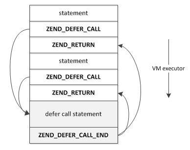
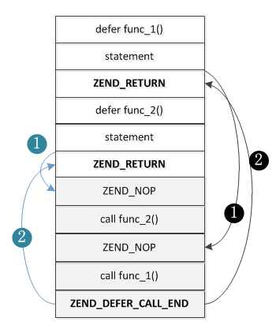

# 附录2：defer推迟执行语法的实现

使用过Go语言的应该都知道defer这个语法，它用来推迟一个函数的执行，在函数执行返回前首先检查当前函数内是否有推迟执行的函数，如果有则执行，然后再返回。defer是一个非常有用的语法，这个功能可以很方便的在函数结束前执行一些清理工作，比如关闭打开的文件、关闭连接、释放资源、解锁等等。这样延迟一个函数有以下两个好处：

* (1) 靠近使用位置，避免漏掉清理工作，同时比放在函数结尾要清晰
* (2) 如果有多处返回的地方可以避免代码重复，比如函数中有很多处return

在一个函数中可以使用多个defer，其执行顺序与栈类似：后进先出，先定义的defer后执行。另外，在返回之后定义的defer将不会被执行，只有返回前定义的才会执行，通过exit退出程序的情况也不会执行任何defer。

在PHP中并没有实现类似的语法，本节我们将尝试在PHP中实现类似Go语言中defer的功能。此功能的实现需要对PHP的语法解析、抽象语法树/opcode的编译、opcode指令的执行等环节进行改造，涉及的地方比较多，但是改动点比较简单，可以很好的帮助大家完整的理解PHP编译、执行两个核心阶段的实现。总体实现思路：

* __(1)语法解析：__ defer本质上还是函数调用，只是将调用时机移到了函数的最后，所以编译时可以复用调用函数的规则，但是需要与普通的调用区分开，所以我们新增一个AST节点类型，其子节点为为正常函数调用编译的AST，语法我们定义为：`defer function_name()`;
* __(2)opcode编译：__ 编译opcode时也复用调用函数的编译逻辑，不同的地方在于把defer放在最后编译，另外需要在编译return前新增一条opcode，用于执行return前跳转到defer开始的位置，在defer的最后也需要新增一条opcode，用于执行完defer后跳回return的位置；
* __(3)执行阶段：__ 执行时如果发现是return前新增的opcode则跳转到defer开始的位置，同时把return的位置记录下来，执行完defer后再跳回return。

编译后的opcode指令如下图所示：



接下来我们详细介绍下各个环节的改动，一步步实现defer功能。

__(1)语法解析__

想让PHP支持`defer function_name()`的语法首先需要修改的是词法解析规则，将"defer"关键词解析为token：T_DEFER，这样词法扫描器在匹配token时遇到"defer"将告诉语法解析器这是一个T_DEFER。这一步改动比较简单，PHP的词法解析规则定义在zend_language_scanner.l中，加入以下代码即可：
```c
<ST_IN_SCRIPTING>"defer" {
    RETURN_TOKEN(T_DEFER);
}
```
完成词法解析规则的修改后接着需要定义语法解析规则，这是非常关键的一步，语法解析器会根据配置的语法规则将PHP代码解析为抽象语法树(AST)。普通函数调用会被解析为ZEND_AST_CALL类型的AST节点，我们新增一种节点类型：ZEND_AST_DEFER_CALL，抽象语法树的节点类型为enum，定义在zend_ast.h中，同时此节点只需要一个子节点，这个子节点用于保存ZEND_AST_CALL节点，因此zend_ast.h的修改如下：
```c
enum _zend_ast_kind {
    ...
    /* 1 child node */
    ...
    ZEND_AST_DEFER_CALL
    ....
}
```
定义完AST节点后就可以在配置语法解析规则了，把defer语法解析为ZEND_AST_DEFER_CALL节点，我们把这条语法规则定义在"statement:"节点下，if、echo、for等语法都定义在此节点下，语法解析规则文件为zend_language_parser.y：
```c
statement:
        '{' inner_statement_list '}' { $$ = $2; }
    ...
    |   T_DEFER function_call ';' { $$ = zend_ast_create(ZEND_AST_DEFER_CALL, $2); }
;
```
修改完这两个文件后需要分别调用re2c、yacc生成对应的C文件，具体的生成命令可以在Makefile.frag中看到：
```c
$ re2c --no-generation-date --case-inverted -cbdFt Zend/zend_language_scanner_defs.h -oZend/zend_language_scanner.c Zend/zend_language_scanner.l
$ yacc -p ini_ -v -d Zend/zend_language_parser.y -oZend/zend_language_parser.c
```
执行完以后将在Zend目录下重新生成zend_language_scanner.c、zend_language_parser.c两个文件。到这一步已经完成生成抽象语法树的工作了，重新编译PHP后已经能够解析defer语法了，将会生成以下节点：


__(2)编译ZEND_AST_DEFER_CALL__

生成抽象语法树后接下来就是编译生成opcodes的操作，即从AST->Opcodes。编译ZEND_AST_DEFER_CALL节点时不能立即进行编译，需要等到当前脚本或函数全部编译完以后再进行编译，所以在编译过程需要把ZEND_AST_DEFER_CALL节点先缓存下来，参考循环结构编译时生成的zend_brk_cont_element的存储位置，我们也把ZEND_AST_DEFER_CALL节点保存在zend_op_array中，通过数组进行存储，将ZEND_AST_DEFER_CALL节点依次存入该数组，zend_op_array中加入以下几个成员：

* __last_defer:__ 整形，记录当前编译的defer数
* __defer_start_op:__ 整形，用于记录defer编译生成opcode指令的起始位置
* __defer_call_array:__ 保存ZEND_AST_DEFER_CALL节点的数组，用于保存ast节点的地址

```c
struct _zend_op_array {
    ...
    int last_defer;
    uint32_t defer_start_op;
    zend_ast **defer_call_array;
}
```
修改完数据结构后接着对应修改zend_op_array初始化的过程：
```c
//zend_opcode.c
void init_op_array(zend_op_array *op_array, zend_uchar type, int initial_ops_size)
{
    ...
    op_array->last_defer = 0;
    op_array->defer_start_op = 0;
    op_array->defer_call_array = NULL;
    ...
}
```
完成依赖的这些数据结构的改造后接下来开始编写具体的编译逻辑，也就是编译ZEND_AST_DEFER_CALL的处理。抽象语法树的编译入口函数为zend_compile_top_stmt()，然后根据不同节点的类型进行相应的编译，我们在zend_compile_stmt()函数中对ZEND_AST_DEFER_CALL节点进行编译：
```c
void zend_compile_stmt(zend_ast *ast)
{
    ...
    switch (ast->kind) {
        ...
        case ZEND_AST_DEFER_CALL:
            zend_compile_defer_call(ast);
            break
        ...
    }
}
```
编译过程只是将ZEND_AST_DEFER_CALL的子节点(即：ZEND_AST_CALL)保存到zend_op_array->defer_call_array数组中，注意这里defer_call_array数组还没有分配内存，参考循环结构的实现，这里我们定义了一个函数用于数组的分配：
```c
//zend_compile.c
void zend_compile_defer_call(zend_ast *ast)
{
    if(!ast){
        return;
    }

    zend_ast **call_ast = NULL;
    //将普通函数调用的ast节点保存到defer_call_array数组中
    call_ast = get_next_defer_call(CG(active_op_array));
    *call_ast = ast->child[0];
}

//zend_opcode.c
zend_ast **get_next_defer_call(zend_op_array *op_array)
{
    op_array->last_defer++;
    op_array->defer_call_array = erealloc(op_array->defer_call_array, sizeof(zend_ast*)*op_array->last_defer);
    return &op_array->defer_call_array[op_array->last_defer-1];
}
```
既然分配了defer_call_array数组的内存就需要在zend_op_array销毁时释放：
```c
//zend_opcode.c
ZEND_API void destroy_op_array(zend_op_array *op_array)
{
    ...
    if (op_array->defer_call_array) {
        efree(op_array->defer_call_array);
    }
    ...
}
```
编译完整个脚本或函数后，最后还会编译一条ZEND_RETURN，也就是返回指令，相当于ret指令，注意：这条opcode并不是我们在脚本中定义的return语句的，而是PHP内核为我们加的一条指令，这就是为什么有些函数我们没有写return也能返回的原因，任何函数或脚本都会生成这样一条指令。我们缓存在zend_op_array->defer_call_array数组中defer就是要在这时进行编译，也就是把defer的指令编译在最后。内核最后编译返回的这条指令由zend_emit_final_return()方法完成，我们把defer的编译放在此方法的末尾：
```c
//zend_compile.c
void zend_emit_final_return(zval *zv)
{
    ...
    ret = zend_emit_op(NULL, returns_reference ? ZEND_RETURN_BY_REF : ZEND_RETURN, &zn, NULL);
    ret->extended_value = -1;

    //编译defer call
    zend_emit_defer_call();
}
```
前面已经说过，defer本质上就是函数调用，所以编译的过程直接复用普通函数调用的即可。另外，在编译时把起始位置记录到zend_op_array->defer_start_op中，因为在执行return前需要知道跳转到什么位置，这个值就是在那时使用的，具体的用法稍后再作说明。编译时按照倒序的顺序进行编译：
```c
//zend_compile.c
void zend_emit_defer_call()
{   
    if (!CG(active_op_array)->defer_call_array) {
        return;
    }
    
    zend_ast *call_ast;
    zend_op *nop;
    znode result;
    uint32_t opnum = get_next_op_number(CG(active_op_array));
    int defer_num  = CG(active_op_array)->last_defer;
 
    //记录推迟的函数调用指令开始位置   
    CG(active_op_array)->defer_start_op = opnum;
    
    while(--defer_num >= 0){
        call_ast = CG(active_op_array)->defer_call_array[defer_num];
        if (call_ast == NULL) {
            continue;
        }
        nop = zend_emit_op(NULL, ZEND_NOP, NULL, NULL);
        nop->op1.var = -2;
        //编译函数调用       
        zend_compile_call(&result, call_ast, BP_VAR_R);
    }
    //compile ZEND_DEFER_CALL
    zend_emit_op(NULL, ZEND_DEFER_CALL_END, NULL, NULL);
}
```
编译完推迟的函数调用之后，编译一条ZEND_DEFER_CALL_END指令，该指令用于执行完推迟的函数后跳回return的位置进行返回，opcode定义在zend_vm_opcodes.h中：
```c
//zend_vm_opcodes.h
#define ZEND_DEFER_CALL_END                  174
```
还有一个地方你可能已经注意到，在逐个编译defer的函数调用前都生成了一条ZEND_NOP的指令，这个的目的是什么呢？开始的时候已经介绍过defer语法的特点，函数中定义的defer并不是全部执行，在return之后定义的defer是不会执行的，比如：
```go
func main(){
    defer fmt.Println("A")

    if 1 == 1{
        return
    }

    defer fmt.Println("B")
}
```
这种情况下第2个defer就不会生效，因此在return前跳转的位置就不一定是zend_op_array->defer_start_op，有可能会跳过几个函数的调用，所以这里我们通过ZEND_NOP这条空指令对多个defer call进行隔离，同时为避免与其它ZEND_NOP指令混淆，增加一个判断条件：op1.var=-2。这样在return前跳转时就根据此前定义的defer数跳过部分函数的调用，如下图所示。



到这一步我们已经完成defer函数调用的编译，此时重新编译PHP后可以看到通过defer推迟的函数调用已经被编译在最后了，只不过这个时候它们不能被执行。

__(3)编译return__


