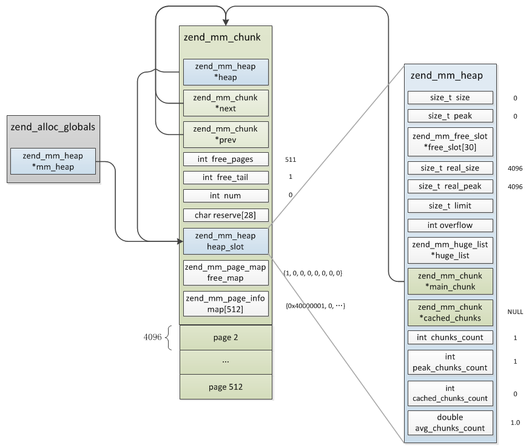
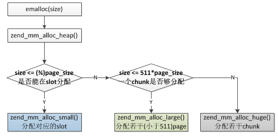

## 5.1 Zend内存池
zend针对内存的操作封装了一层，实现了更高效率的内存利用，其实现主要参考了tcmalloc的设计。

zend内存池有两种粒度的内存块：chunk、page，每个chunk的大小为2M，page大小为4KB，一个chunk被切割为512个page，申请内存时按照三种情况处理：
* __Huge(chunk):__ 申请内存大于2M，直接调用系统分配，分配若干个chunk
* __Large(page):__ 申请内存大于3092B(3/4 page_size)，小于2044KB(511 page_size)，分配若干个page
* __Small(slot):__ 申请内存小于3092B(3/4 page_size)，内存池提前定义好了30种同等大小的内存(8,16,24,32，...3072)，他们分配在不同的page上(不同大小的内存可能会分配在多个连续的page)，申请内存时直接在对应page上查找可用位置

### 5.1.1 基本数据结构
chunk由512个page组成，其中第一个page用于保存chunk结构，剩下的511个page用于内存分配，page主要用于Large、Small两种内存的分配；heap是表示内存池的一个结构，它是最主要的一个结构，用于管理上面三种内存的分配，Zend中只有一个heap结构。

```c
struct _zend_mm_heap {
#if ZEND_MM_STAT
    size_t             size; //当前已用内存数
    size_t             peak; //内存单次申请的峰值
#endif
    zend_mm_free_slot *free_slot[ZEND_MM_BINS]; /* 小内存分配的可用位置链表，ZEND_MM_BINS等于30，即此数组表示的是各种大小内存对应的链表头部 */
#if ZEND_MM_STAT || ZEND_MM_LIMIT
    size_t             real_size;               /* current size of allocated pages */
#endif
#if ZEND_MM_STAT
    size_t             real_peak;               /* peak size of allocated pages */
#endif
#if ZEND_MM_LIMIT
    size_t             limit;                   /* memory limit */
    int                overflow;                /* memory overflow flag */
#endif

    zend_mm_huge_list *huge_list;               /* list of huge allocated blocks */

    zend_mm_chunk     *main_chunk;
    zend_mm_chunk     *cached_chunks;           /* list of unused chunks */
    int                chunks_count;            /* number of alocated chunks */
    int                peak_chunks_count;       /* peak number of allocated chunks for current request */
    int                cached_chunks_count;     /* number of cached chunks */
    double             avg_chunks_count;
}

struct _zend_mm_chunk {
    zend_mm_heap      *heap; //指向heap
    zend_mm_chunk     *next; //指向下一个chunk
    zend_mm_chunk     *prev; //指向上一个chunk
    int                free_pages; //当前chunk的剩余page数
    int                free_tail;               /* number of free pages at the end of chunk */
    int                num;
    char               reserve[64 - (sizeof(void*) * 3 + sizeof(int) * 3)];
    zend_mm_heap       heap_slot; //heap结构，只有主chunk会用到
    zend_mm_page_map   free_map; //标识各page是否已分配的数组，总大小512bit，对应page总数，每个page占一个bit位
    zend_mm_page_info  map[ZEND_MM_PAGES]; //各page的信息：当前page使用类型(用于large分配还是small)、占用的page数等
};

//按固定大小切好的small内存槽
struct _zend_mm_free_slot {
    zend_mm_free_slot *next_free_slot;//此指针只有内存未分配时用到，分配后整个结构体转为char使用
};
```
chunk、page、slot三者的关系：


接下来看下内存池的初始化以及三种内存分配的过程。

### 5.1.2 内存池初始化
内存池在php_module_startup阶段初始化，start_memory_manager()：
```c
ZEND_API void start_memory_manager(void)
{
#ifdef ZTS
    ts_allocate_id(&alloc_globals_id, sizeof(zend_alloc_globals), (ts_allocate_ctor) alloc_globals_ctor, (ts_allocate_dtor) alloc_globals_dtor);
#else
    alloc_globals_ctor(&alloc_globals);
#endif
}

static void alloc_globals_ctor(zend_alloc_globals *alloc_globals)
{
#ifdef MAP_HUGETLB
    tmp = getenv("USE_ZEND_ALLOC_HUGE_PAGES");
    if (tmp && zend_atoi(tmp, 0)) {
        zend_mm_use_huge_pages = 1;
    }
#endif
    ZEND_TSRMLS_CACHE_UPDATE();
    alloc_globals->mm_heap = zend_mm_init();
}
```
__alloc_globals__是一个全局变量，即__AG宏__，它只有一个成员:mm_heap，保存着整个内存池的信息，所有内存的分配都是基于这个值，看下它的初始化：
```c
static zend_mm_heap *zend_mm_init(void)
{
    //向系统申请2M大小的chunk
    zend_mm_chunk *chunk = (zend_mm_chunk*)zend_mm_chunk_alloc_int(ZEND_MM_CHUNK_SIZE, ZEND_MM_CHUNK_SIZE);
    zend_mm_heap *heap;

    heap = &chunk->heap_slot; //heap结构实际是主chunk嵌入的一个结构，后面再分配chunk的heap_slot不再使用
    chunk->heap = heap;
    chunk->next = chunk;
    chunk->prev = chunk;
    chunk->free_pages = ZEND_MM_PAGES - ZEND_MM_FIRST_PAGE; //剩余可用page数
    chunk->free_tail = ZEND_MM_FIRST_PAGE;
    chunk->num = 0;
    chunk->free_map[0] = (Z_L(1) << ZEND_MM_FIRST_PAGE) - 1; //将第一个page的bit分配标识位设置为1
    chunk->map[0] = ZEND_MM_LRUN(ZEND_MM_FIRST_PAGE); //第一个page的类型为ZEND_MM_IS_LRUN，即large内存
    heap->main_chunk = chunk; //指向主chunk
    heap->cached_chunks = NULL; //缓存chunk链表
    heap->chunks_count = 1; //已分配chunk数
    heap->peak_chunks_count = 1;
    heap->cached_chunks_count = 0;
    heap->avg_chunks_count = 1.0;
#if ZEND_MM_STAT || ZEND_MM_LIMIT
    heap->real_size = ZEND_MM_CHUNK_SIZE;
#endif
#if ZEND_MM_STAT
    heap->real_peak = ZEND_MM_CHUNK_SIZE;
    heap->size = 0;
    heap->peak = 0;
#endif
#if ZEND_MM_LIMIT
    heap->limit = (Z_L(-1) >> Z_L(1));
    heap->overflow = 0;
#endif
    heap->huge_list = NULL; //huge内存链表
    return heap;
}
```
这里分配了主chunk，只有第一个chunk的heap会用到，后面分配的chunk不再用到heap，初始化完的结构如下图：



初始化的过程实际只是分配了一个主chunk，这里并没有看到开始提到的小内存slot切割，下一节我们来详细看下各种内存的分配过程。

### 5.1.3 内存分配
文章开头已经简单提过Zend内存分配器按照申请内存的大小有三种不同的实现：



#### 5.1.3.1 Huge分配
超过2M内存的申请，与通用的内存申请没有太大差别，只是将申请的内存块通过单链表进行了管理。

```c
static void *zend_mm_alloc_huge(zend_mm_heap *heap, size_t size ZEND_FILE_LINE_DC ZEND_FILE_LINE_ORIG_DC)
{
    size_t new_size = ZEND_MM_ALIGNED_SIZE_EX(size, REAL_PAGE_SIZE); //按页大小重置实际要分配的内存

#if ZEND_MM_LIMIT
    //如果有内存使用限制则check是否已达上限，达到的话进行zend_mm_gc清理后再检查
    //此过程不再展开分析
#endif

    //分配chunk
    ptr = zend_mm_chunk_alloc(heap, new_size, ZEND_MM_CHUNK_SIZE);
    if (UNEXPECTED(ptr == NULL)) {
        //清理后再尝试分配一次
        if (zend_mm_gc(heap) &&
            (ptr = zend_mm_chunk_alloc(heap, new_size, ZEND_MM_CHUNK_SIZE)) != NULL) {
            /* pass */
        } else {
            //申请失败
            zend_mm_safe_error(heap, "Out of memory");
            return NULL;
        }
    }
    
    //将申请的内存通过zend_mm_huge_list插入到链表中,heap->huge_list指向的实际是zend_mm_huge_list
    zend_mm_add_huge_block(heap, ptr, new_size, ...);
    ...

    return ptr;
}
```
huge的分配过程还是比较简单的。

#### 5.1.3.2 Large分配
大于3/4的page_size(4KB)且小于等于511个page_size的内存申请，也就是一个chunk的大小够用(之所以是511个page而不是512个是因为第一个page始终被chunk结构占用)。

```c
static zend_always_inline void *zend_mm_alloc_large(zend_mm_heap *heap, size_t size ZEND_FILE_LINE_DC ZEND_FILE_LINE_ORIG_DC)
{
    //根据size大小计算需要分配多少个page
    int pages_count = (int)ZEND_MM_SIZE_TO_NUM(size, ZEND_MM_PAGE_SIZE);

    //分配pages_count个page
    void *ptr = zend_mm_alloc_pages(heap, pages_count, ...);
    
    ...

    return ptr;
}
```
进一步看下`zend_mm_alloc_pages`，这个过程比较复杂，简单描述的话就是从第一个chunk开始查找当前chunk下是否有pages_count个连续可用的page，有的话就停止查找，没有的话则接着查找下一个chunk，如果直到最后一个chunk也没找到则重新分配一个新的chunk并插入chunk链表，这个过程中最不好理解的一点在于如何查找pages_count个连续可用的page，这个主要根据__chunk->free_map__实现的，在看具体执行过程之前我们先解释下__free_map__的作用:

我们已经知道每个chunk由512个page组成，而不管是large分配还是small分配，其分配的最小粒子都是page(small也是先分配1个或多个page然后再进行的切割)，所以需要有一个数组来记录每个page是否已经分配，free_map的作用就是标识当前chunk下各page的分配与否，比较特别的是free_map并不是512大小的数组，因为需要记录的信息非常简单，只需要一个bit位就够了，所以free_map就用__长整形__的各bit位来记录的，不同位数的机器长整形大小不同，因此在32、64位下16(4byte整形)或8(8byte整形)个长整形就够512bit了。


```c
static void *zend_mm_alloc_pages(zend_mm_heap *heap, int pages_count ZEND_FILE_LINE_DC ZEND_FILE_LINE_ORIG_DC)
{
    zend_mm_chunk *chunk = heap->main_chunk;
    int page_num, len;

    //从第一个chunk开始查找可用page
    while (1) {
        //当前chunk剩余page总数已不够
        if (UNEXPECTED(chunk->free_pages < pages_count)) {
            goto not_found;
        }else{ //查找当前chunk是否有pages_count个连续可用的page
            int best = -1;
            int best_len = ZEND_MM_PAGES;
            int free_tail = chunk->free_tail;
            zend_mm_bitset *bitset = chunk->free_map;
            zend_mm_bitset tmp = *(bitset++); // zend_mm_bitset tmp = *bitset;  bitset++ 
            int i = 0;

            ...
        }

not_found:
        if (chunk->next == heap->main_chunk) { //是否已到最后一个chunk
get_chunk:
            ...
        }else{
            chunk = chunk->next;
        }
    }

found: //找到可用page，page编号为page_num至(page_num + pages_count)
    /* mark run as allocated */
    chunk->free_pages -= pages_count;
    zend_mm_bitset_set_range(chunk->free_map, page_num, pages_count); //将page_num至(page_num + pages_count)page的bit标识位设置为已分配
    chunk->map[page_num] = ZEND_MM_LRUN(pages_count); //map为两个值的组合值，首先表示当前page属于哪种类型，其次表示包含的page页数
    if (page_num == chunk->free_tail) {
        chunk->free_tail = page_num + pages_count;
    }
    return ZEND_MM_PAGE_ADDR(chunk, page_num);
}
```
查找page的过程并不仅仅是够数即可，这里有一个标准是：__分配的page要尽可能的填满chunk的空隙__，这个过程在上面代码中简单注释了，具体的算法不太容易理解，需要多体会几次。

#### 5.1.3.3 Small分配

### 5.1.4 内存释放


