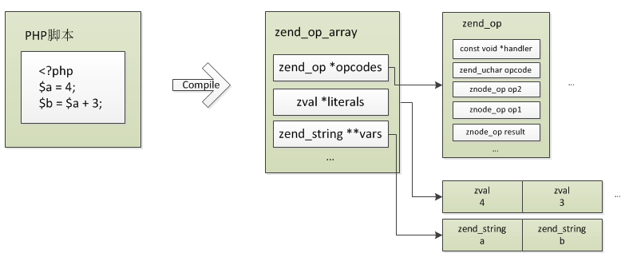
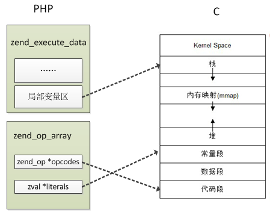

# PHP代码的编译

PHP是解析型高级语言，事实上从内核的角度来看PHP就是一个普通的C程序，它有main函数，我们写的PHP代码是这个程序的输入，然后经过内核的处理输出结果，内核将PHP代码"翻译"为C程序可识别的过程就是PHP的编译。

那么这个"翻译"过程具体都有哪些操作呢？

C程序在编译时将一行行代码编译为机器码，每一个操作都认为是一条机器指令，这些指令写入到编译后的二进制程序中，执行的时候将二进制程序load进相应的内存区域(常量区、数据区、代码区)、分配运行栈，然后从代码区起始位置开始执行，这是C程序编译、执行的简单过程。

同样，PHP的编译与普通的C程序类似，只是PHP代码没有编译成机器码，而是解析成了若干条opcode数组，每条opcode就是C里面普通的struct，含义对应C程序的机器指令，执行的过程就是引擎依次执行opcode，比如我们在PHP里定义一个变量:`$a = 123;`，最终到内核里执行就是malloc一块内存，然后把值写进去。

所以PHP的解析过程任务就是将PHP代码转化为opcode数组，代码里的所有信息都保存在opcode中，然后将opcode数组交给zend引擎执行，opcode就是内核具体执行的命令，比如赋值、加减操作、函数调用等，每一条opcode都对应一个处理handle，这些handler全部是提前定义好的C函数。

从PHP代码到opcode是怎么实现的？最容易想到的方式就是正则匹配，当然过程没有这么简单。PHP编译过程包括词法分析、语法分析，使用re2c、bison完成，旧的PHP版本直接生成了opcode，PHP7新增了抽象语法树（AST），在语法分析阶段生成AST，然后再生成opcode数组。

re2c的示例:(http://re2c.org/examples/examples.html)
```c
#include <stdio.h>

static const char *lex(const char *YYCURSOR)
{
    const char *YYMARKER;
    /*!re2c
        re2c:define:YYCTYPE = char;
        re2c:yyfill:enable = 0;

        end = "\x00";
        bin = '0b' [01]+;
        oct = "0" [0-7]*;
        dec = [1-9][0-9]*;
        hex = '0x' [0-9a-fA-F]+;

        *       { return "err"; }
        bin end { return "bin"; }
        oct end { return "oct"; }
        dec end { return "dec"; }
        hex end { return "hex"; }
    */
}

int main(int argc, char **argv)
{
    for (int i = 1; i < argc; ++i) {
        printf ("%s: %s\n", lex(argv[i]), argv[i]);
    }
    return 0;
}
```
```
$ re2c -o example.cc 01_recognizing_integers.re
$ g++ -o example example.cc
$ ./example 0 12345678901234567890 0xAbcDEf 0x00 007 0B0 0b110101010 0x 0b ? ""
oct: 0
dec: 12345678901234567890
hex: 0xAbcDEf
hex: 0x00
oct: 007
bin: 0B0
bin: 0b110101010
err: 0x
err: 0b
err: ?
err:
```



最终生成的opcode数组结构为：

```c
truct _zend_op_array {
    //common是普通函数或类成员方法对应的opcodes快速访问时使用的字段，后面分析PHP函数实现的时候会详细讲
    /* Common elements */
    zend_uchar type; //标示函数类型：1为PHP内部函数(扩展或内核提供的函数)、2为用户自定义函数(即PHP代码中写的function)
    zend_uchar arg_flags[3]; /* bitset of arg_info.pass_by_reference */
    uint32_t fn_flags;
    zend_string *function_name; //函数名
    zend_class_entry *scope; //所属class
    zend_function *prototype;
    uint32_t num_args; //参数数量
    uint32_t required_num_args; //必传参数数量
    zend_arg_info *arg_info; //参数信息
    /* END of common elements */

    uint32_t *refcount;

    uint32_t this_var;

    uint32_t last;
    zend_op *opcodes; //opcode指令

    int last_var;
    uint32_t T; //临时变量数
    zend_string **vars; //PHP变量名列表

    int last_brk_cont;
    int last_try_catch;
    zend_brk_cont_element *brk_cont_array;
    zend_try_catch_element *try_catch_array;

    /* static variables support */
    HashTable *static_variables; //静态变量符号表

    zend_string *filename; //PHP文件路径
    uint32_t line_start;
    uint32_t line_end;
    zend_string *doc_comment;
    uint32_t early_binding; /* the linked list of delayed declarations */

    int last_literal; 
    zval *literals; //字面量(常量)数组

    int  cache_size;
    void **run_time_cache;

    void *reserved[ZEND_MAX_RESERVED_RESOURCES];
};

struct _zend_op {
    const void *handler; //指令执行handler
    znode_op op1;   //操作数1
    znode_op op2;   //操作数2
    znode_op result; //返回值
    uint32_t extended_value; 
    uint32_t lineno; 
    zend_uchar opcode;  //opcode指令
    zend_uchar op1_type; //操作数1类型
    zend_uchar op2_type; //操作数2类型
    zend_uchar result_type; //返回值类型
};
```

opcode各字段含义下面展开说明。

### 操作数

每条opcode都有两个操作数(不一定都有用)、一个返回值，其中handler是具体执行的方法，handler通过opcode、op1_type、op2_type三个值索引到，每条opcode都最多有(5*5)个不同的处理handler，后面分析zend执行的时候再具体讲这块。

操作数记录着当前指令的关键信息，可以用于变量的存储、访问，比如赋值语句："$a = 45;",两个操作数分别记录"$a"、"45"的存储位置，执行时根据op2取到值"45"，然后赋值给"$a"，而"$a"的位置通过op1获取到。当然操作数并不是全部这么用的，上面只是赋值时候的情况，其它操作会有不同的用法，如函数调用时的传参，op1记录的就是传递的参数是第几个，op2记录的是参数的存储位置，result记录的是函数接收参数的存储位置。

### 操作数类型

每个操作都有5种不同的类型：

```c
#define IS_CONST    (1<<0)  //1
#define IS_TMP_VAR  (1<<1)  //2
#define IS_VAR      (1<<2)  //4
#define IS_UNUSED   (1<<3)  //8
#define IS_CV       (1<<4)  //16
```
* IS_CONST    常量（字面量），编译时就可确定且不会改变的值，比如:$a = "hello~"，其中字符串"hello~"就是常量
* IS_TMP_VAR  临时变量，比如：$a = "hello~" . time()，其中`"hello~" . time()`的值类型就是IS_TMP_VAR，再比如:$a = "123" + $b，`"123" + $b`的结果类型也是IS_TMP_VAR，从这两个例子可以猜测，临时变量多是执行期间其它类型组合现生成的一个中间值，由于它是现生成的，所以把IS_TMP_VAR赋值给IS_CV变量时不会增加其引用计数
* IS_VAR      PHP内部的变量，这个很容易认为是PHP脚本里的变量，其实不是，这个类型最常见的例子是PHP函数的返回值，比如:$a = time()，其中`time()`的结果就是IS_VAR，这条语句实际会有两个zval，一个是`time()`返回值，类型是IS_VAR，另一个是`$a`，类型是IS_CV，整个赋值过程是：调用time()，将返回值存下，类型为IS_CV，然后将此值复制给$a，IS_CV = IS_TMP_VAR
* IS_UNUSED   表示操作数没有使用
* IS_CV       PHP变量，即脚本里定义的变量，这些变量是编译阶段确定的，所以是compile variable

`result_type`除了上面几种类型外还有一种类型`EXT_TYPE_UNUSED (1<<5)`，返回值没有使用时会用到，这个值跟`IS_UNUSED`的区别尚不得知。


### 常量(字面量)、变量的存储&访问

我们先想一下C程序是如何读写字面量、变量的。

```c
#include <stdio.h>
int main()
{
    char *name = "pangudashu";

    printf("%s\n", name);
    return 0;
}
```
我们知道name的值分配在栈上，而"pangudashu"分配在常量区，那么"name"变量名分配在哪呢？

实际上C里面是不会存变量名称的，编译的过程会将变量名替换为偏移量表示：`ebp - 偏移量`或`esp + 偏移量`，将上面的代码转为汇编:
```c
.LC0:
    .string "pangudashu"
    .text
    .globl  main
    .type   main, @function
main:
.LFB0:
    pushq   %rbp
    movq    %rsp, %rbp
    subq    $16, %rsp
    movq    $.LC0, -8(%rbp)
    movq    -8(%rbp), %rax
    movq    %rax, %rdi
    call    puts
    movl    $0, %eax
    leave
```
可以看到`movq    $.LC0, -8(%rbp)`，而`-8(%rbp)`就是name变量。

关于C程序的执行过程、内存分配可以看:[https://github.com/pangudashu/anywork/tree/master/func_execute](https://github.com/pangudashu/anywork/tree/master/func_execute)


虽然PHP代码不会直接编译为机器码，但编译、执行的设计跟C程序是一致的，也有常量区、变量也通过偏移量访问、也有虚拟的执行栈。



在编译时就可确定且不会改变的量称为字面量，也称作常量(IS_CONST)，这些值在编译阶段就已经分配zval，保存在`_zend_op_array->literals`数组中(对应c程序的常量内存区)，访问时通过`_zend_op_array->literals + 偏移量`读取，举个例子：
```c
<?php
$a = 56;
$b = "hello";
```
`56`通过`(zval*)(_zend_op_array->literals + 0)`取到，`hello`通过`(zval*)(_zend_op_array->literals + 16)`取到。


