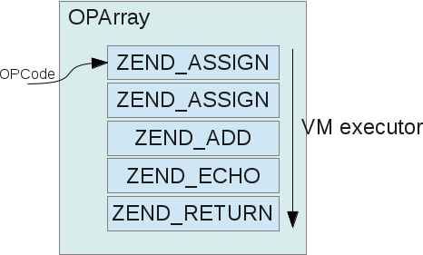

# Zend引擎执行过程

Zend虚拟机主要由两部分组成：编译、执行。

## 1、opcode
opcode是将PHP代码编译产生的Zend虚拟机可识别的指令，php7共有173个opcode，定义在`zend_vm_opcodes.h`中，PHP中的所有语法实现都是由这些opcode组成的。

```c
struct _zend_op {
    const void *handler; //对应执行的C语言function，即每条opcode都有一个C function处理
    znode_op op1;   //操作数1
    znode_op op2;   //操作数2
    znode_op result; //返回值
    uint32_t extended_value; 
    uint32_t lineno; 
    zend_uchar opcode;  //opcode指令
    zend_uchar op1_type; //操作数1类型
    zend_uchar op2_type; //操作数2类型
    zend_uchar result_type; //返回值类型
};
```

## 2、zend_op_array结构
`zend_op_array`是Zend引擎执行阶段的输入，是opcode的集合(当然并不仅仅如此)。



```c
truct _zend_op_array {
    /* Common elements */
    zend_uchar type; //标识函数类型：1为PHP内部函数(扩展或内核提供的函数)、2为用户自定义函数(即PHP代码中写的function)
    zend_uchar arg_flags[3]; /* bitset of arg_info.pass_by_reference */
    uint32_t fn_flags;
    zend_string *function_name; //函数名
    zend_class_entry *scope; //所属class
    zend_function *prototype;
    uint32_t num_args; //参数数量
    uint32_t required_num_args; //必传参数数量
    zend_arg_info *arg_info; //参数信息
    /* END of common elements */

    uint32_t *refcount;

    uint32_t this_var;

    uint32_t last;
    zend_op *opcodes; //opcode指令数组

    int last_var;
    uint32_t T; //临时变量数
    zend_string **vars; //PHP变量名列表

    int last_brk_cont;
    int last_try_catch;
    zend_brk_cont_element *brk_cont_array;
    zend_try_catch_element *try_catch_array;

    /* static variables support */
    HashTable *static_variables; //静态变量符号表

    zend_string *filename; //PHP文件路径
    uint32_t line_start;
    uint32_t line_end;
    zend_string *doc_comment;
    uint32_t early_binding; /* the linked list of delayed declarations */

    int last_literal; 
    zval *literals; //字面量(常量)数组

    int  cache_size;
    void **run_time_cache;

    void *reserved[ZEND_MAX_RESERVED_RESOURCES];
};

```

## 3、opcode执行方式
PHP代码编译为opcode数组：zend_op_array，然后逐条执行，在执行的方式上zend提供了三种不同的方式：CALL、SWITCH、GOTO，默认方式为CALL，下面具体解释下这个是什么意思。

每个opcode都代表了一些特定的处理操作，这个东西怎么提供呢？一种是把每种opcode负责的工作封装成一个function，然后执行器循环执行即可，这就是`CALL`模式的工作方式；另外一种是把所有opcode的处理方式通过C语言里面的label标签区分开，然后执行器执行的时候goto到相应的位置处理，这就是`GOTO`模式的工作方式；最后还有一种方式是把所有的处理方式写到一个switch下，然后通过case不同的opcode执行具体的操作，这就是`SWITCH`模式的工作方式。

假设opcode数组是这个样子：
```c
int op_array[] = {
    opcode_1,
    opcode_2,
    opcode_3,
    ...
};
```
各模式下的工作过程类似这样：
```c
//CALL模式
void opcode_1_handler() {...}

void opcode_2_handler() {...}
...

void execute(int []op_array)
{
    void *opcode_handler_list[] = {&opcode_1_handler, &opcode_2_handler, ...};

    while(1){
        void handler = opcode_handler_list[op_array[i]];
        handler(); //call handler
        i++;
    }
}

//GOTO模式
void execute(int []op_array)
{
    while(1){
        goto opcode_xx_handler_label;
    }

opcode_1_handler_label:
    ...

opcode_2_handler_label:
    ...
...
}

//SWITCH模式
void execute(int []op_array)
{
    while(1){
        switch(op_array[i]){
            case opcode_1:
                ...
            case opcode_2:
                ...
            ...
        }

        i++;
    }
}

```
三种模式效率是不同的，GOTO最快，怎么选择其它模式呢？下载PHP源码后不要直接编译，Zend目录下有个文件：`zend_vm_gen.php`，在编译PHP前执行：`php zend_vm_gen.php --with-vm-kind=CALL|SWITCH|GOTO`，这个脚本将重新生成:`zend_vm_opcodes.h`、`zend_vm_opcodes.c`、`zend_vm_execute.h`三个文件覆盖原来的，然后再编译PHP即可。

后面分析的过程使用的都是默认模式`CALL`。

## 4、zend_executor_globals(EG)
`zend_executor_globals executor_globals`是PHP整个生命周期中最主要的一个结构，是一个全局变量，在main执行前分配(非ZTS下)，直到PHP退出，经常见到的一个宏`EG`操作的就是这个结构。
```c
//zend_compile.c
#ifndef ZTS
ZEND_API zend_compiler_globals compiler_globals;
ZEND_API zend_executor_globals executor_globals;
#endif

//zend_globals_macros.h
# define EG(v) (executor_globals.v)
```
`zend_executor_globals`结构非常大，定义在`zend_globals.h`中，比较重要的几个字段含义如下图所示：


## 5、执行流程
Zend执行的入口位于`zend_vm_execute.h`文件中的__zend_execute()__：

```c
ZEND_API void zend_execute(zend_op_array *op_array, zval *return_value)
{
    zend_execute_data *execute_data;

    if (EG(exception) != NULL) {
        return;
    }

    //分配zend_execute_data
    execute_data = zend_vm_stack_push_call_frame(ZEND_CALL_TOP_CODE,
            (zend_function*)op_array, 0, zend_get_called_scope(EG(current_execute_data)), zend_get_this_object(EG(current_execute_data)));
    if (EG(current_execute_data)) {
        execute_data->symbol_table = zend_rebuild_symbol_table();
    } else {
        execute_data->symbol_table = &EG(symbol_table);
    }
    EX(prev_execute_data) = EG(current_execute_data); //=> execute_data->prev_execute_data = EG(current_execute_data);
    i_init_execute_data(execute_data, op_array, return_value); //初始化execute_data
    zend_execute_ex(execute_data); //执行opcode
    zend_vm_stack_free_call_frame(execute_data); //释放execute_data:销毁所有的PHP变量
}

#define EX(element)             ((execute_data)->element)
```
这个过程主要分了三步：首先分配运行时关键的结构分配zend_execute_data（可以理解为分配运行栈）并初始化，然后执行opcode，最后释放zend_execute_data。

这里还有部分EG操作，EG(current_execute_data)指向的是当前正在执行的zend_execute_data，类似二进制程序执行中的`Esp/Ebp`指针


