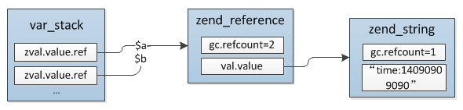

# 变量的内部实现

PHP变量实现的基础结构是`zval`，各种类型的实现均基于此结构实现，是PHP中最基础的一个结构，每个PHP变量都对应一个`zval`，下面就看下这个结构以及PHP变量的内存管理机制。

## 1.zval结构
```c
//zend_type.h
typedef struct _zval_struct     zval;

typedef union _zend_value {
    zend_long         lval;    //int整形
    double            dval;    //浮点型
    zend_refcounted  *counted;
    zend_string      *str;     //string字符串
    zend_array       *arr;     //array数组
    zend_object      *obj;     //object对象
    zend_resource    *res;     //resource资源类型
    zend_reference   *ref;     //引用类型，通过&$var_name定义的
    zend_ast_ref     *ast;     //下面几个都是内核使用的value
    zval             *zv;
    void             *ptr;
    zend_class_entry *ce;
    zend_function    *func;
    struct {
        uint32_t w1;
        uint32_t w2;
    } ww;
} zend_value;

struct _zval_struct {
    zend_value        value; //变量实际的value
    union {
        struct {
            ZEND_ENDIAN_LOHI_4( //忽略这个宏，直接分析下面的结构
                zend_uchar    type,         //变量类型
                zend_uchar    type_flags,  //类型掩码，不同的类型会有不同的几种属性，内存管理会用到
                zend_uchar    const_flags,
                zend_uchar    reserved)     /* call info for EX(This) */
        } v;
        uint32_t type_info; //上面4个值的组合值，可以直接根据type_info取到4个对应位置的值
    } u1;
    union {
        uint32_t     var_flags;
        uint32_t     next;                 //哈希表中解决哈希冲突时用到
        uint32_t     cache_slot;           /* literal cache slot */
        uint32_t     lineno;               /* line number (for ast nodes) */
        uint32_t     num_args;             /* arguments number for EX(This) */
        uint32_t     fe_pos;               /* foreach position */
        uint32_t     fe_iter_idx;          /* foreach iterator index */
    } u2; //一些辅助值
};
```
`zval`结构比较简单，内嵌一个union类型的`zend_value`保存具体变量类型的值或指针，`zval`中还有两个union：`u1`、`u2`:
* __u1：__它的意义比较直观，变量的类型就通过`u1.type`区分，另外一个值`type_flags`为类型掩码，在变量的内存管理、gc机制中会用到，第三部分会详细分析，至于后面两个`const_flags`、`reserved`暂且不管
* __u2：__这个值纯粹是个辅助值，假如`zval`只有:`value`、`u1`两个值，整个zval的大小也会对齐到16byte，既然不管有没有u2大小都是16byte，把多余的4byte拿出来用于一些特殊用途还是很划算的，比如next在哈希表解决哈希冲突时会用到，还有fe_pos在foreach会用到......

从`zend_value`可以看出，除`long`、`double`类型直接存储值外，其它类型都为指针，指向各自的结构。

## 2.类型
`zval.u1.type`类型：
```c
/* regular data types */
#define IS_UNDEF                    0
#define IS_NULL                     1
#define IS_FALSE                    2
#define IS_TRUE                     3
#define IS_LONG                     4
#define IS_DOUBLE                   5
#define IS_STRING                   6
#define IS_ARRAY                    7
#define IS_OBJECT                   8
#define IS_RESOURCE                 9
#define IS_REFERENCE                10

/* constant expressions */
#define IS_CONSTANT                 11
#define IS_CONSTANT_AST             12

/* fake types */
#define _IS_BOOL                    13
#define IS_CALLABLE                 14

/* internal types */
#define IS_INDIRECT                 15
#define IS_PTR                      17
```

### 2.1 基本类型
最简单的类型是true、false、long、double、null，其中true、false、null没有value，直接根据type区分，而long、double的值则直接存在value中：zend_long、double。

### 2.2 字符串
PHP中字符串通过`zend_string`表示:
```c
struct _zend_string {
    zend_refcounted_h gc;
    zend_ulong        h;                /* hash value */
    size_t            len;
    char              val[1];
};
```
* __gc：__变量引用信息，比如当前value的引用数，所有用到引用计数的变量类型都会有这个结构，3.1节会详细分析
* __h：__哈希值，数组中计算索引时会用到
* __len：__字符串长度，通过这个值保证二进制安全
* __val：__字符串内容，变长struct，分配时按len长度申请内存

### 2.3 数组
array是PHP中非常强大的一个数据结构，它的底层实现就是普通的有序HashTable，这里简单看下它的结构，下一节会单独分析数组的实现。

```c
typedef struct _zend_array HashTable;

struct _zend_array {
    zend_refcounted_h gc; //引用计数信息，与字符串相同
    union {
        struct {
            ZEND_ENDIAN_LOHI_4(
                zend_uchar    flags,
                zend_uchar    nApplyCount,
                zend_uchar    nIteratorsCount,
                zend_uchar    reserve)
        } v;
        uint32_t flags;
    } u;
    uint32_t          nTableMask; //计算bucket索引时的掩码
    Bucket           *arData; //bucket数组
    uint32_t          nNumUsed; //已用bucket数
    uint32_t          nNumOfElements; //已有元素数，nNumOfElements <= nNumUsed，因为删除的并不是直接从arData中移除
    uint32_t          nTableSize; //数组的大小，为2^n
    uint32_t          nInternalPointer; //数值索引
    zend_long         nNextFreeElement;
    dtor_func_t       pDestructor;
};
```
### 2.4 对象/资源
```c
struct _zend_object {
    zend_refcounted_h gc;
    uint32_t          handle;
    zend_class_entry *ce; //对象对应的class类
    const zend_object_handlers *handlers;
    HashTable        *properties; //对象属性哈希表
    zval              properties_table[1];
};

struct _zend_resource {
    zend_refcounted_h gc;
    int               handle;
    int               type;
    void             *ptr;
};
```
对象比较常见，资源指的是tcp连接、文件句柄等等类型，这种类型比较灵活，可以随意定义struct，通过ptr指向，后面会单独分析这种类型，这里不再多说。

### 2.5 引用
引用是PHP中比较特殊的一种类型，它实际是指向另外一个PHP变量，对它的修改会直接改动实际指向的zval，可以简单的理解为C中的指针，在PHP中通过`&`操作符产生一个引用变量。
```c
struct _zend_reference {
    zend_refcounted_h gc;
    zval              val;
};
```
结构非常简单，除了公共部分`zend_refcounted_h`外只有一个`val`，举个示例看下具体的结构关系：
```php
$a = "time:" . time();      //$a    -> zend_string_1(refcount=1)
$b = &$a;                   //$a,$b -> zend_reference_1(refcount=2) -> zend_string_1(refcount=1)
```
最终的结果如图：



注意：引用只能通过`&`产生，无法通过赋值传递，比如：
```php
$a = "time:" . time();      //$a    -> zend_string_1(refcount=1)
$b = &$a;                   //$a,$b -> zend_reference_1(refcount=2) -> zend_string_1(refcount=1)
$c = $b;                    //$a,$b -> zend_reference_1(refcount=2) -> zend_string_1(refcount=2)
                            //$c    ->                                 ---
```
`$b = &$a`这时候`$a`、`$b`的类型是引用，但是`$c = $b`并不会直接将`$b`赋值给`$c`，而是把`$b`实际指向的zval赋值给`$c`，如果想要`$c`也是一个引用则需要这么操作：
```php
$a = "time:" . time();      //$a       -> zend_string_1(refcount=1)
$b = &$a;                   //$a,$b    -> zend_reference_1(refcount=2) -> zend_string_1(refcount=1)
$c = &$b;/*或$c = &$a*/     //$a,$b,$c -> zend_reference_1(refcount=3) -> zend_string_1(refcount=1) 
```
这个也表示PHP中的__引用只可能有一层__，__不会出现一个引用指向另外一个引用的情况__，也就是没有C语言中`指针的指针`的概念。

## 3.内存管理
接下来分析下变量的分配、销毁。

在分析变量内存管理之前我们先自己想一下可能的实现方案，最简单的处理方式：定义变量时alloc一个zval及对应的value结构(ref/arr/str/res...)，赋值、函数传参时硬拷贝一个副本，这样各变量最终的值完全都是独立的，不会出现多个变量同时共用一个value的情况，在执行完以后直接将各变量及value结构free掉。

这种方式是可行的，而且内存管理也很简单，但是，硬拷贝带来的一个问题是效率低，比如我们定义了一个变量然后赋值给另外一个变量，可能后面都只是只读操作，假如硬拷贝的话就会有多余的一份数据，这个问题的解决方案是：__引用计数+写时复制__。PHP变量的管理正是基于这两点实现的。

### 3.1 引用计数
引用计数是指在value中增加一个字段`refcount`记录指向当前value的数量，变量复制、函数传参时并不直接硬拷贝一份value数据，而是将`refcount++`，变量销毁时将`refcount--`，等到`refcount`减为0时表示已经没有变量引用这个value，将它销毁即可。
```php
$a = "time:" . time();   //$a       ->  zend_string_1(refcount=1)
$b = $a;                 //$a,$b    ->  zend_string_1(refcount=2)
$c = $b;                 //$a,$b,$c ->  zend_string_1(refcount=3)

unset($b);               //$b = IS_UNDEF  $a,$c ->  zend_string_1(refcount=2)
```
引用计数的信息位于给具体value结构的gc中：
```c
typedef struct _zend_refcounted_h {
    uint32_t         refcount;          /* reference counter 32-bit */
    union {
        struct {
            ZEND_ENDIAN_LOHI_3(
                zend_uchar    type,
                zend_uchar    flags,    /* used for strings & objects */
                uint16_t      gc_info)  /* keeps GC root number (or 0) and color */
        } v;
        uint32_t type_info;
    } u;
} zend_refcounted_h;
```
从上面的zend_value结构可以看出并不是所有的数据类型都会用到引用计数，`long`、`double`直接都是硬拷贝，只有value是指针的那几种类型才__可能__会用到引用计数。

下面再看一个例子：
```php
$a = "hi~";
$b = $a;
```
猜测一下变量`$a/$b`的引用情况。

这个不跟上面的例子一样吗？字符串`"hi~"`有`$a/$b`两个引用，所以`zend_string1(refcount=2)`。但是这是错的，gdb调试发现上面例子zend_string的引用计数为0。这是为什么呢？
```c
$a,$b -> zend_string_1(refcount=0,val="hi~")
```

事实上并不是所有的PHP变量都会用到引用计数，基本类型：true/false/double/long/null是硬拷贝自然不需要这种机制，但是除了这几个还有两个特殊的类型也不会用到：interned string(内部字符串)、immutable array，它们的type是`IS_STRING`、`IS_ARRAY`，与普通string、array类型相同，那怎么区分一个value是否支持引用计数呢？还记得`zval.u1`中那个类型掩码`type_flag`吗？正是通过这个字段标识的，这个字段除了标识value是否支持引用计数外还有其它几个标识位，按位分割。

支持引用计数的value类型其`zval.u1.type_flag`为`IS_TYPE_REFCOUNTED`：
```c
#define IS_TYPE_REFCOUNTED          (1<<2)
```
下面具体列下哪些类型会有这个标识：
```c
|     type       | refcounted |
+----------------+------------+
|simple types    |            |
|string          |      Y     |
|interned string |            |
|array           |      Y     |
|immutable array |            |
|object          |      Y     |
|resource        |      Y     |
|reference       |      Y     |
```
simple types很显然用不到，不再解释，string、array、object、resource、reference有引用计数机制也很容易理解，下面具体解释下另外两个特殊的类型：
* interned string：内部字符串，这是种什么类型？我们在PHP中写的所有字符都可以认为是这种类型，比如function name、class name、variable name、静态字符串等等，我们这样定义:`$a = "hi~;"`后面的字符串内容是唯一不变的，这些字符串等同于C语言中定义在静态变量区的字符串：`char *a = "hi~";`，这些字符串的生命周期为request期间，request完成后会统一销毁释放，自然也就无需在运行期间通过引用计数管理内存。

* immutable array：只有在用opcache的时候才会用到这种类型，暂不分析。

### 3.2 写时复制

### 3.3 垃圾回收


[参考：https://nikic.github.io/2015/05/05/Internal-value-representation-in-PHP-7-part-1.html]

